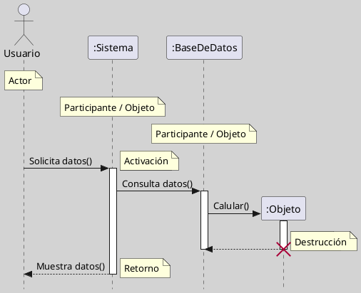
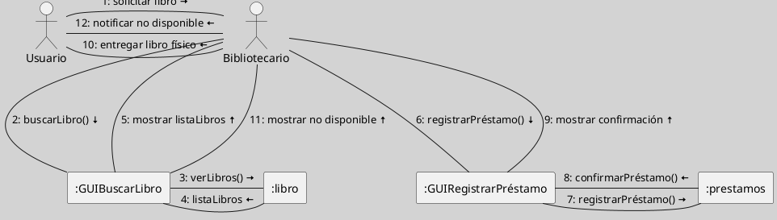

---
{"dg-publish":true,"permalink":"/000 Bandeja de Entrada/Prueba MultiColum Plugin/"}
---

#pruebaConcepto

````col

```col-md

**Figura**
_Ejemplo Básico_

Nota: Elaboración Propia, usando la herramienta [[050 Base de Conocimientos/900 Biblioteca/Zk Lit (Plantuml) Herramienta Para Crear Diagramas a Partir de Texto\|Plantuml]].

```

```col-md
line 1
line 2
```

````


--- start-multi-column: ExampleRegion1  
```column-settings  
number of columns: 2  
```

**Figura**
_Ejemplo Básico_

Nota: Elaboración Propia, usando la herramienta [[050 Base de Conocimientos/900 Biblioteca/Zk Lit (Plantuml) Herramienta Para Crear Diagramas a Partir de Texto\|Plantuml]].

--- end-column ---

**Figura**
_Ejemplo Complejo_

Nota: Elaboración Propia, usando la herramienta [[050 Base de Conocimientos/900 Biblioteca/Zk Lit (Plantuml) Herramienta Para Crear Diagramas a Partir de Texto\|Plantuml]].

--- end-multi-column

