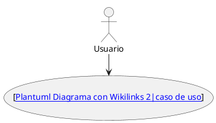

---
{"dg-publish":true,"permalink":"/000 Bandeja de Entrada/Prueba Plantuml Diagrama con Wikilinks 1/"}
---

#pruebaConcepto 

```plantuml
@startuml
!pragma layout smetana
actor Usuario
usecase "[[[Prueba Plantuml Diagrama con Wikilinks 2|caso de uso]]]" as CU1
Usuario --> CU1
@enduml
```
