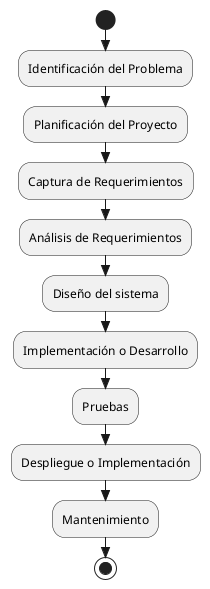

---
{"dg-publish":true,"permalink":"/050 Base de Conocimientos/200  Mi Zettelkasten/100 Docencia/IS1/2025/Clase 03 Costos y Complejidad del Software/Zk Ciclo de Vida del Desarrollo del Software/","tags":["digitalGarden","cicloDeVidaDelDesarrolloDelSoftware"]}
---

## Ciclo de Vida del Desarrollo del Software

El Ciclo de Vida del Desarrollo del Software (SDLC, por sus siglas en inglés) constituye un proceso esencial en la ingeniería del software. Este ciclo abarca desde la concepción inicial de una idea hasta el mantenimiento y evolución del producto final, proporcionando una estructura metodológica que guía la organización, gestión y control de los proyectos de software[Weitzenfeld Ridel yGuardati, 2008](https://weitzenfeld.robolat.org/wp-content/uploads/2015/01/WeitzenfeldGuardatiComputacion2008.pdf). Su propósito es asegurar la calidad, la eficiencia y la alineación del sistema desarrollado con las necesidades de los usuarios y los objetivos del negocio.{ #98febd}

### Fases Típicas

De acuerdo con [[050 Base de Conocimientos/900 Biblioteca/Zk Lit (Pressman, 2013) Ingeniería del Software - Un Enfoque Práctico (Séptima edición). McGraw-Hill Education\|Pressman (2013)]],  [[050 Base de Conocimientos/900 Biblioteca/Zk Lit (Sommerville, 2011) Ingeniería del Software\|Sommerville (2011)]] y  [[050 Base de Conocimientos/900 Biblioteca/Zk Lit (Weitzenfeld, 2005) Ingenieria de software orientada a objetos con UML, Java e Internet\|Weitzenfeld (2005)]], el SDLC se compone de una serie de fases interrelacionadas, cada una con objetivos y actividades específicas. Si bien la denominación y el alcance de cada fase pueden variar según el modelo adoptado ([[050 Base de Conocimientos/200  Mi Zettelkasten/100 Docencia/IS1/2025/Clase 04 Modelos de Proceso de Software/Zk Modelo en Cascada (Waterfall)\|cascada]], [[050 Base de Conocimientos/200  Mi Zettelkasten/100 Docencia/IS1/2025/Clase 04 Modelos de Proceso de Software/Zk Modelo Incremental\|incremental]], [[050 Base de Conocimientos/200  Mi Zettelkasten/100 Docencia/IS1/2025/Clase 04 Modelos de Proceso de Software/Zk Modelo Evolutivo (Espiral)\|espiral]], [[050 Base de Conocimientos/200  Mi Zettelkasten/100 Docencia/IS1/2025/Clase 04 Modelos de Proceso de Software/Zk Modelos Ágiles\|ágil]], entre otros), las etapas fundamentales incluyen:

1. **Identificación del Problema:** Definición del contexto, las necesidades y los desafíos que justifican el desarrollo del software.

2. **Planificación del Proyecto:** Establecimiento de objetivos, estimación de recursos, cronograma, análisis de riesgos y viabilidad del proyecto

3. **[[050 Base de Conocimientos/200  Mi Zettelkasten/100 Docencia/IS1/2025/Clase 03 Costos y Complejidad del Software/Zk Ciclo de Vida del Desarrollo del Software (Captura de Requerimientos)\|Captura de Requerimientos]]:** Elicitación y documentación de las necesidades y expectativas de los stakeholders, que servirán de base para el análisis posterior

4. **Análisis de Requerimientos:** Profundización en los requisitos, identificando dependencias, restricciones y prioridades, y asegurando su viabilidad técnica y organizacional.

5. **Diseño del Sistema:** Elaboración de la arquitectura, los modelos y las especificaciones técnicas que orientarán la construcción del software.

6. **Implementación o Desarrollo:** Codificación y construcción del sistema conforme a los diseños y especificaciones previas.

7. **Pruebas:** Verificación y validación del sistema para asegurar que cumple con los requisitos definidos y es libre de errores críticos.
    
8. **Despliegue o Implementación:** Puesta en producción del sistema, entrega a los usuarios finales y migración de datos si corresponde.
    
9. **Mantenimiento:** Actualización, corrección de errores y adaptación del sistema a nuevos requerimientos o entornos tecnológicos, asegurando su vigencia y calidad a lo largo del tiempo.

La siguiente figura ilustra las fases mencionadas.

<a class="markdown-embed-link" href="/060 Desarrollos/UI-UML Specification Framework (UUSF)/01 Overview/Zk Ciclo de Vida del Desarrollo del Software SDLC (Gráfico Simplificado)/#ciclo-de-vida-del-desarrollo-del-software-sdlc-grafico-simplificado" aria-label="Open link"><svg xmlns="http://www.w3.org/2000/svg" width="24" height="24" viewBox="0 0 24 24" fill="none" stroke="currentColor" stroke-width="2" stroke-linecap="round" stroke-linejoin="round" class="svg-icon lucide-link"><path d="M10 13a5 5 0 0 0 7.54.54l3-3a5 5 0 0 0-7.07-7.07l-1.72 1.71"></path><path d="M14 11a5 5 0 0 0-7.54-.54l-3 3a5 5 0 0 0 7.07 7.07l1.71-1.71"></path></svg></a>

## Ciclo de Vida del Desarrollo del Software SDLC (Gráfico Simplificado)

**Figura**
_Ciclo de Vida de Desarrollo del Software (Fases)_

_Fuente_: [[050 Base de Conocimientos/900 Biblioteca/Zk Lit (Pressman, 2013) Ingeniería del Software - Un Enfoque Práctico (Séptima edición). McGraw-Hill Education\|Pressman (2013)]],  [[050 Base de Conocimientos/900 Biblioteca/Zk Lit (Sommerville, 2011) Ingeniería del Software\|Sommerville (2011)]] y  [[050 Base de Conocimientos/900 Biblioteca/Zk Lit (Weitzenfeld, 2005) Ingenieria de software orientada a objetos con UML, Java e Internet\|Weitzenfeld (2005)]]

