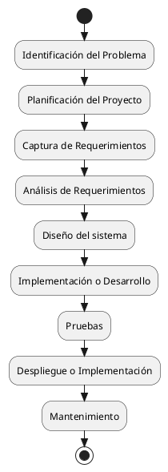

---
{"dg-publish":true,"permalink":"/050 Base de Conocimientos/200  Mi Zettelkasten/100 Docencia/IS1/2025/Clase 03 Costos y Complejidad del Software/Zk Ciclo de Vida del Desarrollo del Software/","tags":["digitalGarden","cicloDeVidaDelDesarrolloDelSoftware"]}
---

## Ciclo de Vida del Desarrollo del Software
El Ciclo Ciclo de Vida del Desarrollo del Software (SDLC) es un proceso fundamental en la ingeniería de software, abarca las diversas fases, desde la concepción inicial hasta el mantenimiento del producto final. 
{ #98febd}

El Ciclo de Vida del Desarrollo del Software (SDLC, por sus siglas en inglés) es un proceso estructurado y fundamental en la Ingeniería de Software, que abarca todas las etapas necesarias para crear, implementar y mantener un sistema informático, desde su concepción inicial hasta su evolución y soporte continuo. Su propósito es garantizar que el producto final cumpla con los requisitos del cliente, sea de alta calidad y se adapte a las necesidades cambiantes del entorno tecnológico

### Fases Típicas
Según  [[050 Base de Conocimientos/900 Biblioteca/Zk Lit (Pressman, 2013) Ingeniería del Software - Un Enfoque Práctico (Séptima edición). McGraw-Hill Education\|Pressman (2013)]] y [[050 Base de Conocimientos/900 Biblioteca/Zk Lit (Weitzenfeld, 2005) Ingenieria de software orientada a objetos con UML, Java e Internet\|Weitzenfeld (2005)]] las fases son:

1. Identificación del Problema
2. Planificación del Proyecto
3. [[050 Base de Conocimientos/200  Mi Zettelkasten/100 Docencia/IS1/2025/Clase 03 Costos y Complejidad del Software/Zk Ciclo de Vida del Desarrollo del Software (Captura de Requerimientos)\|Captura de Requerimientos]]
4. Análisis de Requerimientos
5. Diseño del sistema
6. Implementación o Desarrollo
7. Pruebas
8. Despliegue o Implementación
9. Mantenimiento

<a class="markdown-embed-link" href="/060 Desarrollos/UI-UML Specification Framework (UUSF)/01 Overview/Zk Ciclo de Vida del Desarrollo del Software SDLC (Gráfico Simplificado)/#ciclo-de-vida-del-desarrollo-del-software-sdlc-grafico-simplificado" aria-label="Open link"><svg xmlns="http://www.w3.org/2000/svg" width="24" height="24" viewBox="0 0 24 24" fill="none" stroke="currentColor" stroke-width="2" stroke-linecap="round" stroke-linejoin="round" class="svg-icon lucide-link"><path d="M10 13a5 5 0 0 0 7.54.54l3-3a5 5 0 0 0-7.07-7.07l-1.72 1.71"></path><path d="M14 11a5 5 0 0 0-7.54-.54l-3 3a5 5 0 0 0 7.07 7.07l1.71-1.71"></path></svg></a>

## Ciclo de Vida del Desarrollo del Software SDLC (Gráfico Simplificado)

**Figura**
_Ciclo de Vida de Desarrollo del Software (Fases)_

_Fuente_: [[050 Base de Conocimientos/900 Biblioteca/Zk Lit (Pressman, 2013) Ingeniería del Software - Un Enfoque Práctico (Séptima edición). McGraw-Hill Education\|(Pressman, 2013)]], [[050 Base de Conocimientos/900 Biblioteca/Zk Lit (Weitzenfeld, 2005) Ingenieria de software orientada a objetos con UML, Java e Internet\|(Weitzenfeld, 2005)]]

