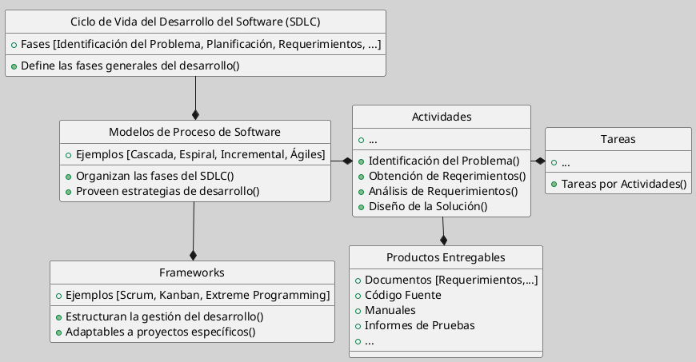
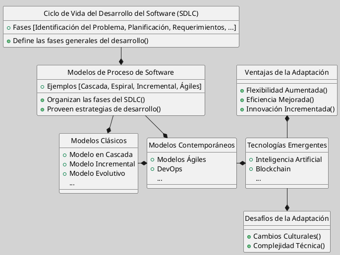

---
{"dg-publish":true,"permalink":"/050 Base de Conocimientos/200  Mi Zettelkasten/100 Docencia/IS1/2025/Clase 04 Modelos de Proceso de Software/Zk !MOC Modelos de Proceso de Software/","tags":["digitalGarden","moc","software","proceso"]}
---

## Contenido

### Introducción
Los [[050 Base de Conocimientos/200  Mi Zettelkasten/100 Docencia/IS1/2025/Clase 04 Modelos de Proceso de Software/Zk Modelos de Proceso de Software\|modelos de proceso de software]] forman parte del concepto más amplio del [[050 Base de Conocimientos/200  Mi Zettelkasten/100 Docencia/IS1/2025/Clase 03 Costos y Complejidad del Software/Zk Ciclo de Vida del Desarrollo del Software\|Ciclo de Vida del Desarrollo del Software (SDLC)]], el cual define las fases generales que son necesarias para desarrollar un producto de software, desde su concepción hasta su mantenimiento. Dentro de este marco, los [[050 Base de Conocimientos/200  Mi Zettelkasten/100 Docencia/IS1/2025/Clase 04 Modelos de Proceso de Software/Zk Modelos de Proceso de Software\|modelos de proceso]] estructuran estas fases en distintos esquemas, proporcionando estrategias específicas para gestionar el desarrollo de software.

Como [[050 Base de Conocimientos/200  Mi Zettelkasten/010 Informática/Zk Framework o Marco de Trabajo\|marcos de trabajo]], los [[050 Base de Conocimientos/200  Mi Zettelkasten/100 Docencia/IS1/2025/Clase 04 Modelos de Proceso de Software/Zk Modelos de Proceso de Software\|modelos de proceso de software]] establecen la secuencia de actividades, tareas y productos entregables necesarios para desarrollar software de alta calidad. Funcionan como una **hoja de ruta** para los equipos de desarrollo, permitiéndoles organizar el proceso, gestionar riesgos, planificar proyectos y asignar recursos de manera eficiente.

Estos modelos no son estáticos, evolucionan y se adaptan a las necesidades específicas de cada proyecto. Su desarrollo ha dado lugar a enfoques más flexibles y contemporáneos, como los modelos ágiles y DevOps, que buscan optimizar la entrega de software y mejorar la colaboración en los equipos.

**Figura**
_Esquema de Modelos de Proceso de Software y su Relación con el SDLC_
Fuente: Elaboración Propia

## Desarrollo
[[050 Base de Conocimientos/200  Mi Zettelkasten/100 Docencia/IS1/2025/Clase 04 Modelos de Proceso de Software/Zk Modelos de Proceso de Software\|Modelos de Proceso de Software]]

Distinguimos dos tipos de Modelo de Procesos de Software:
1. [[050 Base de Conocimientos/200  Mi Zettelkasten/100 Docencia/IS1/2025/Clase 04 Modelos de Proceso de Software/Zk Modelos Clásicos de Proceso de Software\|Modelos Clásicos]]
	1.1 [[050 Base de Conocimientos/200  Mi Zettelkasten/100 Docencia/IS1/2025/Clase 04 Modelos de Proceso de Software/Zk Modelo en Cascada (Waterfall Model)\|Modelo en Cascada]]
	1.2 [[050 Base de Conocimientos/200  Mi Zettelkasten/100 Docencia/IS1/2025/Clase 04 Modelos de Proceso de Software/Zk Modelo Incremental\|Modelo Incremental]]
	1.3 [[050 Base de Conocimientos/200  Mi Zettelkasten/100 Docencia/IS1/2025/Clase 04 Modelos de Proceso de Software/Zk Modelo Evolutivo (Prototipos y Espiral)\|Modelo Evolutivo (Prototipos y Espiral)]]

2. [[050 Base de Conocimientos/200  Mi Zettelkasten/100 Docencia/IS1/2025/Clase 04 Modelos de Proceso de Software/Zk Modelos Contemporáneos (Enfoques) de Proceso de Software\|Modelos Contemporáneos]]
	2.1  [[050 Base de Conocimientos/200  Mi Zettelkasten/100 Docencia/IS1/2025/Clase 04 Modelos de Proceso de Software/Zk Modelos Ágiles\|Modelos Ágiles]]
	2.2 [[050 Base de Conocimientos/200  Mi Zettelkasten/100 Docencia/IS1/2025/Clase 04 Modelos de Proceso de Software/Zk DevOps (Development and Operation)\|DevOps]]

[[050 Base de Conocimientos/200  Mi Zettelkasten/100 Docencia/IS1/2025/Clase 04 Modelos de Proceso de Software/Zk Adaptación de Modelos Clásicos en Entornos Modernos\|Adaptación de Modelos Clásicos en Entornos Modernos]]

## Conclusión
Los [[050 Base de Conocimientos/200  Mi Zettelkasten/100 Docencia/IS1/2025/Clase 04 Modelos de Proceso de Software/Zk Modelos de Proceso de Software\|modelos de proceso de software]] han evolucionado desde enfoques [[050 Base de Conocimientos/200  Mi Zettelkasten/100 Docencia/IS1/2025/Clase 04 Modelos de Proceso de Software/Zk Modelos Clásicos de Proceso de Software\|tradicionales]] como los modelos [[050 Base de Conocimientos/200  Mi Zettelkasten/100 Docencia/IS1/2025/Clase 04 Modelos de Proceso de Software/Zk Modelo en Cascada (Waterfall Model)\|en Cascada]], [[050 Base de Conocimientos/200  Mi Zettelkasten/100 Docencia/IS1/2025/Clase 04 Modelos de Proceso de Software/Zk Modelo Incremental\|Incremental]] y [[050 Base de Conocimientos/200  Mi Zettelkasten/100 Docencia/IS1/2025/Clase 04 Modelos de Proceso de Software/Zk Modelo Evolutivo (Prototipos y Espiral)\|Evolutivo]], hasta enfoques [[050 Base de Conocimientos/200  Mi Zettelkasten/100 Docencia/IS1/2025/Clase 04 Modelos de Proceso de Software/Zk Modelos Contemporáneos (Enfoques) de Proceso de Software\|contemporáneos]] como los [[050 Base de Conocimientos/200  Mi Zettelkasten/100 Docencia/IS1/2025/Clase 04 Modelos de Proceso de Software/Zk Modelos Ágiles\|modelos ágiles]] y [[050 Base de Conocimientos/200  Mi Zettelkasten/100 Docencia/IS1/2025/Clase 04 Modelos de Proceso de Software/Zk DevOps (Development and Operation)\|DevOps]]. La [[050 Base de Conocimientos/200  Mi Zettelkasten/100 Docencia/IS1/2025/Clase 04 Modelos de Proceso de Software/Zk Adaptación de Modelos Clásicos en Entornos Modernos\|adaptación]] de modelos clásicos a tecnologías emergentes como AI es crucial para mantener su relevancia.

**Ventajas y Desafíos**, la integración de tecnologías emergentes mejora la flexibilidad y eficiencia, pero también plantea desafíos culturales y técnicos.

**Futuro del Desarrollo de Software**, el futuro del desarrollo de software dependerá de la capacidad de los modelos de proceso para adaptarse a nuevas tecnologías y necesidades cambiantes del mercado.

**Figura**
_SDLC y los Modelos Clásicos y Contemporáneos_
Fuente: Elaboración Propia
