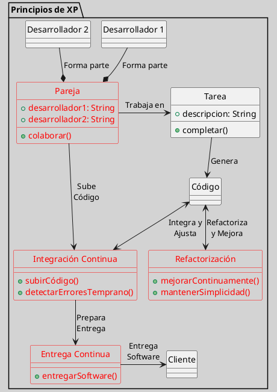

---
{"dg-publish":true,"permalink":"/050 Base de Conocimientos/200  Mi Zettelkasten/100 Docencia/IS1/2025/Clase 04 Modelos de Proceso de Software/Zk Extreme Programming (XP)/","tags":["digitalGarden","xp"]}
---

## Extreme Programming (XP)

### Definición
Extreme Programming es una metodología ágil que enfatiza la programación en pareja, la integración continua y la entrega continua de software funcional. Se centra en la simplicidad, la comunicación y la retroalimentación constante [[050 Base de Conocimientos/900 Biblioteca/Zk Lit (Beck, 2004) Extreme Programming Explained - Embrace Change\|(Beck, 2004)]].

### Principios

**Programación en Pareja** 
Dos desarrolladores trabajan juntos en una sola tarea.

**Integración Continua**
El código se integra frecuentemente para detectar errores temprano.

**Entrega Continua**
Se entrega software funcional al cliente de manera regular.

**Refactorización**
La [[050 Base de Conocimientos/200  Mi Zettelkasten/100 Docencia/IS1/2025/Clase 04 Modelos de Proceso de Software/Zk Refactorización\|refactorización]] se refiere la mejora continua del código para mantener su simplicidad.

Figura
_Principios de XP_

Fuente: Elaboración Propia

### Ventajas   
**Calidad del Código**
La programación en pareja y la refactorización mejoran la calidad del código.

**Flexibilidad**
Permite adaptarse rápidamente a cambios en los requisitos.        

**Retroalimentación**
La entrega continua proporciona retroalimentación temprana del cliente.

### Referencias
Ver [[050 Base de Conocimientos/900 Biblioteca/Zk Lit (Beck, 2004) Extreme Programming Explained - Embrace Change\|(Beck, 2004)]]
