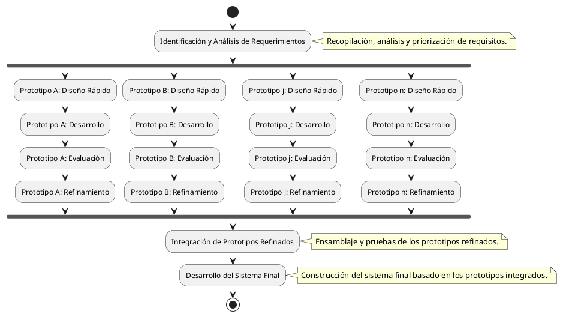

---
{"dg-publish":true,"permalink":"/050 Base de Conocimientos/200  Mi Zettelkasten/100 Docencia/IS1/2025/Clase 04 Modelos de Proceso de Software/Zk Modelo de Prototipos/","tags":["digitalGarden","modeloDeProceso"]}
---

## Modelo de Prototipos

### Definición

El Modelo de Prototipos es un paradigma de desarrollo de software que se centra en la creación iterativa de prototipos para explorar y refinar los requisitos del sistema antes de la implementación final. Este enfoque es especialmente valioso cuando los requisitos iniciales son ambiguos, incompletos o propensos a cambiar ([[050 Base de Conocimientos/900 Biblioteca/Zk Lit (Pressman, 2013) Ingeniería del Software - Un Enfoque Práctico (Séptima edición). McGraw-Hill Education\|Pressman, 2013]]; [[050 Base de Conocimientos/900 Biblioteca/Zk Lit (Sommerville, 2011) Ingeniería del Software\|Sommerville, 2011]]). A diferencia de los modelos lineales como la [[050 Base de Conocimientos/200  Mi Zettelkasten/100 Docencia/IS1/2025/Clase 04 Modelos de Proceso de Software/Zk Modelo en Cascada (Waterfall)\|cascada]], el modelo de prototipos adopta una naturaleza [[050 Base de Conocimientos/200  Mi Zettelkasten/100 Docencia/IS1/2025/Clase 04 Modelos de Proceso de Software/Zk Modelo Evolutivo (Prototipos y Espiral)\|evolutiva]], donde la comprensión del sistema se profundiza a través de la interacción con los prototipos ([[050 Base de Conocimientos/900 Biblioteca/Zk Lit (Pfleeger, 2006) Software Engineering Theory and Practice\|Pfleeger, 2006]]).

### Fases Principales

Figura
_Modelo Evolutivo por Prototipos_

Fuente: Elaboración propia.

**Identificación y Análisis de Requerimientos**
- Se inicia con la recopilación exhaustiva de requisitos, involucrando a usuarios y stakeholders.
- Esta fase también incluye el análisis y priorización de requisitos para enfocar el desarrollo en las funcionalidades más críticas.

**Diseño Rápido del Prototipo**
- Se crea un diseño preliminar que representa los aspectos clave del sistema.
- Este diseño se enfoca en la interfaz de usuario y las funcionalidades esenciales, priorizando la rapidez sobre la perfección.

**Desarrollo del Prototipo**
- El diseño se transforma en un prototipo funcional que permite la interacción del usuario.
- Se utilizan herramientas de desarrollo rápido para agilizar la creación del prototipo.

**Evaluación del Prototipo**
- Los usuarios prueban el prototipo y proporcionan retroalimentación detallada.
- Esta evaluación se centra en la usabilidad, funcionalidad y cumplimiento de los requisitos.

**Refinamiento del Prototipo**
- El prototipo se ajusta y mejora iterativamente basándose en la retroalimentación.
- Este ciclo de evaluación y refinamiento se repite hasta que los requisitos estén claros y validados.

**Desarrollo del Sistema Final**
- Con los requisitos clarificados, se procede al desarrollo del sistema final.
- El prototipo refinado puede servir como base para el sistema final, o puede desecharse y utilizarse la información recopilada.

### Ventajas

- Retroalimentación Temprana y Continua: Permite identificar y corregir errores y malentendidos desde las primeras etapas del desarrollo.
- Mayor Participación del Usuario: Involucra activamente a los usuarios en el proceso de desarrollo, aumentando la satisfacción y la aceptación del sistema final.
- Flexibilidad y Adaptabilidad: Facilita la incorporación de cambios en los requisitos a medida que avanza el proyecto.
- Reducción de Riesgos: Minimiza el riesgo de desarrollar un sistema que no cumpla con las expectativas del usuario o que no sea viable técnicamente.

## Desventajas

- Gestión de Prototipos: Requiere una gestión cuidadosa para evitar la proliferación de prototipos y la falta de control sobre las versiones.
- Complejidad en la Integración: La integración de múltiples prototipos en el sistema final puede ser compleja y requerir una planificación cuidadosa.
- Posible Desperdicio de Esfuerzo: Si los prototipos no se gestionan adecuadamente, puede haber un desperdicio de esfuerzo en la creación de prototipos que no se utilizan en el sistema final.
- Dependencia de un Buen Diseño Inicial: Si la arquitectura no está bien definida, pueden surgir problemas de escalabilidad y mantenimiento.

Adicionalmente podemos decir agregar:

- El modelo de prototipos es especialmente útil en proyectos con requisitos inciertos, interfaces de usuario complejas o tecnologías nuevas.
- La clave del éxito radica en la comunicación efectiva entre desarrolladores y usuarios, y en la capacidad de adaptar el prototipo a la retroalimentación recibida.
- Es común que se realicen trabajos en paralelo, donde varios equipos trabajan en diferentes prototipos, para acelerar el proceso de desarrollo.