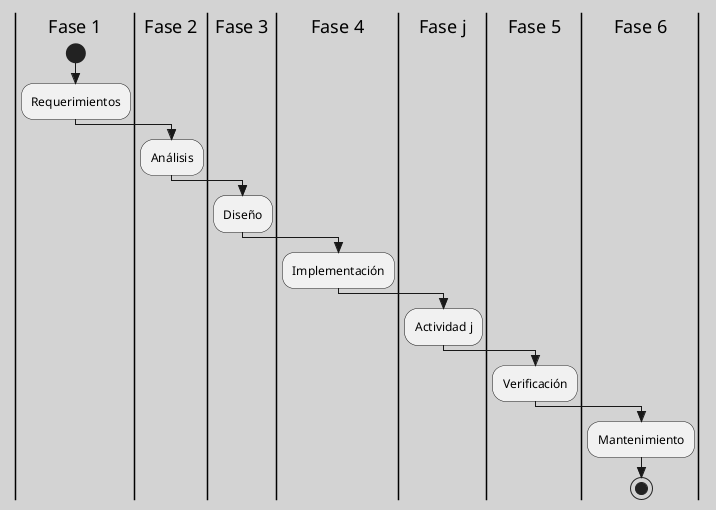

---
{"dg-publish":true,"permalink":"/050 Base de Conocimientos/200  Mi Zettelkasten/100 Docencia/IS1/2025/Clase 04 Modelos de Proceso de Software/Zk Modelo en Cascada (Waterfall Model)/","tags":["digitalGarden","modeloDeProceso"]}
---

## Modelo en Cascada

### Definición

El modelo en cascada, también conocido como el modelo de agua (Waterfall Model), es un enfoque secuencial de desarrollo de software en el que cada fase debe completarse antes de iniciar la siguiente. Este modelo se caracteriza por dividir el proceso de desarrollo en fases predefinidas y lineales, donde cada fase concluye antes de que comience la siguiente. Este modelo fue introducido en 1970 por [[050 Base de Conocimientos/900 Biblioteca/Zk Lit (Winston W. Royce) Wikipedia\|Winston W. Royce]] [[050 Base de Conocimientos/900 Biblioteca/Zk Lit (Pressman, 2013) Ingeniería del Software - Un Enfoque Práctico (Séptima edición). McGraw-Hill Education\|(Pressman, 2013]]; [[050 Base de Conocimientos/900 Biblioteca/Zk Lit (Sommerville, 2011) Ingeniería del Software\|Sommerville, 2011)]]. 

----
### Fases Principales

**Requerimientos**
- Recopilación y documentación detallada de las necesidades del cliente.
- Evaluación de los costos, la rentabilidad y la factibilidad del proyecto.
- Definición de los requisitos funcionales y no funcionales, incluyendo expectativas de los usuarios finales.
   
**Análisis**
- Entender y especificar detalladamente los requerimientos.

**Diseño**
- Creación de la arquitectura del sistema y diseño detallado de los componentes.
- Formulación de una solución específica basada en las exigencias, tareas y estrategias definidas en la fase anterior.
- Desarrollo de un plan de diseño detallado, incluyendo interfaces, entornos de trabajo, librerías, etc.
   
**Implementación**
- Traducción del diseño en código ejecutable.
- Programación del software, búsqueda de errores y pruebas unitarias.
- Desarrollo de los diversos componentes, su verificación a través de pruebas unitarias y su integración en el producto final

**Verificación**
- Pruebas para asegurar que el software cumple con los requisitos especificados.
- Integración del software en el entorno seleccionado, incluyendo pruebas beta y pruebas de aceptación.
- Verificación de que el software cumple con las exigencias definidas con anterioridad.

**Mantenimiento**
- Corrección de errores, mejoras y adaptaciones a nuevos entornos.
- Entrega del software, mantenimiento y mejora del producto final.
- Uso del producto por parte del cliente, detección de problemas y correcciones necesarias para garantizar la satisfacción del cliente

----
### Ventajas
- Estructura y Previsibilidad: Permite planificar y presupuestar con precisión.
- Disciplina y Organización: Garantiza una organización disciplinada y estructurada.
- Control de Gestión: Facilita el control de la gestión y la departamentalización en función de los plazos.
- Hábitos de Codificación: Establece buenos hábitos de codificación definiendo primero y aplicando después el diseño .

----
### Desventajas
- Poca Flexibilidad: No permite cambios significativos durante el proyecto.
- Falta de Adaptabilidad: No es adecuado para proyectos con cambios frecuentes o inciertos.

----
### Aplicaciones
- Proyectos con requerimientos estables y bien definidos: Ideal para software crítico donde los cambios son costosos y riesgosos.
- Entornos regulados: Ampliamente utilizado en industrias como la médica, aeroespacial y financiera, donde se requiere una documentación rigurosa y validación formal.
- Desarrollo de software gubernamental y militar: Sectores donde la certificación de calidad y cumplimiento normativo es esencial.

----
### Conclusión
El modelo en cascada es un enfoque clásico y estructurado para el desarrollo de software, pero su poca flexibilidad puede ser un obstáculo en proyectos con requisitos cambiantes. Aunque es popular por su estructura y previsibilidad, es importante considerar las ventajas e inconvenientes antes de aplicarlo a un proyecto específico [[050 Base de Conocimientos/900 Biblioteca/Zk Lit (Pfleeger, 2006) Software Engineering Theory and Practice\|(Pfleeger, 2006]]; [[050 Base de Conocimientos/900 Biblioteca/Zk Lit (Pressman, 2013) Ingeniería del Software - Un Enfoque Práctico (Séptima edición). McGraw-Hill Education\|Pressman, 2013]]; [[050 Base de Conocimientos/900 Biblioteca/Zk Lit (Sommerville, 2011) Ingeniería del Software\|Sommerville, 2011)]].