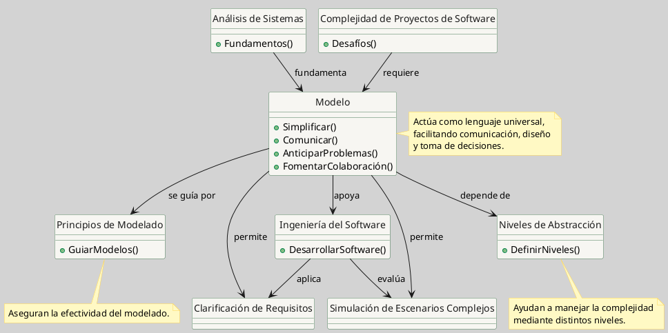

---
{"dg-publish":true,"permalink":"/050 Base de Conocimientos/200  Mi Zettelkasten/100 Docencia/IS1/2025/Clase 05 El Modelado en la Ingeniería del Software/Zk !MOC El Modelado en la Ingeniería del Software/","tags":["digitalGarden","moc","software","proceso"]}
---

## El Modelado en la Ingeniería del Software

### Introducción

En el dinámico y complejo mundo de la [[050 Base de Conocimientos/200  Mi Zettelkasten/100 Docencia/IS1/2025/Clase 02 Introducción a la Ingeniería del Software/Zk Ingeniería del Software\|Ingeniería del Software]], la habilidad gestionar la complejidad es primordial. Este MOC se adentra en los pilares fundamentales que sustentan el desarrollo de sistemas robustos y eficientes. Comenzaremos explorando los **objetivos del Análisis de Sistemas**, una fase crítica donde se desentrañan los requisitos y se evalúa la viabilidad de los proyectos, sentando las bases para un desarrollo exitoso. A continuación, nos enfrentaremos a la **complejidad inherente de los proyectos de software**, un desafío multifacético que demanda estrategias claras y precisas para garantizar la calidad y la escalabilidad de las soluciones.

En este contexto, los **modelos** emergen como protagonistas. Son herramientas que trascienden la mera representación gráfica, convirtiéndose en el lenguajel que facilita la comunicación, el diseño y la toma de decisiones. A través de este MOC, exploraremos cómo los modelos permiten transformar la abstracción en claridad, permitiendo a los ingenieros de software construir sistemas que no solo cumplen con los requisitos funcionales, sino que también se adaptan a las necesidades cambiantes del mundo digital.

### Desarrollo

#### El Análisis de Sistemas

El [[050 Base de Conocimientos/200  Mi Zettelkasten/100 Docencia/IS1/2025/Clase 05 El Modelado en la Ingeniería del Software/Zk Análisis de Sistemas\|Análisis de Sistemas]] en [[050 Base de Conocimientos/200  Mi Zettelkasten/100 Docencia/IS1/2025/Clase 02 Introducción a la Ingeniería del Software/Zk Ingeniería del Software\|Ingeniería del Software]] se centra en comprender profundamente los requisitos, la viabilidad, las funcionalidades y las limitaciones de un sistema, así como en establecer una línea base sólida para su desarrollo.

Entre sus [[050 Base de Conocimientos/200  Mi Zettelkasten/100 Docencia/IS1/2025/Clase 05 El Modelado en la Ingeniería del Software/Zk Objetivos del Análisis de Sistemas\|objetivos básicos]] se encuentran la identificación precisa de requisitos, la evaluación exhaustiva de la viabilidad del proyecto, la asignación efectiva de funcionalidades, y la identificación de limitaciones. Además, busca mejorar el rendimiento general del sistema, garantizar su fiabilidad, optimizar la experiencia del usuario, facilitar la toma de decisiones informadas, apoyar la escalabilidad, asegurar la seguridad y el cumplimiento normativo, y promover la rentabilidad del proyecto.

----
#### Complejidad de los Proyectos

La [[050 Base de Conocimientos/200  Mi Zettelkasten/100 Docencia/IS1/2025/Clase 05 El Modelado en la Ingeniería del Software/Zk Complejidad de los Proyectos de Software\|complejidad de los proyectos]] de software crece en paralelo con el tamaño y la funcionalidad del sistema. Esta complejidad puede manifestarse en tres dimensiones clave: estructural, lógica y procesal, cada una de las cuales impacta significativamente en el desarrollo, mantenimiento y escalabilidad del software.

----
#### Los Modelos en la Ingeniería del Software

Tras explorar los [[050 Base de Conocimientos/200  Mi Zettelkasten/100 Docencia/IS1/2025/Clase 05 El Modelado en la Ingeniería del Software/Zk Objetivos del Análisis de Sistemas\|objetivos del Análisis de Sistemas]], donde se establecen los cimientos para el desarrollo del software, y reconocer la [[050 Base de Conocimientos/200  Mi Zettelkasten/100 Docencia/IS1/2025/Clase 05 El Modelado en la Ingeniería del Software/Zk Complejidad de los Proyectos de Software\|complejidad inherente de los proyectos de software]], nos adentramos en el núcleo del modelado. En la [[050 Base de Conocimientos/200  Mi Zettelkasten/100 Docencia/IS1/2025/Clase 02 Introducción a la Ingeniería del Software/Zk Ingeniería del Software\|ingeniería de software]], los [[050 Base de Conocimientos/200  Mi Zettelkasten/100 Docencia/IS1/2025/Clase 05 El Modelado en la Ingeniería del Software/Zk Modelo - Definición\|modelos]] emergen como herramientas esenciales para gestionar esta complejidad.

Los modelos son representaciones simplificadas de sistemas o procesos, diseñadas para capturar los aspectos esenciales que facilitan la comprensión y el análisis. La [[050 Base de Conocimientos/200  Mi Zettelkasten/100 Docencia/IS1/2025/Clase 05 El Modelado en la Ingeniería del Software/Zk Modelo - Definición\|definición de modelo]] en este contexto se enfoca en la capacidad de abstracción, permitiendo a los equipos comunicarse eficazmente, diseñar de manera proactiva y respaldar la toma de decisiones estratégicas. Los [[050 Base de Conocimientos/200  Mi Zettelkasten/100 Docencia/IS1/2025/Clase 05 El Modelado en la Ingeniería del Software/Zk Objetivos de los Modelos en Ingeniería de Software\|objetivos de los modelos]] abarcan desde la clarificación de requisitos hasta la simulación de escenarios complejos, proporcionando una base sólida para el desarrollo de software.

La [[050 Base de Conocimientos/200  Mi Zettelkasten/100 Docencia/IS1/2025/Clase 05 El Modelado en la Ingeniería del Software/Zk La Importancia del Modelado en el Desarrollo de Sistemas\|importancia del modelado]] radica en su capacidad para gestionar la complejidad, mejorar la colaboración entre equipos y anticipar problemas potenciales. Los modelos pueden ser abordados desde una [[050 Base de Conocimientos/200  Mi Zettelkasten/100 Docencia/IS1/2025/Clase 05 El Modelado en la Ingeniería del Software/Zk Aproximación Empírica - Usos Prácticos de los Modelos en Ingeniería del Software\|perspectiva empírica]], enfocándose en usos prácticos, o desde una [[050 Base de Conocimientos/200  Mi Zettelkasten/100 Docencia/IS1/2025/Clase 05 El Modelado en la Ingeniería del Software/Zk Aproximación Formal - Funciones Técnicas y Organizativas de los Modelos\|perspectiva formal]], destacando sus funciones técnicas y organizativas.

Para asegurar que los modelos sean efectivos, se deben seguir ciertos [[050 Base de Conocimientos/200  Mi Zettelkasten/100 Docencia/IS1/2025/Clase 05 El Modelado en la Ingeniería del Software/Zk Principios del Modelado\|principios del modelado]], como la abstracción, simplificación y reutilización. Además, los modelos pueden ser representados a diferentes [[050 Base de Conocimientos/200  Mi Zettelkasten/100 Docencia/IS1/2025/Clase 05 El Modelado en la Ingeniería del Software/Zk Niveles de Abstracción en el Modelado de Software\|niveles de abstracción]], desde el conceptual hasta el físico. Finalmente, la [[050 Base de Conocimientos/200  Mi Zettelkasten/100 Docencia/IS1/2025/Clase 05 El Modelado en la Ingeniería del Software/Zk Componentes y Estructura de un Modelo\|estructura de un modelo]] incluye componentes y relaciones que definen cómo se organiza y representa el sistema.

----
### Conclusiones
A lo largo de este MOC, hemos recorrido un camino que nos ha llevado desde los fundamentos del [[050 Base de Conocimientos/200  Mi Zettelkasten/100 Docencia/IS1/2025/Clase 05 El Modelado en la Ingeniería del Software/Zk Análisis de Sistemas\|Análisis de Sistemas]], donde se establecen los pilares para un desarrollo eficiente, hasta la [[050 Base de Conocimientos/200  Mi Zettelkasten/100 Docencia/IS1/2025/Clase 05 El Modelado en la Ingeniería del Software/Zk Complejidad de los Proyectos de Software\|la complejidad inherente a los proyectos de software]], un desafío que demanda estrategias claras y precisas. En este recorrido, hemos adelantado que los [[050 Base de Conocimientos/200  Mi Zettelkasten/100 Docencia/IS1/2025/Clase 05 El Modelado en la Ingeniería del Software/Zk Modelo - Definición\|modelos]] emergen como herramientas indispensables, actuando como puentes entre la abstracción y la claridad en el desarrollo de software.

Hemos mencionado que los [[050 Base de Conocimientos/200  Mi Zettelkasten/100 Docencia/IS1/2025/Clase 05 El Modelado en la Ingeniería del Software/Zk Modelo - Definición\|modelos]], más allá de ser simples representaciones gráficas, se convierten en un lenguaje universal que facilita la comunicación, el diseño y la toma de decisiones. Su capacidad para simplificar sistemas complejos, anticipar problemas y fomentar la colaboración los convierte en aliados imprescindibles en la [[050 Base de Conocimientos/200  Mi Zettelkasten/100 Docencia/IS1/2025/Clase 02 Introducción a la Ingeniería del Software/Zk Ingeniería del Software\|Ingeniería del Software]].

Desde la **clarificación de requisitos** hasta la **simulación de escenarios complejos**, los [[050 Base de Conocimientos/200  Mi Zettelkasten/100 Docencia/IS1/2025/Clase 05 El Modelado en la Ingeniería del Software/Zk Modelo - Definición\|modelos]] nos permiten construir sistemas robustos, eficientes y adaptables. Al seguir [[050 Base de Conocimientos/200  Mi Zettelkasten/100 Docencia/IS1/2025/Clase 05 El Modelado en la Ingeniería del Software/Zk Principios del Modelado\|principios de modelado]] sólidos y comprender los [[050 Base de Conocimientos/200  Mi Zettelkasten/100 Docencia/IS1/2025/Clase 05 El Modelado en la Ingeniería del Software/Zk Niveles de Abstracción en el Modelado de Software\|noveles de abstracción]], podemos asegurar que nuestros modelos sean efectivos y útiles.

