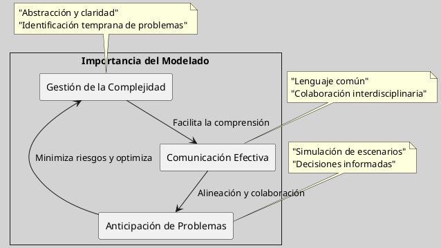

---
{"dg-publish":true,"permalink":"/050 Base de Conocimientos/200  Mi Zettelkasten/100 Docencia/IS1/2025/Clase 05 El Modelado/Zk La Importancia del Modelado en el Desarrollo de Sistemas/","tags":["digitalGarden"]}
---

## La Importancia del Modelado en el Desarrollo de Sistemas

En el ámbito de la [[050 Base de Conocimientos/200  Mi Zettelkasten/100 Docencia/IS1/2025/Clase 02 Introducción a la Ingeniería del Software/Zk La Ingeniería del Software\|ingeniería de software]], donde los sistemas pueden alcanzar alta [[050 Base de Conocimientos/200  Mi Zettelkasten/100 Docencia/IS1/2025/Clase 05 El Modelado/Zk Complejidad de los Proyectos de Software\|complejidad]], el [[050 Base de Conocimientos/200  Mi Zettelkasten/100 Docencia/IS1/2025/Clase 05 El Modelado/Zk Modelo - Definición\|modelado]] se convierte en una práctica fundamental. Su importancia radica en su capacidad para transformar la abstracción en claridad, facilitando la gestión de la complejidad inherente al desarrollo de software.

**Gestión de la Complejidad y Claridad Conceptual**

Modelar no es simplemente dibujar diagramas; es un ejercicio de abstracción que permite a los ingenieros de software capturar la esencia de un sistema, ignorando detalles superfluos que podrían oscurecer su comprensión. Al representar visualmente la arquitectura, los componentes y las interacciones de un sistema, el modelado proporciona una hoja de ruta clara que guía el desarrollo y facilita la identificación de posibles problemas desde las etapas iniciales del proyecto [[050 Base de Conocimientos/900 Biblioteca/Zk Lib (Rumbaugh et al.,2000) Lenguaje Unificado de Modelado. Manual de Referencia\|(Rumbaugh et al., 2000)]].

**Comunicación Efectiva y Colaboración Interdisciplinaria**

En proyectos de software, donde convergen diversas disciplinas y roles, la comunicación efectiva es crucial. Los modelos actúan como un lenguaje común, permitiendo que desarrolladores, analistas, diseñadores y clientes compartan una comprensión unificada del sistema. Al visualizar los requisitos, la funcionalidad y el comportamiento del software, los modelos facilitan la colaboración, reducen la ambigüedad y aseguran que todos los involucrados estén alineados en cuanto a los objetivos y el alcance del proyecto [[050 Base de Conocimientos/900 Biblioteca/Zk Lib (Rumbaugh et al.,2000) Lenguaje Unificado de Modelado. Manual de Referencia\|(Rumbaugh et al., 2000)]].

**Anticipación y Resolución Proactiva de Problemas**

Modelar no solo describe el presente, sino que también permite anticipar el futuro. Al simular diferentes escenarios y evaluar el impacto de diversas decisiones de diseño, los modelos ayudan a identificar posibles cuellos de botella, riesgos y errores antes de que se materialicen durante la implementación. Esta capacidad de anticipación permite a los equipos de desarrollo tomar decisiones informadas, minimizar los riesgos y optimizar el rendimiento del software, ahorrando tiempo, recursos y evitando costosos retrabajos [[050 Base de Conocimientos/900 Biblioteca/Zk Lit (Sommerville, 2011) Ingeniería del Software\|(Sommerville, 2011)]].

