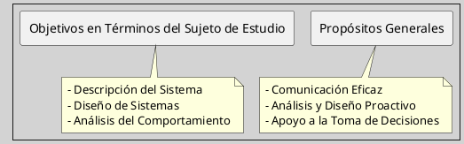

---
{"dg-publish":true,"permalink":"/050 Base de Conocimientos/200  Mi Zettelkasten/100 Docencia/IS1/2025/Clase 05 El Modelado/Zk Objetivos de los Modelos en Ingeniería de Software/","tags":["digitalGarden"]}
---

## Objetivos de los Modelos en Ingeniería de Software

Los [[050 Base de Conocimientos/200  Mi Zettelkasten/100 Docencia/IS1/2025/Clase 05 El Modelado/Zk Modelo - Definición\|modelos]] desempeñan un rol importante en el desarrollo de software, facilitando la comprensión, el diseño y la toma de decisiones. A continuación, se describen sus principales propósitos:

### Objetivos Generales de los Modelos

**Comunicación Eficaz**

Los modelos actúan como un lenguaje universal, permitiendo que desarrolladores, clientes y otros interesados compartan una comprensión común del sistema o proceso. Al representar visualmente la funcionalidad y la estructura del software, los modelos eliminan ambigüedades y aseguran que todos los participantes estén alineados en cuanto a los objetivos y el funcionamiento del proyecto.

**Análisis y Diseño Proactivo**

Los modelos son herramientas poderosas para el análisis y diseño de sistemas complejos. Permiten a los equipos identificar posibles problemas y cuellos de botella antes de que se materialicen durante la implementación. Al simular diferentes escenarios y evaluar el impacto de diversas decisiones de diseño, los modelos ayudan a minimizar los riesgos y a optimizar el rendimiento del software.

**Apoyo a la Toma de Decisiones Estratégicas**

Los modelos facilitan la simulación de diversos escenarios, lo que permite a los responsables de la toma de decisiones evaluar los posibles resultados y seleccionar la opción más adecuada. Al proporcionar una visión clara y concisa de las implicaciones de cada elección, los modelos ayudan a minimizar la incertidumbre y a maximizar el éxito del proyecto.

### **Objetivos en Términos del Sujeto de Estudio**

**Descripción del Sistema**
Los modelos pueden ser utilizados para describir un sistema existente, identificando sus componentes y relaciones.

**Diseño de Sistemas**
Los modelos pueden ser utilizados para diseñar nuevos sistemas, definiendo los componentes y relaciones necesarias.

**Análisis del Comportamiento**
Los modelos pueden ser utilizados para analizar el comportamiento de un sistema bajo diferentes condiciones, prediciendo cómo se comportará en diferentes escenarios.

### Esquema Gráfico
**Figura**
_Propósitos del Modelado_

Fuente: Elaboración propia.

