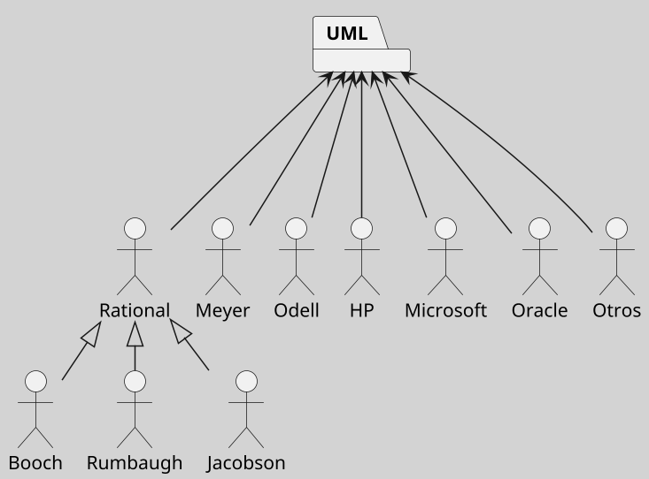

---
{"dg-publish":true,"permalink":"/050 Base de Conocimientos/200  Mi Zettelkasten/100 Docencia/IS1/2025/Clase 06 Introducción al UML/Zk Historia del Lenguaje Unificado del Modelado (UML)/","tags":["digitalGarden"]}
---

## Historia del Lenguaje Unificado del Modelado (UML)

La historia del [[050 Base de Conocimientos/200  Mi Zettelkasten/010 Informática/Zk UML - El Lenguaje Unificado de Modelado\|Lenguaje Unificado de Modelado (UML)]] se remonta a la década de 1990, cuando surgió la necesidad de unificar las diversas notaciones de métodos de análisis y diseño orientados a objetos [[050 Base de Conocimientos/900 Biblioteca/Zk Lit (Booch et al., 2006) Booch, G., Rumbaugh, J., y Jacobson, I. (2006). El lenguaje Unificado de Modelado - Guía del Usuario (2a ed). Addison-Wesley.\|(Booch et al., 2006]]).

### Antecedentes

A finales de los años 80 y principios de los 90, la industria del software experimentó un crecimiento significativo en el uso de la programación orientada a objetos. Sin embargo, esto llevó a una proliferación de métodos y notaciones diferentes, lo que dificultaba la comunicación entre los desarrolladores. Los métodos más populares de la época incluyeron el **Método Booch** de Grady Booch, la **Técnica de Modelado Orientado a Objetos (OMT)** de James Rumbaugh, y el **Método OOSE** de Ivar Jacobson.

### Creación del UML

En octubre de 1994, James Rumbaugh se unió a Rational Software, fundada por Grady Booch. Poco después, en 1995, se les unió Ivar Jacobson, conocidos colectivamente como "los tres amigos". Su objetivo era unificar los métodos existentes y crear un lenguaje de modelado estándar. En 1996, se formó el consorcio UML Partners para completar las especificaciones del UML y proponerlo al [Object Management Group (OMG)](https://www.omg.org)

**Figura**
__Consorcio UML__

Nota: Grafico de elaboración propia basado en [(Wikipedia: UML Partners, s.f.)](https://en.wikipedia.org/wiki/UML_Partners)

### Evolución del UML

- UML 1.1 (1997)
	La primera versión de [[050 Base de Conocimientos/200  Mi Zettelkasten/010 Informática/Zk UML - El Lenguaje Unificado de Modelado\|UML]] se presentó en **enero de 1997**, y la versión 1.1 fue adoptada por la OMG en **noviembre de 1997**. Aunque inicialmente dominada por la notación OMT, UML 1.x integró elementos de los métodos de Booch y Jacobson.

- UML 1.2 (1999)

- UML 1.3 (2000)

- UML 1.4 (2001)

- UML 1.4 (2003)

- UML 1.4 (2001)

- UML 1.4 (2003)

- UML 2.0 (2005)
	En **2005**, se lanzó UML 2.0, que corrigió defectos y mejoró la integración semántica.

- UML 2.1.2 (2007)

- UML 2.2 (2009)

- UML 2.3 (2010)

- UML 2.4.1 (2011)

- UML 2.5.1 (2017)
	Lanzada formalmente en diciembre de 2017, es la más reciente y ampliamente utilizada. Ofrece una [[050 Base de Conocimientos/200  Mi Zettelkasten/100 Docencia/IS1/2025/Clase 06 Introducción al UML/Zk Diagramas del Lenguaje Unificado de Modelado (UML) v2.5.1\|amplia gama de diagramas]] para [[050 Base de Conocimientos/200  Mi Zettelkasten/100 Docencia/IS1/2025/Clase 06 Introducción al UML/Zk UML - Una Herramienta para Visualizar, Especificar, Construir y Documentar Proyectos de Software\|visualizar, especificar, construir y documentar]] sistemas complejos [[050 Base de Conocimientos/900 Biblioteca/Zk Lit (OMG, 2017) UML Specifications\|(OMG, 2017)]].

El [[050 Base de Conocimientos/200  Mi Zettelkasten/010 Informática/Zk UML - El Lenguaje Unificado de Modelado\|UML]] ha evolucionado desde su creación en la década de 1990 hasta convertirse en un estándar global para el modelado de sistemas de software. Su historia refleja la colaboración entre pioneros en la [[050 Base de Conocimientos/200  Mi Zettelkasten/100 Docencia/IS1/2025/Clase 02 Introducción a la Ingeniería del Software/Zk Ingeniería del Software\|Ingeniería del Software]] y la necesidad continua de mejorar y estandarizar las prácticas de modelado.