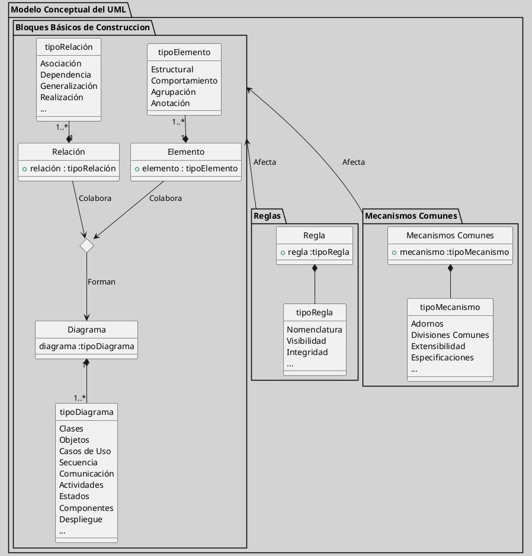

---
{"dg-publish":true,"permalink":"/050 Base de Conocimientos/200  Mi Zettelkasten/100 Docencia/IS1/2025/Clase 06 Introducción al UML/Zk Modelo Conceptual del UML/","tags":["digitalGarden"]}
---

## Modelo Conceptual del UML

El [[050 Base de Conocimientos/200  Mi Zettelkasten/010 Informática/Zk UML - El Lenguaje Unificado de Modelado\|Lenguaje Unificado de Modelado]] es una herramienta que proporciona un estándar de representar artefactos de software. Su modelo conceptual se basa en tres elementos principales ([[050 Base de Conocimientos/900 Biblioteca/Zk Lit (OMG, 2017) UML Specifications\|OMG, 2017]]; [[050 Base de Conocimientos/900 Biblioteca/Zk Lit (Booch et al., 2006) Booch, G., Rumbaugh, J., y Jacobson, I. (2006). El lenguaje Unificado de Modelado - Guía del Usuario. Addison-Wesley\|Booch et al., 2006]]). :

1. **Bloques de Básicos de Construcción**, son los elementos fundamentales que componen los [[050 Base de Conocimientos/200  Mi Zettelkasten/100 Docencia/IS1/2025/Clase 06 Introducción al UML/Zk Diagramas del Lenguaje Unificado de Modelado (UML) v2.5.1\|modelos UML]].
2. **Reglas**, comprende las normas que determinan cómo se combinan los Bloques Básicos de Construcción.
3. **Mecanismos Comunes**, son convenciones que se aplican a los Bloques Básicos de Construcción.

**Figura**
_Modelo Conceptual del UML_

{ #c3673e}

Fuente: Elaboración propia

----
### Bloques Básicos de Construcción

Los bloques de construcción básicos de UML se dividen en tres categorías:

----
#### Elementos

- **Estructurales**: Representan las partes estáticas de un sistema, como clases, objetos e interfaces.
- **Comportamiento**: Representan los aspectos dinámicos de un sistema, como interacciones y máquinas de estados.
- **Agrupación**: Organizan los elementos en grupos, como paquetes.
- **Anotación**: Proporcionan comentarios y explicaciones, como notas.

----
#### Relaciones

- [[050 Base de Conocimientos/200  Mi Zettelkasten/100 Docencia/IS1/2025/Clase 08 Modelo Conceptual del UML - Elementos, Relaciones, Reglas y Mecanismos Comunes/Zk Modelo Conceptual del UML (Relaciones)#Asociación\|Asociación]]: Representa una conexión entre elementos.
- [[050 Base de Conocimientos/200  Mi Zettelkasten/100 Docencia/IS1/2025/Clase 08 Modelo Conceptual del UML - Elementos, Relaciones, Reglas y Mecanismos Comunes/Zk Modelo Conceptual del UML (Relaciones)#Dependencia\|Dependencia]]: Indica que un elemento depende de otro.
- [[050 Base de Conocimientos/200  Mi Zettelkasten/100 Docencia/IS1/2025/Clase 08 Modelo Conceptual del UML - Elementos, Relaciones, Reglas y Mecanismos Comunes/Zk Modelo Conceptual del UML (Relaciones)#Generalización\|Generalización]]: Muestra una relación "es un tipo de".
- [[050 Base de Conocimientos/200  Mi Zettelkasten/100 Docencia/IS1/2025/Clase 08 Modelo Conceptual del UML - Elementos, Relaciones, Reglas y Mecanismos Comunes/Zk Modelo Conceptual del UML (Relaciones)#Realización\|Realización]]: Conecta una interfaz con su implementación.

----
#### Diagramas

Son representaciones gráficas de conjuntos de elementos y relaciones. 
Algunos diagramas comunes:

- [[050 Base de Conocimientos/200  Mi Zettelkasten/100 Docencia/IS1/2025/Clase 07 Modelo Conceptual del UML - Diagramas/Zk UML Diagrama de Casos de Uso\|Casos de Uso]]: Describen las interacciones entre usuarios y el sistema.
- [[050 Base de Conocimientos/200  Mi Zettelkasten/100 Docencia/IS1/2025/Clase 07 Modelo Conceptual del UML - Diagramas/Zk UML Diagrama de Clases\|Clases]]: Muestran la estructura estática de un sistema.
- [[050 Base de Conocimientos/200  Mi Zettelkasten/100 Docencia/IS1/2025/Clase 07 Modelo Conceptual del UML - Diagramas/Zk UML Diagrama de Objetos\|Objetos]]: Representan instancias de clases.
- **Interacción**:
	- [[050 Base de Conocimientos/200  Mi Zettelkasten/100 Docencia/IS1/2025/Clase 07 Modelo Conceptual del UML - Diagramas/Zk UML Diagrama de Secuencia\|Secuencia]]: Muestra la secuencia de mensajes entre objetos, con un énfasis en lo temporal.
	- [[050 Base de Conocimientos/200  Mi Zettelkasten/100 Docencia/IS1/2025/Clase 07 Modelo Conceptual del UML - Diagramas/Zk UML Diagrama de Comunicación\|Colaboración o Comunicación]]: Muestra la secuencia de mensajes entre objetos, con un énfasis estructural.
- [[050 Base de Conocimientos/200  Mi Zettelkasten/100 Docencia/IS1/2025/Clase 07 Modelo Conceptual del UML - Diagramas/Zk UML Diagrama de Actividades\|Actividades]]: Modelan el flujo de control de un proceso.
- [[050 Base de Conocimientos/200  Mi Zettelkasten/100 Docencia/IS1/2025/Clase 07 Modelo Conceptual del UML - Diagramas/Zk UML Diagrama de Estados\|Estados]]: Describen los posibles estados de un objeto y sus transiciones.
- [[050 Base de Conocimientos/200  Mi Zettelkasten/100 Docencia/IS1/2025/Clase 07 Modelo Conceptual del UML - Diagramas/Zk UML Diagrama de Componentes\|Componentes]]: Muestran la arquitectura de software.
- [[050 Base de Conocimientos/200  Mi Zettelkasten/100 Docencia/IS1/2025/Clase 07 Modelo Conceptual del UML - Diagramas/Zk UML Diagrama de Paquetes\|Paquetes]]: Permite la agrupación de elementos o diagramas.
- [[050 Base de Conocimientos/200  Mi Zettelkasten/100 Docencia/IS1/2025/Clase 07 Modelo Conceptual del UML - Diagramas/Zk UML Diagrama de Despliegue\|Despliegue]]: Representan la distribución física de componentes en hardware.
- Etc.

----
### Reglas

Las reglas de UML definen cómo se utilizan los Bloques Básicos de Construcción:

- **Nomenclatura**: Establece convenciones para nombrar elementos.
- **Visibilidad**: Especifica quién puede acceder a los elementos.
- **Integridad**: Asegura la coherencia y validez del modelo.
- Etc.

----
### Mecanismos Comunes

Los mecanismos comunes son herramientas que se aplican en todo UML:

- **Especificaciones**: Proporcionan descripciones detalladas de los elementos.
- **Adornos**: Aportan información adicional a los elementos gráficos.
- **Extensibilidad**: Permite personalizar y ampliar UML, por ejemplo [[Zk Estereotipos UML\|Estereotipos]].
- **Divisiones comunes**: Permiten la separación de modelos en diferentes vistas.

