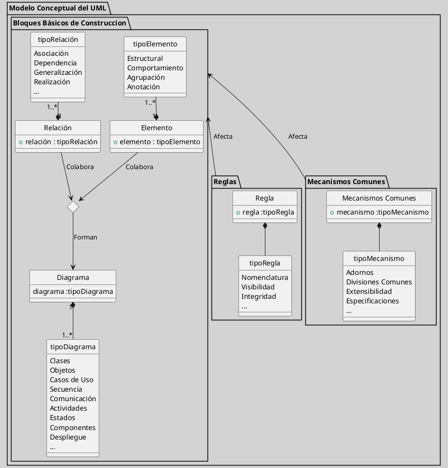

---
{"dg-publish":true,"permalink":"/050 Base de Conocimientos/200  Mi Zettelkasten/100 Docencia/IS1/2025/Clase 07 Modelo Conceptual del UML - Diagramas/Zk !MOC Modelo Conceptual del UML (Diagramas)/","tags":["digitalGarden","moc","UML"]}
---

## MOC Modelo Conceptual del UML (Diagramas)

### Introducción

El [[050 Base de Conocimientos/200  Mi Zettelkasten/100 Docencia/IS1/2025/Clase 06 Introducción al UML/Zk Modelo Conceptual del UML\|Modelo Conceptual del UML]] es el fundamento sobre el cual se construye el [[050 Base de Conocimientos/200  Mi Zettelkasten/010 Informática/Zk UML - El Lenguaje Unificado de Modelado\|Lenguaje Unificado de Modelado (UML)]]. Este modelo conceptual define los elementos y estructuras que permiten a los desarrolladores de software [[050 Base de Conocimientos/200  Mi Zettelkasten/100 Docencia/IS1/2025/Clase 06 Introducción al UML/Zk UML - Una Herramienta para Visualizar, Especificar, Construir y Documentar Proyectos de Software\|visualizar, especificar, construir y documentar]] sistemas complejos de manera efectiva. El UML se ha convertido en un estándar ampliamente aceptado en la industria del software, gracias a su capacidad para proporcionar una visión integral y coherente del diseño de sistemas.

En la clase anterior, exploramos los [[050 Base de Conocimientos/200  Mi Zettelkasten/100 Docencia/IS1/2025/Clase 06 Introducción al UML/Zk Historia del Lenguaje Unificado del Modelado (UML)\|orígenes, antecedentes y precursores]] del UML y su [[050 Base de Conocimientos/200  Mi Zettelkasten/100 Docencia/IS1/2025/Clase 06 Introducción al UML/Zk Actualidad, Perspectivas y Futuro del Lenguaje Unificado de Modelado (UML)\|relevancia y evolución]], así como su papel en el desarrollo de software.

En la clase de hoy, profundizaremos en los principales diagramas que componen el[[050 Base de Conocimientos/200  Mi Zettelkasten/100 Docencia/IS1/2025/Clase 06 Introducción al UML/Zk Modelo Conceptual del UML\|Modelo Conceptual del UML]]. Estos diagramas, que incluyen [[050 Base de Conocimientos/200  Mi Zettelkasten/100 Docencia/IS1/2025/Clase 07 Modelo Conceptual del UML - Diagramas/Zk UML Diagrama de Clases\|clases]], [[050 Base de Conocimientos/200  Mi Zettelkasten/100 Docencia/IS1/2025/Clase 07 Modelo Conceptual del UML - Diagramas/Zk UML Diagrama de Objetos\|objetos]], [[050 Base de Conocimientos/200  Mi Zettelkasten/100 Docencia/IS1/2025/Clase 07 Modelo Conceptual del UML - Diagramas/Zk UML Diagrama de Casos de Uso\|casos de uso]], [[050 Base de Conocimientos/200  Mi Zettelkasten/100 Docencia/IS1/2025/Clase 07 Modelo Conceptual del UML - Diagramas/Zk UML Diagrama de Secuencia\|secuencia]], [[050 Base de Conocimientos/200  Mi Zettelkasten/100 Docencia/IS1/2025/Clase 07 Modelo Conceptual del UML - Diagramas/Zk UML Diagrama de Comunicación\|comunicación]], [[050 Base de Conocimientos/200  Mi Zettelkasten/100 Docencia/IS1/2025/Clase 07 Modelo Conceptual del UML - Diagramas/Zk UML Diagrama de Actividades\|actividades]], [[050 Base de Conocimientos/200  Mi Zettelkasten/100 Docencia/IS1/2025/Clase 07 Modelo Conceptual del UML - Diagramas/Zk UML Diagrama de Estados\|estados]], [[050 Base de Conocimientos/200  Mi Zettelkasten/100 Docencia/IS1/2025/Clase 07 Modelo Conceptual del UML - Diagramas/Zk UML Diagrama de Componentes\|componentes]], [[050 Base de Conocimientos/200  Mi Zettelkasten/100 Docencia/IS1/2025/Clase 07 Modelo Conceptual del UML - Diagramas/Zk UML Diagrama de Paquetes\|paquetes]] y [[050 Base de Conocimientos/200  Mi Zettelkasten/100 Docencia/IS1/2025/Clase 07 Modelo Conceptual del UML - Diagramas/Zk UML Diagrama de Despliegue\|despliegue]], son esenciales para modelar tanto la [[050 Base de Conocimientos/200  Mi Zettelkasten/100 Docencia/IS1/2025/Clase 07 Modelo Conceptual del UML - Diagramas/Zk Diagramas UML 2.5.1 (Estructurales)\|estructura estática]] como el [[050 Base de Conocimientos/200  Mi Zettelkasten/100 Docencia/IS1/2025/Clase 07 Modelo Conceptual del UML - Diagramas/Zk Diagramas UML 2.5.1 (Dinámicos)\|comportamiento dinámico]] de los sistemas.

Buscamos además comprender cómo UML facilita la comunicación entre los equipos de desarrollo, mejora la calidad del software y reduce los riesgos asociados con la [[050 Base de Conocimientos/200  Mi Zettelkasten/100 Docencia/IS1/2025/Clase 05 El Modelado en la Ingeniería del Software/Zk Complejidad de los Proyectos de Software\|complejidad]] de los sistemas modernos.

### Desarrollo
Partimos de la figura del Modelo Conceptual del UML que vimos en la clase anterior.

<a class="markdown-embed-link" href="/050-base-de-conocimientos/200-mi-zettelkasten/100-docencia/is-1/2025/clase-06-introduccion-al-uml/zk-modelo-conceptual-del-uml/#c3673e" aria-label="Open link"><svg xmlns="http://www.w3.org/2000/svg" width="24" height="24" viewBox="0 0 24 24" fill="none" stroke="currentColor" stroke-width="2" stroke-linecap="round" stroke-linejoin="round" class="svg-icon lucide-link"><path d="M10 13a5 5 0 0 0 7.54.54l3-3a5 5 0 0 0-7.07-7.07l-1.72 1.71"></path><path d="M14 11a5 5 0 0 0-7.54-.54l-3 3a5 5 0 0 0 7.07 7.07l1.71-1.71"></path></svg></a>

### Diagramas

Partiendo del [[050 Base de Conocimientos/200  Mi Zettelkasten/100 Docencia/IS1/2025/Clase 06 Introducción al UML/Zk Modelo Conceptual del UML\|Modelo Conceptual del UML]], dentro de los **Bloques Básicos de Construcción**, encontramos los **Diagramas**, que son fundamentales para modelar sistemas complejos. Como se puede observar en el gráfico, el UML 2.5.1 incluye una variedad de diagramas, con un total de 14 tipos distintos. En esta clase, realizaremos un recorrido por los 10 diagramas más relevantes, con el objetivo de proporcionar una visión general de su potencial y permitir que visualicemos cómo se pueden aplicar en la práctica.

La idea es que, al final de esta clase, tenga una comprensión básica de cada tipo de diagrama y se pueda apreciar las posibilidades que ofrecen para diseñar y analizar sistemas de software. En clases posteriores, profundizaremos en cada tipo de diagrama, explorando sus detalles y aplicaciones específicas.

Antes de profundizar en los detalles de los diagramas del UML, es importante aclarar algunos conceptos básicos fundamentales. A continuación, te presentamos definiciones precisas sobre los **diagramas**, **modelos** y **artefactos** en el contexto del UML:
- [[050 Base de Conocimientos/200  Mi Zettelkasten/100 Docencia/IS1/2025/Clase 07 Modelo Conceptual del UML - Diagramas/Zk Diagrama UML - Definición\|Diagramas UML]]
- [[050 Base de Conocimientos/200  Mi Zettelkasten/100 Docencia/IS1/2025/Clase 07 Modelo Conceptual del UML - Diagramas/Zk Modelo UML\|Modelos UML]]
- [[050 Base de Conocimientos/200  Mi Zettelkasten/100 Docencia/IS1/2025/Clase 07 Modelo Conceptual del UML - Diagramas/Zk Artefacto UML\|Artefactos UML]]
- [[050 Base de Conocimientos/200  Mi Zettelkasten/100 Docencia/IS1/2025/Clase 07 Modelo Conceptual del UML - Diagramas/Zk Comparativo entre Diagrama, Modelo y Artefacto\|Comparativo entre Diagrama, Modelo y Artefacto]]

Procederemos a realizar un recorrido por los diferentes diagramas del UML, explorando sus características y aplicaciones. El orden en que los abordemos no es relevante, ya que cada diagrama ofrece una perspectiva única y complementaria del sistema. Aunque si es importante resaltar que los diagramas se dividen en dos grupos, estructurales y dinámicos.

Procederemos a realizar un recorrido por los diferentes diagramas del UML, explorando sus características y aplicaciones. Aunque el orden en que los abordemos no es relevante, es importante destacar que los diagramas se clasifican en dos grupos principales: los [[050 Base de Conocimientos/200  Mi Zettelkasten/100 Docencia/IS1/2025/Clase 07 Modelo Conceptual del UML - Diagramas/Zk Diagramas UML 2.5.1 (Estructurales)\|diagramas estructurales]], que se enfocan en la organización estática del sistema, y los [[050 Base de Conocimientos/200  Mi Zettelkasten/100 Docencia/IS1/2025/Clase 07 Modelo Conceptual del UML - Diagramas/Zk Diagramas UML 2.5.1 (Dinámicos)\|diagramas dinámicos]], que modelan su comportamiento en el tiempo. Cada diagrama ofrece una perspectiva única y complementaria del sistema, lo que permite una comprensión integral de su estructura y funcionamiento.

- [[050 Base de Conocimientos/200  Mi Zettelkasten/100 Docencia/IS1/2025/Clase 07 Modelo Conceptual del UML - Diagramas/Zk UML Diagrama de Clases\|Diagrama de Clases]]
- [[050 Base de Conocimientos/200  Mi Zettelkasten/100 Docencia/IS1/2025/Clase 07 Modelo Conceptual del UML - Diagramas/Zk UML Diagrama de Objetos\|Diagrama de Objetos]]
- [[050 Base de Conocimientos/200  Mi Zettelkasten/100 Docencia/IS1/2025/Clase 07 Modelo Conceptual del UML - Diagramas/Zk UML Diagrama de Casos de Uso\|Diagrama de Casos de Uso]]
- [[050 Base de Conocimientos/200  Mi Zettelkasten/100 Docencia/IS1/2025/Clase 07 Modelo Conceptual del UML - Diagramas/Zk UML Diagrama de Secuencia\|Diagrama de Secuencia]]
- [[050 Base de Conocimientos/200  Mi Zettelkasten/100 Docencia/IS1/2025/Clase 07 Modelo Conceptual del UML - Diagramas/Zk UML Diagrama de Comunicación\|Diagrama de Comunicación]]
- [[050 Base de Conocimientos/200  Mi Zettelkasten/100 Docencia/IS1/2025/Clase 07 Modelo Conceptual del UML - Diagramas/Zk UML Diagrama de Actividades\|Diagrama de Actividades]]
- [[050 Base de Conocimientos/200  Mi Zettelkasten/100 Docencia/IS1/2025/Clase 07 Modelo Conceptual del UML - Diagramas/Zk UML Diagrama de Estados\|Diagrama de Estados]]
- [[050 Base de Conocimientos/200  Mi Zettelkasten/100 Docencia/IS1/2025/Clase 07 Modelo Conceptual del UML - Diagramas/Zk UML Diagrama de Componentes\|Diagrama de Componentes]]
- [[050 Base de Conocimientos/200  Mi Zettelkasten/100 Docencia/IS1/2025/Clase 07 Modelo Conceptual del UML - Diagramas/Zk UML Diagrama de Despliegue\|Diagrama de Despliegue]]
- [[050 Base de Conocimientos/200  Mi Zettelkasten/100 Docencia/IS1/2025/Clase 07 Modelo Conceptual del UML - Diagramas/Zk UML Diagrama de Paquetes\|Diagrama de Paquetes]]

Cada uno de los diagramas UML ofrece una perspectiva única sobre la complejidad de los sistemas, pero cuando se combinan, se complementan mutuamente para proporcionar una comprensión aún más profunda y detallada. Al integrar diferentes tipos de diagramas, se puede visualizar cómo las estructuras estáticas se relacionan con el comportamiento dinámico del sistema, lo que permite una visión integral y coherente del diseño. Para más detalles sobre cómo los diagramas trabajan juntos, consultar [[050 Base de Conocimientos/200  Mi Zettelkasten/100 Docencia/IS1/2025/Clase 07 Modelo Conceptual del UML - Diagramas/Zk Sinergia de los Diagramas UML\|Sinergia de los Diagramas UML]].

En el mismo sentido, los diagramas UML se integran perfectamente con el [[050 Base de Conocimientos/200  Mi Zettelkasten/100 Docencia/IS1/2025/Clase 03 Costos y Complejidad del Software/Zk Ciclo de Vida del Desarrollo del Software\|Ciclo de Vida del Desarrollo de Software (SDLC)]], desde la fase de requisitos hasta la implementación y pruebas. Al utilizar diagramas de casos de uso para definir funcionalidades, diagramas de clases para diseñar la estructura, y diagramas de secuencia para modelar interacciones, se puede asegurar la coherencia y consistencia del sistema en cada fase del desarrollo. Además, la integración de UML con modelos de proceso como Agile o Waterfall permite adaptarse a diferentes metodologías de desarrollo, lo que mejora la calidad del software y reduce los costos al detectar errores temprano. Para más detalles sobre cómo UML se relaciona con el SDLC, consultar [[050 Base de Conocimientos/200  Mi Zettelkasten/100 Docencia/IS1/2025/Clase 07 Modelo Conceptual del UML - Diagramas/Zk Integración del UML con el Ciclo de Vida del Desarrollo de Software\|Integración del UML con el Ciclo de Vida del Desarrollo de Software]].

Este párrafo describe cómo los diagramas UML se utilizan en diferentes fases del SDLC y cómo se adaptan a diferentes modelos de proceso, destacando los beneficios de su integración.

### Conclusiones

Los diagramas UML son herramientas poderosas para diseñar y analizar sistemas complejos. Al entender cómo se utilizan estos diagramas, los desarrolladores pueden mejorar significativamente la calidad y eficiencia de sus proyectos.