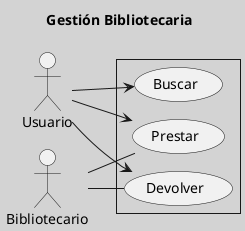
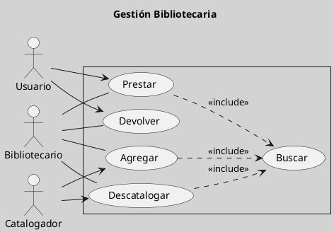

---
{"dg-publish":true,"permalink":"/050 Base de Conocimientos/200  Mi Zettelkasten/100 Docencia/IS1/2025/Clase 07 Modelo Conceptual del UML - Diagramas/Zk Modelo Conceptual del UML (Diagrama de Casos de Uso)/","tags":["digitalGarden","modeloConceptualUML"]}
---

## Modelo Conceptual del UML (Diagrama de Casos de Uso)

El diagrama de casos de uso es un tipo de [[050 Base de Conocimientos/200  Mi Zettelkasten/100 Docencia/IS1/2025/Clase 07 Modelo Conceptual del UML - Diagramas/Zk Diagramas UML 2.5.1 (Estructurales)\|diagrama estructural]] que describe las interacciones entre actores y el sistema (sujeto) para alcanzar objetivos específicos. Se utiliza para capturar requisitos funcionales y definir las funcionalidades del sistema ([[050 Base de Conocimientos/900 Biblioteca/Zk Lit (Booch et al., 2006) Booch, G., Rumbaugh, J., y Jacobson, I. (2006). El lenguaje Unificado de Modelado - Guía del Usuario (2a ed). Addison-Wesley.\|(Booch et al., 2006)]]; [[050 Base de Conocimientos/900 Biblioteca/Zk Lit (OMG, 2017) UML Specifications\|(OMG, 2017, p. 639)]]).

| Tipos                                                   | Objetivo                                                                                  |
| ------------------------------------------------------- | ----------------------------------------------------------------------------------------- |
| [[050 Base de Conocimientos/200  Mi Zettelkasten/100 Docencia/IS1/2025/Clase 07 Modelo Conceptual del UML - Diagramas/Zk Diagramas UML 2.5.1 (Estructurales)\|Estructural]] | Describe las interacciones entre actores y el sistema para alcanzar objetivos específicos |

----
### Visualización
#### Escenario Elemental
**Figura**
_Ejemplo de Diagrama de Casos de Uso Simple_

#### Escenario Avanzado
**Figura**
_Ejemplo de Diagrama de Casos de Uso más Complejo_

----

### Características Relevantes

| Elementos más Frecuentes                                                 | Relaciones                                                           | Otros                                                                                                                    |
| ------------------------------------------------------------------------ | -------------------------------------------------------------------- | ------------------------------------------------------------------------------------------------------------------------ |
| Actores, casos de uso, sujeto de estudio (sistema, subsistema, elemento) | Asociaciones, dependencias (inclusión, extensión), generalizaciones. | - Utilizado para capturar y analizar requisitos funcionales. - Describe las interacciones entre actores y el sistema. |

_Nota_: La lista de elementos y relaciones son los más frecuentemente utilizados.

----
### Ejemplos de Uso

| Aplicaciones                                          | Escenarios                                                  |
| ----------------------------------------------------- | ----------------------------------------------------------- |
| Análisis de requisitos, definición de funcionalidades | Desarrollo de software, modelado de sistemas de información |

----
### Notas Adicionales

Aunque el diagrama de casos de uso se utiliza para capturar requisitos funcionales, técnicamente se clasifica como [[050 Base de Conocimientos/200  Mi Zettelkasten/100 Docencia/IS1/2025/Clase 07 Modelo Conceptual del UML - Diagramas/Zk Diagramas UML 2.5.1 (Dinámicos)\|estructural]] porque describe la estructura de los casos de uso y sus relaciones sin mostrar el comportamiento dinámico del sistema. Sin embargo, en la práctica, su uso se cruza con aspectos dinámicos al describir interacciones entre actores y el sistema.