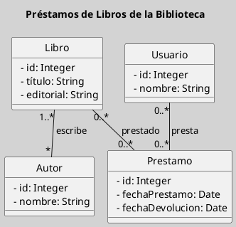
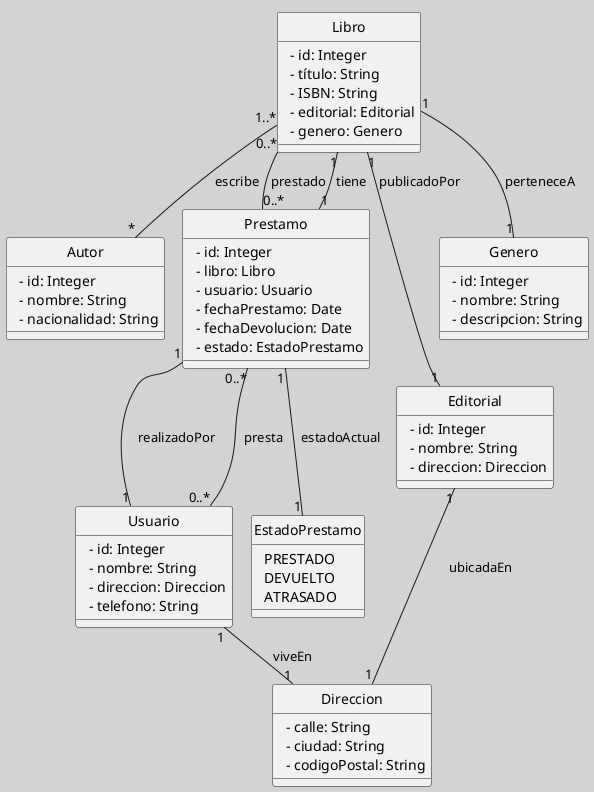

---
{"dg-publish":true,"permalink":"/050 Base de Conocimientos/200  Mi Zettelkasten/100 Docencia/IS1/2025/Clase 07 Modelo Conceptual del UML - Diagramas/Zk Modelo Conceptual del UML (Diagrama de Clases)/","tags":["digitalGarden","modeloConceptualUML"]}
---

## Modelo Conceptual del UML (Diagrama de Clases)

<a class="markdown-embed-link" href="/050 Base de Conocimientos/200  Mi Zettelkasten/100 Docencia/IS1/2025/Clase 13 Diagrama de Clases (Fundamentos, Elementos, Relaciones, etc.)/Zk Diagrama de Clases (Introducción, Definición, Características y sus Usos)/#definicion" aria-label="Open link"><svg xmlns="http://www.w3.org/2000/svg" width="24" height="24" viewBox="0 0 24 24" fill="none" stroke="currentColor" stroke-width="2" stroke-linecap="round" stroke-linejoin="round" class="svg-icon lucide-link"><path d="M10 13a5 5 0 0 0 7.54.54l3-3a5 5 0 0 0-7.07-7.07l-1.72 1.71"></path><path d="M14 11a5 5 0 0 0-7.54-.54l-3 3a5 5 0 0 0 7.07 7.07l1.71-1.71"></path></svg></a>

### Definición

Un **diagrama de clases** es una representación gráfica que muestra las clases de un sistema, sus atributos, operaciones (métodos) y las relaciones estáticas entre ellas. Es el diagrama [[050 Base de Conocimientos/200  Mi Zettelkasten/100 Docencia/IS1/2025/Clase 07 Modelo Conceptual del UML - Diagramas/Zk Diagramas UML 2.5.1 (Estructurales)\|estructural]] más utilizado en UML y sirve como base para el análisis y diseño orientado a objetos ([[050 Base de Conocimientos/900 Biblioteca/Zk Lit (Booch et al., 2006) Booch, G., Rumbaugh, J., y Jacobson, I. (2006). El lenguaje Unificado de Modelado - Guía del Usuario (2a ed). Addison-Wesley.\|Booch et al., 2006]]; [[050 Base de Conocimientos/900 Biblioteca/Zk Lit (Rumbaugh et al., 2007) Lenguaje Unificado de Modelado. Manual de Referencia\|Rumbaugh et al., 2007]]).

### Tipo

| Tipo                                                    | Objetivo                                                                                                       |
| ------------------------------------------------------- | -------------------------------------------------------------------------------------------------------------- |
| [[050 Base de Conocimientos/200  Mi Zettelkasten/100 Docencia/IS1/2025/Clase 07 Modelo Conceptual del UML - Diagramas/Zk Diagramas UML 2.5.1 (Estructurales)\|Estructural]] | Describe la estructura estática de un sistema, incluyendo clases, atributos, métodos y relaciones entre ellas. |

----
### Visualización
#### Escenario Elemental

**Figura**
_Ejemplo de Diagrama de Clases Simple_

#### Escenario Avanzado
**Figura**
_Ejemplo de Diagrama de Clases con Mayor Complejidad_

----
### Elementos y Relaciones más Comunes

| Elementos más                | Relaciones                                   | Otros                                                                                                                                    |
| ---------------------------- | -------------------------------------------- | ---------------------------------------------------------------------------------------------------------------------------------------- |
| Clases, interfaces, paquetes | Asociaciones, dependencias, generalizaciones | - Fundamental en el diseño de software. - Utilizado para visualizar la estructura del sistema - Deben llevar un nombre descriptivo |
_Nota_: La lista de elementos y relaciones son los más frecuentemente utilizados.

----
### Ejemplos de Uso

| Aplicaciones                                                                | Escenarios                                             |
| --------------------------------------------------------------------------- | ------------------------------------------------------ |
| Modelado de sistemas de información, de persistencia de datos, entre otros. | Análisis de requisitos, definición de funcionalidades. |
