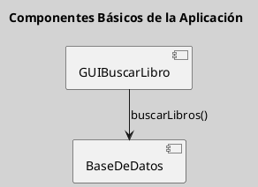
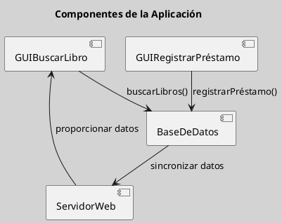

---
{"dg-publish":true,"permalink":"/050 Base de Conocimientos/200  Mi Zettelkasten/100 Docencia/IS1/2025/Clase 07 Modelo Conceptual del UML - Diagramas/Zk Modelo Conceptual del UML (Diagrama de Componentes)/","tags":["digitalGarden","modeloConceptualUML"]}
---

## Modelo Conceptual del UML (Diagrama de Componentes)

El diagrama de componentes es un tipo de diagrama estructural que describe la estructura física de un sistema en términos de componentes y sus interfaces. Se utiliza para modelar la arquitectura de sistemas complejos y distribuidos.

| Tipos                                                   | Objetivo                                                                                 |
| ------------------------------------------------------- | ---------------------------------------------------------------------------------------- |
| [[050 Base de Conocimientos/200  Mi Zettelkasten/100 Docencia/IS1/2025/Clase 07 Modelo Conceptual del UML - Diagramas/Zk Diagramas UML 2.5.1 (Estructurales)\|Estructural]] | Describe la estructura física de un sistema en términos de componentes y sus interfaces. |

----
### Visualización
#### Escenario Elemental
**Figura**
_Ejemplo de Diagrama de Componentes Simple

#### Escenario Avanzado
**Figura**
_Ejemplo de Diagrama de Componentes más Complejo_

----
### Características Relevantes

| Elementos más Frecuentes         | Relaciones | Otros                                               |
| -------------------------------- | ---------- | --------------------------------------------------- |
| Componentes, Interfaces, puertos | Conexiones | Utilizado para modelar la arquitectura de sistemas. |

_Nota_: La lista de elementos y relaciones son los más frecuentemente utilizados.

----
### Ejemplos de Uso

| Aplicaciones                                                            | Escenarios                                       |
| ----------------------------------------------------------------------- | ------------------------------------------------ |
| Diseño de sistemas distribuidos, modelado de arquitecturas de software. | Desarrollo de software, integración de sistemas. |
