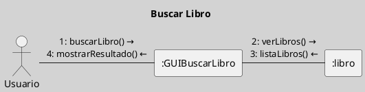
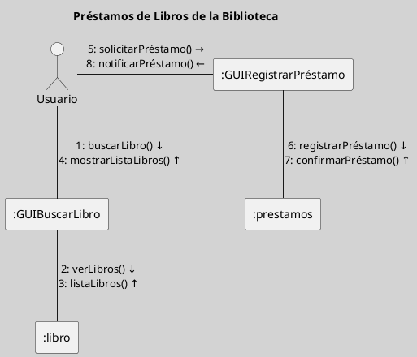

---
{"dg-publish":true,"permalink":"/050 Base de Conocimientos/200  Mi Zettelkasten/100 Docencia/IS1/2025/Clase 07 Modelo Conceptual del UML - Diagramas/Zk Modelo Conceptual del UML (Diagrama de Comunicación)/","tags":["digitalGarden","modeloConceptualUML"]}
---

## Modelo Conceptual del UML (Diagrama de Comunicación)

El diagrama de comunicación es un tipo de diagrama dinámico que describe la estructura de las interacciones entre objetos, enfocándose en la organización de los mensajes y las conexiones entre los participantes. Aunque similar al diagrama de secuencia, se centra más en la estructura de las interacciones.

| Tipos                                                       | Objetivo                                                                                                       |
| ----------------------------------------------------------- | -------------------------------------------------------------------------------------------------------------- |
| [[050 Base de Conocimientos/200  Mi Zettelkasten/100 Docencia/IS1/2025/Clase 07 Modelo Conceptual del UML - Diagramas/Zk Diagramas UML 2.5.1 (Dinámicos)\|Dinámico]] | Describe la estructura estática de un sistema, incluyendo clases, atributos, métodos y relaciones entre ellas. |

----
### Visualización
#### Escenario Elemental
**Figura**
_Ejemplo de Diagrama de Comunicación Simple_

#### Escenario Avanzado
**Figura**
_Ejemplo de Diagrama de Comunicación más Complejo_

----
### Características Relevantes

| Elementos más Frecuentes                         | Relaciones                                                                                                                                              | Otros                                                                    |
| ------------------------------------------------ | ------------------------------------------------------------------------------------------------------------------------------------------------------- | ------------------------------------------------------------------------ |
| Participantes (que pueden ser actores u objetos) | Vínculos (un solo vínculo entre dos participantes); Mensajes (ilustran interacciones entre participantes, representan operaciones o llamadas a métodos. | Utilizado para modelar la estructura de las interacciones entre objetos. |

_Nota_: La lista de elementos y relaciones son los más frecuentemente utilizados.

----
### Ejemplos de Uso

| Aplicaciones                                     | Escenarios                                    |
| ------------------------------------------------ | --------------------------------------------- |
| Diseño de interfaces, análisis de interacciones. | Desarrollo de software, modelado de sistemas. |

----

<a class="markdown-embed-link" href="/050 Base de Conocimientos/200  Mi Zettelkasten/100 Docencia/IS1/2025/Clase 14 Diagramas de Interacción/Zk Diagramas de Interacción (Introducción)/#3d4f56" aria-label="Open link"><svg xmlns="http://www.w3.org/2000/svg" width="24" height="24" viewBox="0 0 24 24" fill="none" stroke="currentColor" stroke-width="2" stroke-linecap="round" stroke-linejoin="round" class="svg-icon lucide-link"><path d="M10 13a5 5 0 0 0 7.54.54l3-3a5 5 0 0 0-7.07-7.07l-1.72 1.71"></path><path d="M14 11a5 5 0 0 0-7.54-.54l-3 3a5 5 0 0 0 7.07 7.07l1.71-1.71"></path></svg></a>

>[!Nota] Nota
>En versiones anteriores del UML, este diagrama era conocido como **Diagrama de Colaboración**. El nombre cambió a **Diagrama de Comunicación** en UML 2.0 para enfatizar su enfoque en la estructura de las interacciones entre los participantes.

