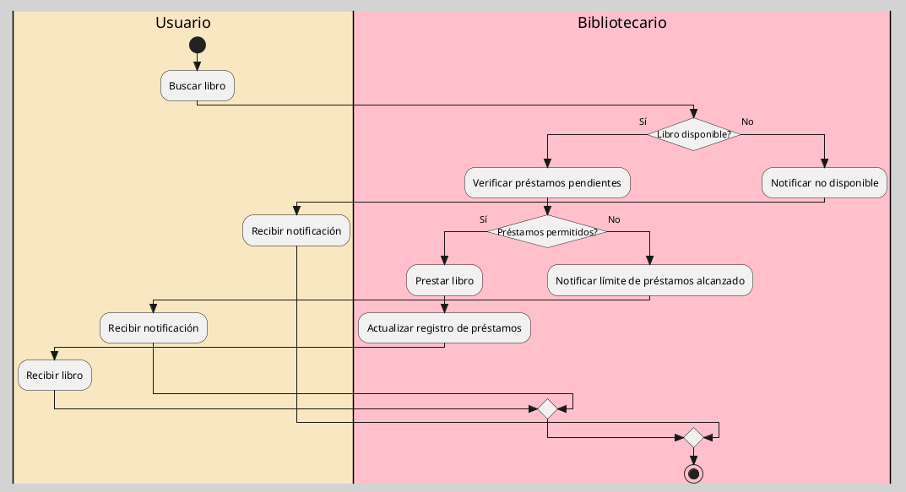
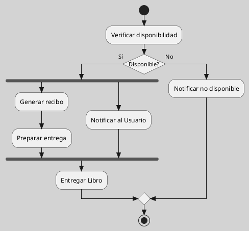

---
{"dg-publish":true,"permalink":"/050 Base de Conocimientos/200  Mi Zettelkasten/100 Docencia/IS1/2025/Clase 07 Modelo Conceptual del UML - Diagramas/Zk UML Diagrama de Actividades/","tags":["digitalGarden","modeloConceptualUML"]}
---

## Diagrama de Actividades

El diagrama de actividades es un tipo de diagrama dinámico que muestra el flujo de trabajo y las actividades que se realizan en un proceso. Se utiliza para modelar procesos empresariales y flujos de trabajo, ayudando a entender cómo se realizan las tareas dentro del sistema.

| Tipos                                                       | Objetivo                                                                                         |
| ----------------------------------------------------------- | ------------------------------------------------------------------------------------------------ |
| [[050 Base de Conocimientos/200  Mi Zettelkasten/100 Docencia/IS1/2025/Clase 07 Modelo Conceptual del UML - Diagramas/Zk Diagramas UML 2.5.1 (Dinámicos)\|Dinámico]] | Describe procesos y flujos de trabajo, mostrando cómo se realizan las tareas dentro del sistema. |

----
### Visualización
#### Escenario Elemental
**Figura**
_Ejemplo de Diagrama de Actividades Simple

#### Escenario Avanzado
**Figura**
_Ejemplo de Diagrama de Actividades más Complejo_

**Figura**
_Ejemplo de Diagrama de Actividades por Calles (Swimlines)_

**Figura**
_Ejemplo de Diagrama de Actividades con Flujos Paralelos_

### Características Relevantes

| Elementos más Frecuentes                                                                       | Relaciones                       | Otros                                                                                                  |
| ---------------------------------------------------------------------------------------------- | -------------------------------- | ------------------------------------------------------------------------------------------------------ |
| Actividades, nodos de decisión, nodos de inicio y fin, calles, divisiones y uniones de flujos. | Flujo de control de actividades. | Utilizado para modelar procesos como algoritmos, procedimientos empresariales, flujos de trabajo, etc. |
_Nota_: La lista de elementos y relaciones son los más frecuentemente utilizados.

----
### Ejemplos de Uso

| Aplicaciones                                              | Escenarios                                    |
| --------------------------------------------------------- | --------------------------------------------- |
| Modelado de procesos empresariales, diseño de algoritmos. | Desarrollo de software, gestión de proyectos. |
