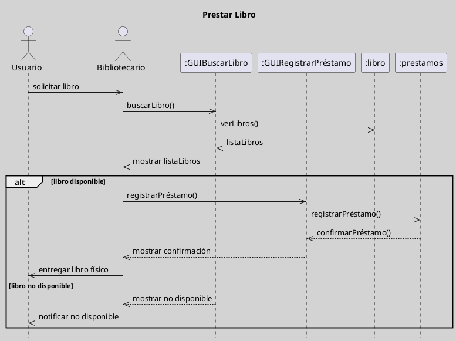

---
{"dg-publish":true,"permalink":"/050 Base de Conocimientos/200  Mi Zettelkasten/100 Docencia/IS1/2025/Clase 07 Modelo Conceptual del UML - Diagramas/Zk UML Diagrama de Clases/","tags":["digitalGarden","modeloConceptualUML"]}
---

## Diagrama de Clases

El diagrama de clases es un tipo de diagrama estructural que se utiliza para modelar la estructura estática de un sistema, mostrando las clases, sus atributos, métodos y las relaciones entre ellas. Es fundamental para diseñar y comprender la arquitectura de un sistema de software.

| Tipos                                                          | Objetivo                                                                                                       |
| -------------------------------------------------------------- | -------------------------------------------------------------------------------------------------------------- |
| [[050 Base de Conocimientos/200  Mi Zettelkasten/100 Docencia/IS1/2025/Clase 07 Modelo Conceptual del UML - Diagramas/Zk Diagramas UML 2.5.1 (Dinámicos)\|Estructural]] | Describe la estructura estática de un sistema, incluyendo clases, atributos, métodos y relaciones entre ellas. |

----
### Visualización
#### Escenario Elemental
**Figura**
_Ejemplo de Diagrama de Clases Simple_

#### Escenario Avanzado
**Figura**
_Ejemplo de Diagrama de Clases con Mayor Complejidad_

----
### Características Relevantes

| Elementos más Frecuentes     | Relaciones                                   | Otros                                                                                                                                    |
| ---------------------------- | -------------------------------------------- | ---------------------------------------------------------------------------------------------------------------------------------------- |
| Clases, interfaces, paquetes | Asociaciones, dependencias, generalizaciones | - Fundamental en el diseño de software. - Utilizado para visualizar la estructura del sistema - Deben llevar un nombre descriptivo |
_Nota_: La lista de elementos y relaciones son los más frecuentemente utilizados.

----
### Ejemplos de Uso

| Aplicaciones                                                                | Escenarios                                             |
| --------------------------------------------------------------------------- | ------------------------------------------------------ |
| Modelado de sistemas de información, de persistencia de datos, entre otros. | Análisis de requisitos, definición de funcionalidades. |
