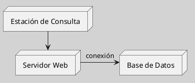
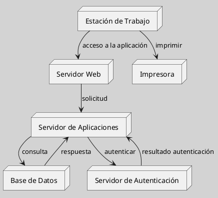

---
{"dg-publish":true,"permalink":"/050 Base de Conocimientos/200  Mi Zettelkasten/100 Docencia/IS1/2025/Clase 07 Modelo Conceptual del UML - Diagramas/Zk UML Diagrama de Despliegue/","tags":["digitalGarden","modeloConceptualUML"]}
---

## UML Diagrama de Despliegue

### Tipo de Diagrama o Modelo

El diagrama de despliegue es un tipo de diagrama estructural que describe cómo se despliegan los componentes físicos del sistema. Se utiliza para planificar la infraestructura física y la distribución de componentes en un sistema.

| Tipos                                                          | Objetivo                                                         |
| -------------------------------------------------------------- | ---------------------------------------------------------------- |
| [[050 Base de Conocimientos/200  Mi Zettelkasten/100 Docencia/IS1/2025/Clase 07 Modelo Conceptual del UML - Diagramas/Zk Diagramas UML 2.5.1 (Dinámicos)\|Estructural]] | Describe cómo se despliegan los componentes físicos del sistema. |

----
### Visualización
#### Escenario Elemental
**Figura**
_Ejemplo de Diagrama de xxxx Simple_

#### Escenario Avanzado
**Figura**
_Ejemplo de Diagrama de xxxx más Elaborado_

----
### Características Relevantes

| Elementos más Frecuentes                                   | Relaciones              | Otros                                                                                               |
| ---------------------------------------------------------- | ----------------------- | --------------------------------------------------------------------------------------------------- |
| Nodos (servidores, dispositivos), componentes desplegados. | Conexiones entre nodos. | Utilizado para planificar la infraestructura física y la distribución de componentes en un sistema. |
_Nota_: La lista de elementos y relaciones son los más frecuentemente utilizados.

----
### Ejemplos de Uso

| Aplicaciones                                                           | Escenarios                                           |
| ---------------------------------------------------------------------- | ---------------------------------------------------- |
| Planificación de infraestructura, despliegue de sistemas distribuidos. | Desarrollo de software, gestión de centros de datos. |
