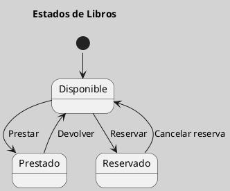
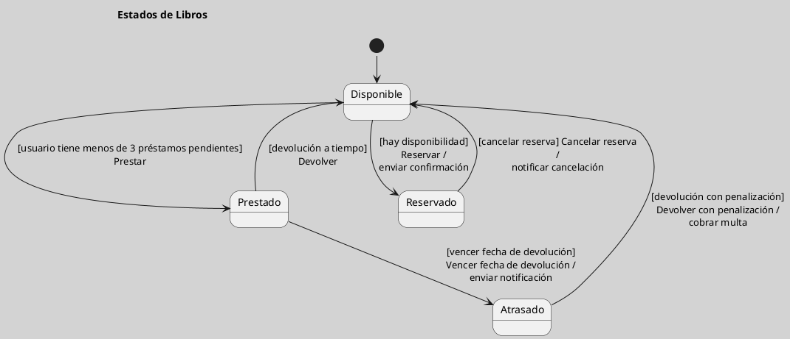

---
{"dg-publish":true,"permalink":"/050 Base de Conocimientos/200  Mi Zettelkasten/100 Docencia/IS1/2025/Clase 07 Modelo Conceptual del UML - Diagramas/Zk UML Diagrama de Estados/","tags":["digitalGarden","modeloConceptualUML"]}
---

## Diagrama de Estados

El diagrama de estados es un tipo de diagrama dinámico que describe los estados que puede tener un objeto y las transiciones entre ellos. Se utiliza para modelar el comportamiento de objetos que cambian de estado en respuesta a eventos.

| Tipos                                                       | Objetivo                                                                       |
| ----------------------------------------------------------- | ------------------------------------------------------------------------------ |
| [[050 Base de Conocimientos/200  Mi Zettelkasten/100 Docencia/IS1/2025/Clase 07 Modelo Conceptual del UML - Diagramas/Zk Diagramas UML 2.5.1 (Dinámicos)\|Dinámico]] | Describe los estados que puede tener un objeto y las transiciones entre ellos. |

----
### Visualización
#### Escenario Elemental
**Figura**
_Ejemplo de Diagrama de Estados Simple_

#### Escenario Avanzado
**Figura**
_Ejemplo de Diagrama de Estados más Complejo_

----
### Características Relevantes

| Elementos más Frecuentes | Relaciones                 | Otros                                                                                                              |
| ------------------------ | -------------------------- | ------------------------------------------------------------------------------------------------------------------ |
| Estados, eventos         | Transiciones entre estados | Utilizado para modelar el comportamiento de objetos o grupos de este que cambian de estado en respuesta a eventos. |
_Nota_: La lista de elementos y relaciones son los más frecuentemente utilizados.

----
### Ejemplos de Uso

| Aplicaciones                                                                     | Escenarios                                               |
| -------------------------------------------------------------------------------- | -------------------------------------------------------- |
| Modelado de sistemas de gestión de estado, diseño de protocolos de comunicación. | Desarrollo de software, modelado de sistemas de control. |
