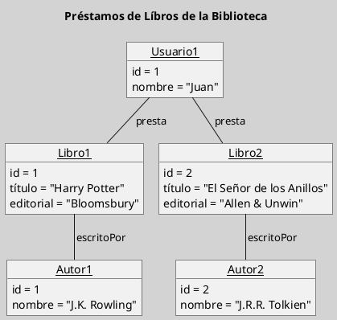
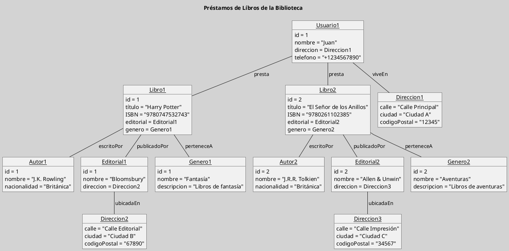

---
{"dg-publish":true,"permalink":"/050 Base de Conocimientos/200  Mi Zettelkasten/100 Docencia/IS1/2025/Clase 07 Modelo Conceptual del UML - Diagramas/Zk UML Diagrama de Objetos/","tags":["digitalGarden","modeloConceptualUML"]}
---

## Diagrama de Objetos

El diagrama de objetos es un tipo de diagrama estructural que muestra instancias de clases y sus relaciones en un momento específico. Se utiliza para visualizar escenarios de ejecución o pruebas de sistemas, ayudando a entender cómo se comportan los objetos en tiempo de ejecución.

| Tipos                                                          | Objetivo                                                                                    |
| -------------------------------------------------------------- | ------------------------------------------------------------------------------------------- |
| [[050 Base de Conocimientos/200  Mi Zettelkasten/100 Docencia/IS1/2025/Clase 07 Modelo Conceptual del UML - Diagramas/Zk Diagramas UML 2.5.1 (Dinámicos)\|Estructural]] | Describe un momento específico del sistema, mostrando instancias de clases y sus relaciones |

----
### Visualización
#### Escenario Elemental
**Figura**
_Ejemplo de Diagrama de Objetos Simple

#### Escenario Complejo
**Figura**
_Ejemplo de Diagrama de Objetos con Mayor Complejidad_

----
### Características Relevantes

| Elementos más Frecuentes              | Relaciones                 | Otros                                                                                                              |
| ------------------------------------- | -------------------------- | ------------------------------------------------------------------------------------------------------------------ |
| Objetos, que son instancias de clases | Asociaciones entre objetos | - Utilizado para visualizar escenarios de ejecución o pruebas de sistemas. - Deben llevar un nombre descriptivo |
_Nota_: La lista de elementos y relaciones son los más frecuentemente utilizados.

----
### Ejemplos de Uso

| Aplicaciones                                                  | Escenarios                                        |
| ------------------------------------------------------------- | ------------------------------------------------- |
| Visualización de escenarios de ejecución, pruebas de sistemas | Análisis de comportamiento en tiempo de ejecución |
