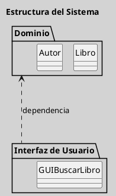
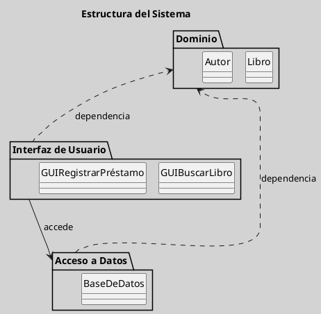

---
{"dg-publish":true,"permalink":"/050 Base de Conocimientos/200  Mi Zettelkasten/100 Docencia/IS1/2025/Clase 07 Modelo Conceptual del UML - Diagramas/Zk UML Diagrama de Paquetes/","tags":["digitalGarden","modeloConceptualUML"]}
---

## UML Diagrama de Paquetes

El diagrama de paquetes es un tipo de diagrama estructural que organiza los elementos del modelo en paquetes para facilitar su gestión y reutilización. Se utiliza para estructurar grandes modelos y facilitar la navegación.

| Tipos                                                          | Objetivo                                                                                                   |
| -------------------------------------------------------------- | ---------------------------------------------------------------------------------------------------------- |
| [[050 Base de Conocimientos/200  Mi Zettelkasten/100 Docencia/IS1/2025/Clase 07 Modelo Conceptual del UML - Diagramas/Zk Diagramas UML 2.5.1 (Dinámicos)\|Estructural]] | Describe cómo se organizan los elementos del modelo en paquetes para facilitar su gestión y reutilización. |

----
### Visualización
#### Escenario Elemental
**Figura**
_Ejemplo de Diagrama de Paquetes Simple_

#### Escenario Avanzado
**Figura**
_Ejemplo de Diagrama de Paquetes más Elaborado_

----
### Características Relevantes

| Elementos más Frecuentes               | Relaciones                       | Otros                                                                                                             |
| -------------------------------------- | -------------------------------- | ----------------------------------------------------------------------------------------------------------------- |
| Paquetes, dependencias entre paquetes. | Asociaciones, Dependencias, etc. | Utilizado para organizar y estructurar grandes modelos, facilitando la navegación y el mantenimiento del sistema. |
_Nota_: La lista de elementos y relaciones son los más frecuentemente utilizados.

----
### Ejemplos de Uso

| Aplicaciones                                                                     | Escenarios                                              |
| -------------------------------------------------------------------------------- | ------------------------------------------------------- |
| Organización de grandes proyectos de software, gestión de bibliotecas de clases. | Desarrollo de software, modelado de sistemas complejos. |
 