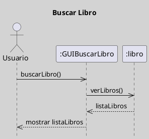
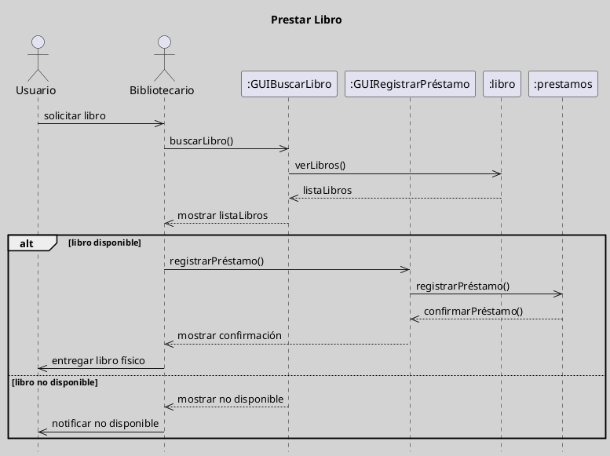

---
{"dg-publish":true,"permalink":"/050 Base de Conocimientos/200  Mi Zettelkasten/100 Docencia/IS1/2025/Clase 07 Modelo Conceptual del UML - Diagramas/Zk UML Diagrama de Secuencia/","tags":["digitalGarden","modeloConceptualUML"]}
---

## Diagrama de Secuencia

El diagrama de secuencia es un tipo de diagrama dinámico que muestra la secuencia temporal de mensajes entre objetos. Se utiliza para modelar interacciones entre objetos en el tiempo, ayudando a entender cómo se comportan los sistemas dinámicamente.

| Tipos                                                       | Objetivo                                                                               |
| ----------------------------------------------------------- | -------------------------------------------------------------------------------------- |
| [[050 Base de Conocimientos/200  Mi Zettelkasten/100 Docencia/IS1/2025/Clase 07 Modelo Conceptual del UML - Diagramas/Zk Diagramas UML 2.5.1 (Dinámicos)\|Dinámico]] | Describe la secuencia temporal de mensajes entre los participantes (actores, objetos). |

----
### Visualización
#### Escenario Elemental
**Figura**
_Ejemplo de Diagrama de Secuencia Simple_

#### Escenario Avanzado
**Figura**
_Ejemplo de Diagrama de Secuencia más Complejo_

### Características Relevantes

| Elementos más Frecuentes                         | Relaciones                                                                                          | Otros                                                                      |
| ------------------------------------------------ | --------------------------------------------------------------------------------------------------- | -------------------------------------------------------------------------- |
| Participantes (que pueden ser actores u objetos) | Mensajes (ilustran interacciones entre participantes, representan operaciones o llamadas a métodos. | - Utilizado para modelar interacciones con énfasis temporal entre objetos. |
_Nota_: La lista de elementos y relaciones son los más frecuentemente utilizados.

----
### Ejemplos de Uso

| Aplicaciones                                                      | Escenarios                                    |
| ----------------------------------------------------------------- | --------------------------------------------- |
| Análisis de comportamiento, diseño de protocolos de comunicación. | Desarrollo de software, modelado de sistemas. |
