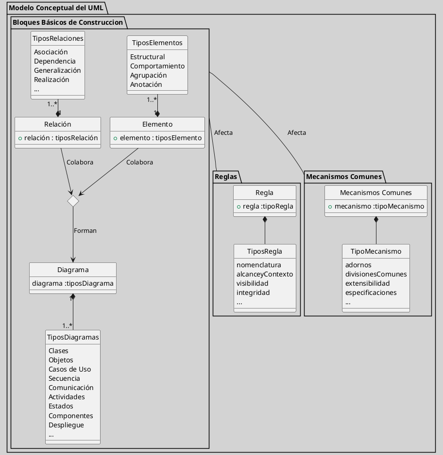

---
{"dg-publish":true,"permalink":"/050 Base de Conocimientos/200  Mi Zettelkasten/100 Docencia/IS1/2025/Clase 08 Modelo Conceptual del UML - Elementos, Relaciones, Reglas y Mecanismos Comunes/Zk !MOC Modelo Conceptual del UML - Elementos, Relaciones, Reglas y Mecanismos Comunes/","tags":["digitalGarden","moc","UML"]}
---

## MOC Modelo Conceptual del UML - Elementos, Relaciones, Reglas y Mecanismos Comunes

### Introducción

El [[050 Base de Conocimientos/200  Mi Zettelkasten/100 Docencia/IS1/2025/Clase 06 Introducción al UML/Zk Modelo Conceptual del UML\|Modelo Conceptual del UML]] es el fundamento sobre el cual se construye el [[050 Base de Conocimientos/200  Mi Zettelkasten/100 Docencia/IS1/2025/Clase 06 Introducción al UML/Zk UML - El Lenguaje Unificado de Modelado\|Lenguaje Unificado de Modelado (UML)]]. Este modelo conceptual define los elementos y estructuras que permiten a los desarrolladores de software [[050 Base de Conocimientos/200  Mi Zettelkasten/100 Docencia/IS1/2025/Clase 06 Introducción al UML/Zk UML - Una Herramienta para Visualizar, Especificar, Construir y Documentar Proyectos de Software\|visualizar, especificar, construir y documentar]] sistemas complejos de manera efectiva. El UML se ha convertido en un estándar ampliamente aceptado en la industria del software, gracias a su capacidad para proporcionar una visión integral y coherente del diseño de sistemas.

En la clase anterior, realizamos un recorrido por los principales diagramas del UML ([[050 Base de Conocimientos/200  Mi Zettelkasten/100 Docencia/IS1/2025/Clase 07 Modelo Conceptual del UML - Diagramas/Zk Modelo Conceptual del UML (Diagrama de Clases)\|clases]], [[050 Base de Conocimientos/200  Mi Zettelkasten/100 Docencia/IS1/2025/Clase 07 Modelo Conceptual del UML - Diagramas/Zk Modelo Conceptual del UML (Diagrama de Objetos)\|objetos]], [[050 Base de Conocimientos/200  Mi Zettelkasten/100 Docencia/IS1/2025/Clase 07 Modelo Conceptual del UML - Diagramas/Zk Modelo Conceptual del UML (Diagrama de Casos de Uso)\|casos de uso]], [[050 Base de Conocimientos/200  Mi Zettelkasten/100 Docencia/IS1/2025/Clase 07 Modelo Conceptual del UML - Diagramas/Zk Modelo Conceptual del UML (Diagrama de Secuencia)\|secuencia]], [[050 Base de Conocimientos/200  Mi Zettelkasten/100 Docencia/IS1/2025/Clase 07 Modelo Conceptual del UML - Diagramas/Zk Modelo Conceptual del UML (Diagrama de Comunicación)\|comunicación]], [[050 Base de Conocimientos/200  Mi Zettelkasten/100 Docencia/IS1/2025/Clase 07 Modelo Conceptual del UML - Diagramas/Zk Modelo Conceptual del UML (Diagrama de Actividades)\|actividades]], [[050 Base de Conocimientos/200  Mi Zettelkasten/100 Docencia/IS1/2025/Clase 07 Modelo Conceptual del UML - Diagramas/Zk Modelo Conceptual del UML (Diagrama de Estados)\|estados]], [[050 Base de Conocimientos/200  Mi Zettelkasten/100 Docencia/IS1/2025/Clase 07 Modelo Conceptual del UML - Diagramas/Zk Modelo Conceptual del UML (Diagrama de Componentes)\|componentes]], [[050 Base de Conocimientos/200  Mi Zettelkasten/100 Docencia/IS1/2025/Clase 07 Modelo Conceptual del UML - Diagramas/Zk Modelo Conceptual del UML (Diagrama de Paquetes)\|paquetes]] y [[050 Base de Conocimientos/200  Mi Zettelkasten/100 Docencia/IS1/2025/Clase 07 Modelo Conceptual del UML - Diagramas/Zk Modelo Conceptual del UML (Diagrama de Despliegue)\|despliegue]]), los que se clasifican en [[050 Base de Conocimientos/200  Mi Zettelkasten/100 Docencia/IS1/2025/Clase 07 Modelo Conceptual del UML - Diagramas/Zk Diagramas UML 2.5.1 (Estructurales)\|estructurales]] y [[050 Base de Conocimientos/200  Mi Zettelkasten/100 Docencia/IS1/2025/Clase 07 Modelo Conceptual del UML - Diagramas/Zk Diagramas UML 2.5.1 (Dinámicos)\|dinámicos]].

El [[050 Base de Conocimientos/200  Mi Zettelkasten/100 Docencia/IS1/2025/Clase 06 Introducción al UML/Zk Modelo Conceptual del UML\|Modelo Conceptual del UML]] constituye la base fundamental del [[050 Base de Conocimientos/200  Mi Zettelkasten/100 Docencia/IS1/2025/Clase 06 Introducción al UML/Zk UML - El Lenguaje Unificado de Modelado\|Lenguaje Unificado de Modelado (UML)]]. Este modelo define los elementos y estructuras que permiten a los profesionales de software [[050 Base de Conocimientos/200  Mi Zettelkasten/100 Docencia/IS1/2025/Clase 06 Introducción al UML/Zk UML - Una Herramienta para Visualizar, Especificar, Construir y Documentar Proyectos de Software\|visualizar, especificar, construir y documentar]] sistemas complejos con precisión y coherencia. Su adopción como estándar industrial se debe a su capacidad para ofrecer una representación unificada del diseño de sistemas.

En clases anteriores, exploramos los diagramas UML esenciales:
- **Estructurales**: [[050 Base de Conocimientos/200  Mi Zettelkasten/100 Docencia/IS1/2025/Clase 07 Modelo Conceptual del UML - Diagramas/Zk Modelo Conceptual del UML (Diagrama de Clases)\|clases]], [[050 Base de Conocimientos/200  Mi Zettelkasten/100 Docencia/IS1/2025/Clase 07 Modelo Conceptual del UML - Diagramas/Zk Modelo Conceptual del UML (Diagrama de Objetos)\|objetos]], [[050 Base de Conocimientos/200  Mi Zettelkasten/100 Docencia/IS1/2025/Clase 07 Modelo Conceptual del UML - Diagramas/Zk Modelo Conceptual del UML (Diagrama de Componentes)\|componentes]], [[050 Base de Conocimientos/200  Mi Zettelkasten/100 Docencia/IS1/2025/Clase 07 Modelo Conceptual del UML - Diagramas/Zk Modelo Conceptual del UML (Diagrama de Paquetes)\|paquetes]], [[050 Base de Conocimientos/200  Mi Zettelkasten/100 Docencia/IS1/2025/Clase 07 Modelo Conceptual del UML - Diagramas/Zk Modelo Conceptual del UML (Diagrama de Despliegue)\|despliegue]].
- **Dinámicos**: [[050 Base de Conocimientos/200  Mi Zettelkasten/100 Docencia/IS1/2025/Clase 07 Modelo Conceptual del UML - Diagramas/Zk Modelo Conceptual del UML (Diagrama de Casos de Uso)\|casos de uso]], [[050 Base de Conocimientos/200  Mi Zettelkasten/100 Docencia/IS1/2025/Clase 07 Modelo Conceptual del UML - Diagramas/Zk Modelo Conceptual del UML (Diagrama de Secuencia)\|secuencia]], [[050 Base de Conocimientos/200  Mi Zettelkasten/100 Docencia/IS1/2025/Clase 07 Modelo Conceptual del UML - Diagramas/Zk Modelo Conceptual del UML (Diagrama de Comunicación)\|comunicación]], [[050 Base de Conocimientos/200  Mi Zettelkasten/100 Docencia/IS1/2025/Clase 07 Modelo Conceptual del UML - Diagramas/Zk Modelo Conceptual del UML (Diagrama de Actividades)\|actividades]], [[050 Base de Conocimientos/200  Mi Zettelkasten/100 Docencia/IS1/2025/Clase 07 Modelo Conceptual del UML - Diagramas/Zk Modelo Conceptual del UML (Diagrama de Estados)\|estados]].

### Desarrollo
A modo de ubicarnos, partimos nuevamente de la figura del Modelo Conceptual del UML que vimos en las clases anteriores.

<a class="markdown-embed-link" href="/050-base-de-conocimientos/200-mi-zettelkasten/100-docencia/is-1/2025/clase-06-introduccion-al-uml/zk-modelo-conceptual-del-uml/#c3673e" aria-label="Open link"><svg xmlns="http://www.w3.org/2000/svg" width="24" height="24" viewBox="0 0 24 24" fill="none" stroke="currentColor" stroke-width="2" stroke-linecap="round" stroke-linejoin="round" class="svg-icon lucide-link"><path d="M10 13a5 5 0 0 0 7.54.54l3-3a5 5 0 0 0-7.07-7.07l-1.72 1.71"></path><path d="M14 11a5 5 0 0 0-7.54-.54l-3 3a5 5 0 0 0 7.07 7.07l1.71-1.71"></path></svg></a>

En la clase de hoy, abordatemos analizando:
- Los que Elementos de tipo [[050 Base de Conocimientos/200  Mi Zettelkasten/100 Docencia/IS1/2025/Clase 08 Modelo Conceptual del UML - Elementos, Relaciones, Reglas y Mecanismos Comunes/Zk Modelo Conceptual del UML (Elementos Estructurales)\|Estructural]], de [[050 Base de Conocimientos/200  Mi Zettelkasten/100 Docencia/IS1/2025/Clase 08 Modelo Conceptual del UML - Elementos, Relaciones, Reglas y Mecanismos Comunes/Zk Modelo Conceptual del UML (Elementos de Comportamiento)\|Comportamiento]], de [[050 Base de Conocimientos/200  Mi Zettelkasten/100 Docencia/IS1/2025/Clase 08 Modelo Conceptual del UML - Elementos, Relaciones, Reglas y Mecanismos Comunes/Zk Modelo Conceptual del UML (Elementos de Agrupación)\|Agrupación]] y [[050 Base de Conocimientos/200  Mi Zettelkasten/100 Docencia/IS1/2025/Clase 08 Modelo Conceptual del UML - Elementos, Relaciones, Reglas y Mecanismos Comunes/Zk Modelo Conceptual del UML (Elementos de Anotación)\|Anotación]] que componen el [[050 Base de Conocimientos/200  Mi Zettelkasten/100 Docencia/IS1/2025/Clase 06 Introducción al UML/Zk Modelo Conceptual del UML\|Modelo Conceptual del UML]]. 
- Las Relaciones: de [[050 Base de Conocimientos/200  Mi Zettelkasten/100 Docencia/IS1/2025/Clase 08 Modelo Conceptual del UML - Elementos, Relaciones, Reglas y Mecanismos Comunes/Zk Modelo Conceptual del UML (Relaciones)#Asociación\|Asociación]], de [[050 Base de Conocimientos/200  Mi Zettelkasten/100 Docencia/IS1/2025/Clase 08 Modelo Conceptual del UML - Elementos, Relaciones, Reglas y Mecanismos Comunes/Zk Modelo Conceptual del UML (Relaciones)#Dependencia\|Dependencia]], de [[050 Base de Conocimientos/200  Mi Zettelkasten/100 Docencia/IS1/2025/Clase 08 Modelo Conceptual del UML - Elementos, Relaciones, Reglas y Mecanismos Comunes/Zk Modelo Conceptual del UML (Relaciones)#Generalización\|Generalización]] y de [[050 Base de Conocimientos/200  Mi Zettelkasten/100 Docencia/IS1/2025/Clase 08 Modelo Conceptual del UML - Elementos, Relaciones, Reglas y Mecanismos Comunes/Zk Modelo Conceptual del UML (Relaciones)#Realización\|Realización]]
- Las Reglas: de [[050 Base de Conocimientos/200  Mi Zettelkasten/100 Docencia/IS1/2025/Clase 08 Modelo Conceptual del UML - Elementos, Relaciones, Reglas y Mecanismos Comunes/Zk Modelo Conceptual del UML (Reglas)#Reglas de Nombres\|Nomenclatura]], de [[050 Base de Conocimientos/200  Mi Zettelkasten/100 Docencia/IS1/2025/Clase 08 Modelo Conceptual del UML - Elementos, Relaciones, Reglas y Mecanismos Comunes/Zk Modelo Conceptual del UML (Reglas)#Reglas de Alcance y Contexto\|Alcance y Contexto]], de [[050 Base de Conocimientos/200  Mi Zettelkasten/100 Docencia/IS1/2025/Clase 08 Modelo Conceptual del UML - Elementos, Relaciones, Reglas y Mecanismos Comunes/Zk Modelo Conceptual del UML (Reglas)#Reglas de Visibilidad\|Visibilidad]] y de [[050 Base de Conocimientos/200  Mi Zettelkasten/100 Docencia/IS1/2025/Clase 08 Modelo Conceptual del UML - Elementos, Relaciones, Reglas y Mecanismos Comunes/Zk Modelo Conceptual del UML (Reglas)#Reglas de Integridad\|Integridad]]
- Los Mecanismos Comunes: [[050 Base de Conocimientos/200  Mi Zettelkasten/100 Docencia/IS1/2025/Clase 08 Modelo Conceptual del UML - Elementos, Relaciones, Reglas y Mecanismos Comunes/Zk Modelo Conceptual del UML (Mecanismos Comunes)#Especificaciones\|Especificaciones]], [[050 Base de Conocimientos/200  Mi Zettelkasten/100 Docencia/IS1/2025/Clase 08 Modelo Conceptual del UML - Elementos, Relaciones, Reglas y Mecanismos Comunes/Zk Modelo Conceptual del UML (Mecanismos Comunes)#Adornos\|Adornos]], [[050 Base de Conocimientos/200  Mi Zettelkasten/100 Docencia/IS1/2025/Clase 08 Modelo Conceptual del UML - Elementos, Relaciones, Reglas y Mecanismos Comunes/Zk Modelo Conceptual del UML (Mecanismos Comunes)#Divisiones Comunes\|Divisiones Comunes]] y [[050 Base de Conocimientos/200  Mi Zettelkasten/100 Docencia/IS1/2025/Clase 08 Modelo Conceptual del UML - Elementos, Relaciones, Reglas y Mecanismos Comunes/Zk Modelo Conceptual del UML (Mecanismos Comunes)#Mecanismos de Extensibilidad\|Mecanismos de Extensibilidad]].

Buscamos además entender cómo el UML facilita la comunicación entre los equipos de desarrollo, mejora la calidad del software y reduce los riesgos asociados con la [[050 Base de Conocimientos/200  Mi Zettelkasten/100 Docencia/IS1/2025/Clase 05 El Modelado en la Ingeniería del Software/Zk Complejidad de los Proyectos de Software\|complejidad]] de los sistemas.

## Conclusión

[[050 Base de Conocimientos/200  Mi Zettelkasten/100 Docencia/IS1/2025/Clase 06 Introducción al UML/Zk UML - El Lenguaje Unificado de Modelado\|UML]] no solo es una herramienta de modelado, sino un **puente entre el diseño conceptual y la ejecución técnica**. Su correcta aplicación mejora la calidad del software, facilita la comunicación técnica y reduce riesgos en proyectos de mediana a alta complejidad. Como señala [[050 Base de Conocimientos/900 Biblioteca/Zk Lit (Booch et al., 2006) Booch, G., Rumbaugh, J., y Jacobson, I. (2006). El lenguaje Unificado de Modelado - Guía del Usuario (2a ed). Addison-Wesley.\|Booch et al. (2006)]], "un modelo UML bien construido es la primera línea de defensa contra la deuda técnica".

Aproximadamente el **80%** de los problemas de modelado pueden resolverse usando solo el **20%** de las características de UML, mencionado en [[050 Base de Conocimientos/900 Biblioteca/Zk Lit (Booch et al., 2006) Booch, G., Rumbaugh, J., y Jacobson, I. (2006). El lenguaje Unificado de Modelado - Guía del Usuario (2a ed). Addison-Wesley.\|Booch et al. (2006)]].
