```plantuml
@startuml
!pragma layout smetana
skinparam style strictuml
skinparam classAttributeIconSize 0
skinparam BackgroundColor LightGray
'left to right direction
top to bottom direction
skinparam linetype ortho

class Estudiante {
  - apellidos :string
  - nombres :string
  - matricula :string
  - fechaNacimiento :date
    ...
  + buscar(): boolean
}
@enduml
```

```plantuml
@startuml
!pragma layout smetana
skinparam style strictuml
skinparam classAttributeIconSize 0
skinparam BackgroundColor LightGray
'left to right direction
top to bottom direction
skinparam linetype ortho

Object Estudiante {
  apellidos = "Fernández Pérez"
  nombres = "Juan Carlos"
  matricula = "ZX900001"
  fechaNacimiento "10/10/2000"
}
@enduml
```

```plantuml
@startuml
!pragma layout smetana
skinparam style strictuml
skinparam classAttributeIconSize 0
skinparam BackgroundColor LightGray
'left to right direction
top to bottom direction
skinparam linetype ortho

[Servicio de Autenticación] as Auth
@enduml
```

```plantuml
@startuml
!pragma layout smetana
skinparam style strictuml
skinparam classAttributeIconSize 0
skinparam BackgroundColor LightGray
'left to right direction
top to bottom direction
skinparam linetype ortho

node "Servidor Web" as web
@enduml
```

---
{"dg-publish":true,"permalink":"/050 Base de Conocimientos/200  Mi Zettelkasten/100 Docencia/IS1/2025/Clase 08 Modelo Conceptual del UML - Elementos, Relaciones, Reglas y Mecanismos Comunes/Zk Modelo Conceptual del UML (Elementos Estructurales)/","tags":["digitalGarden","modeloConceptualUML"]}
---

## Elementos Estructurales del Modelo Conceptual del UML

 Representan la partes estáticas del sistema, definiendo componentes físicos o conceptuales ([[050 Base de Conocimientos/900 Biblioteca/Zk Lit (Booch et al., 2006) Booch, G., Rumbaugh, J., y Jacobson, I. (2006). El lenguaje Unificado de Modelado - Guía del Usuario. Addison-Wesley\|Booch et al. (2006)]]; [[050 Base de Conocimientos/900 Biblioteca/Zk Lit (OMG, 2017) UML Specifications\|OMG, 2017]]; [[050 Base de Conocimientos/900 Biblioteca/Zk Lit (Rumbaugh et al.,2000) Lenguaje Unificado de Modelado. Manual de Referencia\|Rumbaugh et al., 2000]])

### Elementos

#### Clase

| Item       | Descripción                                                                                                                                                                                                                                |
| ---------- | ------------------------------------------------------------------------------------------------------------------------------------------------------------------------------------------------------------------------------------------ |
| Definición | Modela conjunto de objetos con atributos y operaciones comunes [[050 Base de Conocimientos/900 Biblioteca/Zk Lit (Booch et al., 2006) Booch, G., Rumbaugh, J., y Jacobson, I. (2006). El lenguaje Unificado de Modelado - Guía del Usuario. Addison-Wesley\|(Booch et al., 2006)]]. |
| Uso        | Se usa como base para modelar entidades en sistemas orientados a objetos.                                                                                                                                                                  |

**Figura**
_Representación Gráfica de la Clase_

----
#### Objeto

| Item       | Descripción                                                                                                                                                                                                                                            |
| ---------- | ------------------------------------------------------------------------------------------------------------------------------------------------------------------------------------------------------------------------------------------------------ |
| Definición | Representados como instancias de clases, mostrando sus valores específicos [[050 Base de Conocimientos/900 Biblioteca/Zk Lit (Booch et al., 2006) Booch, G., Rumbaugh, J., y Jacobson, I. (2006). El lenguaje Unificado de Modelado - Guía del Usuario. Addison-Wesley\|(Booch et al., 2006)]]. |
| Uso        | Modelar conjunto de instancias de clases.                                                                                                                                                                                                              |

**Figura**
_Representación Gráfica de la Clase_

----
#### Caso de Uso

| Item       | Descripción                                                                                                                                                                                                                                                                                                                                                                                                    |
| ---------- | -------------------------------------------------------------------------------------------------------------------------------------------------------------------------------------------------------------------------------------------------------------------------------------------------------------------------------------------------------------------------------------------------------------- |
| Definición | Representan funcionalidades desde la perspectiva del usuario ([[050 Base de Conocimientos/900 Biblioteca/Zk Lit (Booch et al., 2006) Booch, G., Rumbaugh, J., y Jacobson, I. (2006). El lenguaje Unificado de Modelado - Guía del Usuario. Addison-Wesley\|Booch et al. (2006)]]; [[050 Base de Conocimientos/900 Biblioteca/Zk Lit (OMG, 2017) UML Specifications\|OMG, 2017]]; [[050 Base de Conocimientos/900 Biblioteca/Zk Lit (Rumbaugh et al.,2000) Lenguaje Unificado de Modelado. Manual de Referencia\|Rumbaugh et al., 2000]]). |
| Uso        | Se utilizar para capturar requisitos funcionales.                                                                                                                                                                                                                                                                                                                                                              |

**Figura**
_Representación Gráfica del Caso de Uso_

```plantuml
@startuml
!pragma layout smetana
skinparam style strictuml
skinparam classAttributeIconSize 0
skinparam BackgroundColor LightGray
'left to right direction
top to bottom direction
skinparam linetype ortho

(Inscribir Estudiante)
@enduml
```

----
#### Componente

| Item       | Descripción                                                                                                                                                                                                                                                                                                                                                                                                                           |
| ---------- | ------------------------------------------------------------------------------------------------------------------------------------------------------------------------------------------------------------------------------------------------------------------------------------------------------------------------------------------------------------------------------------------------------------------------------------- |
| Definición | Módulos reemplazables con interfaces definidas ([[050 Base de Conocimientos/900 Biblioteca/Zk Lit (Booch et al., 2006) Booch, G., Rumbaugh, J., y Jacobson, I. (2006). El lenguaje Unificado de Modelado - Guía del Usuario. Addison-Wesley\|Booch et al. (2006)]]; [[050 Base de Conocimientos/900 Biblioteca/Zk Lit (OMG, 2017) UML Specifications\|OMG, 2017]]; [[050 Base de Conocimientos/900 Biblioteca/Zk Lit (Rumbaugh et al.,2000) Lenguaje Unificado de Modelado. Manual de Referencia\|Rumbaugh et al., 2000]]).Referencia\|Rumbaugh et al., 2000]]). |
| Uso        | Modelar arquitecturas modulares.                                                                                                                                                                                                                                                                                                                                                                                                      |

**Figura**
_Representación Gráfica del Componente_

----
#### Nodo

| Item       | Descripción                                                                                                                                                                                                                                                                                                                                                                                                                                                           |
| ---------- | --------------------------------------------------------------------------------------------------------------------------------------------------------------------------------------------------------------------------------------------------------------------------------------------------------------------------------------------------------------------------------------------------------------------------------------------------------------------- |
| Definición | Elementos físicos computaciones (hardware) como servidores o dispositivos donde se ejecutan componentes de software ([[050 Base de Conocimientos/900 Biblioteca/Zk Lit (Booch et al., 2006) Booch, G., Rumbaugh, J., y Jacobson, I. (2006). El lenguaje Unificado de Modelado - Guía del Usuario. Addison-Wesley\|Booch et al. (2006)]]; [[050 Base de Conocimientos/900 Biblioteca/Zk Lit (OMG, 2017) UML Specifications\|OMG, 2017]]; [[050 Base de Conocimientos/900 Biblioteca/Zk Lit (Rumbaugh et al.,2000) Lenguaje Unificado de Modelado. Manual de Referencia\|Rumbaugh et al., 2000]]). |
| Uso        | Modelar infraestructura.                                                                                                                                                                                                                                                                                                                                                                                                                                              |

**Figura**
_Representación Gráfica del Componente_

