---
{"dg-publish":true,"permalink":"/050 Base de Conocimientos/200  Mi Zettelkasten/100 Docencia/IS1/2025/Clase 08 Modelo Conceptual del UML - Elementos, Relaciones, Reglas y Mecanismos Comunes/Zk Modelo Conceptual del UML (Elementos de Agrupación)/","tags":["digitalGarden"]}
---

## Elemento de Agrupación del Modelo Conceptual del UML

Los elementos de agrupación son mecanismos organizativos en UML que permiten estructurar modelos complejos mediante la encapsulación lógica de componentes relacionados. Su principal función es **modularizar sistemas** y gestionar dependencias entre partes del modelo ([[050 Base de Conocimientos/900 Biblioteca/Zk Lit (Booch et al., 2006) Booch, G., Rumbaugh, J., y Jacobson, I. (2006). El lenguaje Unificado de Modelado - Guía del Usuario. Addison-Wesley\|Booch et al. (2006)]]; [[050 Base de Conocimientos/900 Biblioteca/Zk Lit (OMG, 2017) UML Specifications\|OMG, 2017]]; [[050 Base de Conocimientos/900 Biblioteca/Zk Lit (Rumbaugh et al.,2000) Lenguaje Unificado de Modelado. Manual de Referencia\|Rumbaugh et al., 2000]].

### Elemento

#### Actividad

| Item       | Descripción                                                                                                                                                                                                                                              |
| ---------- | -------------------------------------------------------------------------------------------------------------------------------------------------------------------------------------------------------------------------------------------------------- |
| Definición | Contenedores genéricos para clases, casos de uso, diagramas u otros paquetes [[050 Base de Conocimientos/900 Biblioteca/Zk Lit (Booch et al., 2006) Booch, G., Rumbaugh, J., y Jacobson, I. (2006). El lenguaje Unificado de Modelado - Guía del Usuario. Addison-Wesley\|(Booch et al., 2006)]]. |
| Uso        | -  Agrupar elementos por capas (ejemplo: `Frontend`, `Backend`, `Subsistema`). - Evitar colisiones de nombres en proyectos grandes.                                                                                                                   |

**Figura**
_Representación Gráfica de la Actividad_

```plantuml
@startuml
!pragma layout smetana
skinparam style strictuml
skinparam classAttributeIconSize 0
skinparam BackgroundColor LightGray
'left to right direction
top to bottom direction
skinparam linetype ortho

package paquete { 

}
@enduml
```

