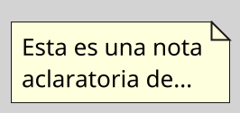

---
{"dg-publish":true,"permalink":"/050 Base de Conocimientos/200  Mi Zettelkasten/100 Docencia/IS1/2025/Clase 08 Modelo Conceptual del UML - Elementos, Relaciones, Reglas y Mecanismos Comunes/Zk Modelo Conceptual del UML (Elementos de Anotación)/","tags":["digitalGarden"]}
---

## Elemento de Anotación del Modelo Conceptual del UML

Los elementos de anotación en UML son mecanismos para añadir **comentarios**, **restricciones** o **información adicional** a los modelos sin alterar su semántica estructural o comportamental. Su propósito es mejorar la claridad y el contexto del diseño ([[050 Base de Conocimientos/900 Biblioteca/Zk Lit (Booch et al., 2006) Booch, G., Rumbaugh, J., y Jacobson, I. (2006). El lenguaje Unificado de Modelado - Guía del Usuario. Addison-Wesley\|Booch et al. (2006)]]; [[050 Base de Conocimientos/900 Biblioteca/Zk Lit (OMG, 2017) UML Specifications\|OMG, 2017]]; [[050 Base de Conocimientos/900 Biblioteca/Zk Lit (Rumbaugh et al.,2000) Lenguaje Unificado de Modelado. Manual de Referencia\|Rumbaugh et al., 2000]].

### Elemento

#### **Nota**

| Item       | Descripción                                                                                                                                                                                                                                                  |
| ---------- | ------------------------------------------------------------------------------------------------------------------------------------------------------------------------------------------------------------------------------------------------------------ |
| Definición | Comentarios textuales libres, representados como rectángulos con esquina doblada [[050 Base de Conocimientos/900 Biblioteca/Zk Lit (Booch et al., 2006) Booch, G., Rumbaugh, J., y Jacobson, I. (2006). El lenguaje Unificado de Modelado - Guía del Usuario. Addison-Wesley\|(Booch et al., 2006)]]. |
| Uso        | - Explicar decisiones de diseño. - Documentar supuestos o requisitos no formales.                                                                                                                                                                         |

**Figura**
_Representación Gráfica de la Nota _

_Nota:_ Estas notas pueden ir vinculadas a algún elemento o relación o flotantes.
