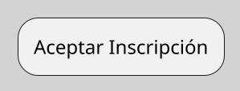
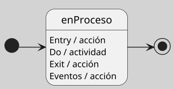
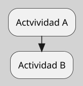
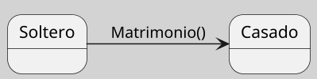

---
{"dg-publish":true,"permalink":"/050 Base de Conocimientos/200  Mi Zettelkasten/100 Docencia/IS1/2025/Clase 08 Modelo Conceptual del UML - Elementos, Relaciones, Reglas y Mecanismos Comunes/Zk Modelo Conceptual del UML (Elementos de Comportamiento)/","tags":["digitalGarden","modeloConceptualUML"]}
---

## Elementos de Comportamiento del Modelo Conceptual del UML

 Modelan dinámicas del sistema mediante interacciones y flujos. Describen cómo se comporta un sistema en el tiempo, incluyendo actividades, estados y transiciones ([[050 Base de Conocimientos/900 Biblioteca/Zk Lit (Booch et al., 2006) Booch, G., Rumbaugh, J., y Jacobson, I. (2006). El lenguaje Unificado de Modelado - Guía del Usuario. Addison-Wesley\|Booch et al. (2006)]]; [[050 Base de Conocimientos/900 Biblioteca/Zk Lit (OMG, 2017) UML Specifications\|OMG, 2017]]; [[050 Base de Conocimientos/900 Biblioteca/Zk Lit (Rumbaugh et al.,2000) Lenguaje Unificado de Modelado. Manual de Referencia\|Rumbaugh et al., 2000]])

### Elementos

#### Actividad

| Item       | Descripción                                                                                                                                                                                                                                                                                |
| ---------- | ------------------------------------------------------------------------------------------------------------------------------------------------------------------------------------------------------------------------------------------------------------------------------------------ |
| Definición | Comportamiento que organiza acciones y objetos en una secuencia cronológica mediante flujos de control y datos [[050 Base de Conocimientos/900 Biblioteca/Zk Lit (Booch et al., 2006) Booch, G., Rumbaugh, J., y Jacobson, I. (2006). El lenguaje Unificado de Modelado - Guía del Usuario. Addison-Wesley\|(Booch et al., 2006)]]. |
| Uso        | - Modelar procesos empresariales o flujos de trabajo algorítmicos. - Detallar casos de uso complejos con múltiples pasos condicionales.                                                                                                                                                 |

**Figura**
_Representación Gráfica de la Actividad_

----
#### Estado

| Item       | Descripción                                                                                                                                                                                                                                                                       |
| ---------- | --------------------------------------------------------------------------------------------------------------------------------------------------------------------------------------------------------------------------------------------------------------------------------- |
| Definición | Condición temporal de un objeto durante su ciclo de vida, determinada por eventos internos o externos [[050 Base de Conocimientos/900 Biblioteca/Zk Lit (Booch et al., 2006) Booch, G., Rumbaugh, J., y Jacobson, I. (2006). El lenguaje Unificado de Modelado - Guía del Usuario. Addison-Wesley\|(Booch et al., 2006)]]. |
| Uso        | - Representar situaciones como `En espera`, `Activo`, o `Fallido` en máquinas de estados. - Especificar restricciones de comportamiento en componentes.                                                                                                                        |

**Figura**
_Representación Gráfica del Estado y Estados Especiales (Inicial y Final)_

----
#### Transición

| Item         | Descripción                                                                                                                                                                                                                                                                                                                                                                                                                                      |
| ------------ | ------------------------------------------------------------------------------------------------------------------------------------------------------------------------------------------------------------------------------------------------------------------------------------------------------------------------------------------------------------------------------------------------------------------------------------------------ |
| Definición   | Relación dirigida entre dos estados o activadad por un **evento** bajo ciertas **condiciones** ([[050 Base de Conocimientos/900 Biblioteca/Zk Lit (Booch et al., 2006) Booch, G., Rumbaugh, J., y Jacobson, I. (2006). El lenguaje Unificado de Modelado - Guía del Usuario. Addison-Wesley\|Booch et al. (2006)]]; [[050 Base de Conocimientos/900 Biblioteca/Zk Lit (OMG, 2017) UML Specifications\|OMG, 2017]]; [[050 Base de Conocimientos/900 Biblioteca/Zk Lit (Rumbaugh et al.,2000) Lenguaje Unificado de Modelado. Manual de Referencia\|Rumbaugh et al., 2000]]). |
| Uso          | - Describir cómo un objeto responde a eventos - Especificar guardas lógicas para flujos alternativos                                                                                                                                                                                                                                                                                                                                          |

**Figura**
_Representación Gráfica de la Transición entre Actividades_

_Nota:_ Las transiciones entre actividades ocurren de forma secuencial, sin necesidad de un disparador explícito; la finalización de una actividad inicia automáticamente la siguiente.

**Figura**
_Representación Gráfica de la Transición entre Estados_

_Nota:_ Las transiciones entre actividades ocurren de forma secuencial, sin necesidad de un disparador explícito; la finalización de una actividad inicia automáticamente la siguiente.
