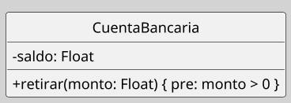
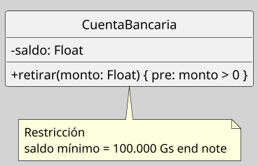
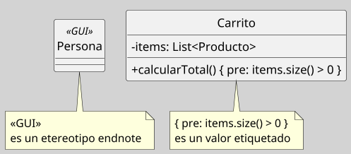

---
{"dg-publish":true,"permalink":"/050 Base de Conocimientos/200  Mi Zettelkasten/100 Docencia/IS1/2025/Clase 08 Modelo Conceptual del UML - Elementos, Relaciones, Reglas y Mecanismos Comunes/Zk Modelo Conceptual del UML (Mecanismos Comunes)/","tags":["digitalGarden","reglas"]}
---

## Mecanismos Comunes

Los mecanismos comunes de UML son patrones de modelado que unifican la sintaxis y semántica del lenguaje, asegurando consistencia en la representación de sistemas ([[050 Base de Conocimientos/900 Biblioteca/Zk Lit (Booch et al., 2006) Booch, G., Rumbaugh, J., y Jacobson, I. (2006). El lenguaje Unificado de Modelado - Guía del Usuario. Addison-Wesley\|Booch et al. (2006)]]; [[050 Base de Conocimientos/900 Biblioteca/Zk Lit (OMG, 2017) UML Specifications\|OMG, 2017]]; [[050 Base de Conocimientos/900 Biblioteca/Zk Lit (Rumbaugh et al.,2000) Lenguaje Unificado de Modelado. Manual de Referencia\|Rumbaugh et al., 2000]].

### Componentes Principales

#### Especificaciones

| Item       | Descripción                                                                                                                                                                                                                                                                                                                                                    |
| ---------- | -------------------------------------------------------------------------------------------------------------------------------------------------------------------------------------------------------------------------------------------------------------------------------------------------------------------------------------------------------------- |
| Definición | Notaciones adicionales que modifican o contextualizan elementos UML ([[050 Base de Conocimientos/900 Biblioteca/Zk Lit (Booch et al., 2006) Booch, G., Rumbaugh, J., y Jacobson, I. (2006). El lenguaje Unificado de Modelado - Guía del Usuario. Addison-Wesley\|Booch et al. (2006)]]; [[050 Base de Conocimientos/900 Biblioteca/Zk Lit (Rumbaugh et al.,2000) Lenguaje Unificado de Modelado. Manual de Referencia\|Rumbaugh et al., 2000]]. |
| Uso        | - Ejemplo: Definir precondiciones de un método en una clase.                                                                                                                                                                                                                                                                                                   |

**Figura**
_Especificaciones no Visibles en Diagrama_

----
#### Adornos

| Item       | Descripción                                                                                                                                                                                                                                                                                                                                                        |
| ---------- | ------------------------------------------------------------------------------------------------------------------------------------------------------------------------------------------------------------------------------------------------------------------------------------------------------------------------------------------------------------------ |
| Definición | Descripciones textuales o formales que complementan la notación gráfica ([[050 Base de Conocimientos/900 Biblioteca/Zk Lit (Booch et al., 2006) Booch, G., Rumbaugh, J., y Jacobson, I. (2006). El lenguaje Unificado de Modelado - Guía del Usuario. Addison-Wesley\|Booch et al. (2006)]]; [[050 Base de Conocimientos/900 Biblioteca/Zk Lit (Rumbaugh et al.,2000) Lenguaje Unificado de Modelado. Manual de Referencia\|Rumbaugh et al., 2000]]. |
| Uso        | - Detallar atributos, operaciones y restricciones **no visibles en diagramas**. - Ejemplo: Definir precondiciones de un método en una clase.                                                                                                                                                                                                                    |

**Figura**
_Especificaciones no Visibles en Diagrama _

----

#### Divisiones Comunes

| Item        | Descripción                                                                                                                                                                                                                                                                                                                                                                                                                                                                           |
| ----------- | ------------------------------------------------------------------------------------------------------------------------------------------------------------------------------------------------------------------------------------------------------------------------------------------------------------------------------------------------------------------------------------------------------------------------------------------------------------------------------------- |
| Definición  | Se refiere a la separación clara y consistente de elementos clave en el diseño de un sistema. El objetivo principal es mejorar la claridad, la organización y la mantenibilidad del modelo ([[050 Base de Conocimientos/900 Biblioteca/Zk Lit (Booch et al., 2006) Booch, G., Rumbaugh, J., y Jacobson, I. (2006). El lenguaje Unificado de Modelado - Guía del Usuario. Addison-Wesley\|Booch et al. (2006)]]; [[050 Base de Conocimientos/900 Biblioteca/Zk Lit (Rumbaugh et al.,2000) Lenguaje Unificado de Modelado. Manual de Referencia\|Rumbaugh et al., 2000]]. |
| Principales | Las dos divisiones comunes más importantes son: Interfaz vs. Implementación y Clase vs. Objeto                                                                                                                                                                                                                                                                                                                                                                                        |
| Regla       | Mantener la división consistente en todos los diagramas                                                                                                                                                                                                                                                                                                                                                                                                                               |

----
#### Mecanismos de Extensibilidad

| Item        | Descripción                                                                                                                                                                                                                                                                                                                   |
| ----------- | ----------------------------------------------------------------------------------------------------------------------------------------------------------------------------------------------------------------------------------------------------------------------------------------------------------------------------- |
| Definición  | Adaptar UML a dominios específicos ([[050 Base de Conocimientos/900 Biblioteca/Zk Lit (Booch et al., 2006) Booch, G., Rumbaugh, J., y Jacobson, I. (2006). El lenguaje Unificado de Modelado - Guía del Usuario. Addison-Wesley\|Booch et al. (2006)]]; [[050 Base de Conocimientos/900 Biblioteca/Zk Lit (Rumbaugh et al.,2000) Lenguaje Unificado de Modelado. Manual de Referencia\|Rumbaugh et al., 2000]]. |
| Principales | Estereotipos y Valores Etiquetados                                                                                                                                                                                                                                                                                            |
**Figura**
_Mecanismos de Extensibilidad_

----
