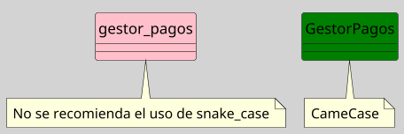
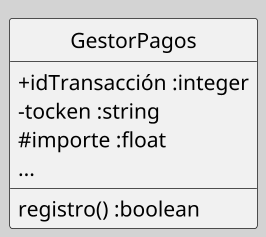

---
{"dg-publish":true,"permalink":"/050 Base de Conocimientos/200  Mi Zettelkasten/100 Docencia/IS1/2025/Clase 08 Modelo Conceptual del UML - Elementos, Relaciones, Reglas y Mecanismos Comunes/Zk Modelo Conceptual del UML (Reglas)/","tags":["digitalGarden","reglas"]}
---

## Reglas

Conjunto de normas que garantizan la coherencia y validez de los modelos UML. Se aplican a nombres, alcances, relaciones y ejecución ([[050 Base de Conocimientos/900 Biblioteca/Zk Lit (Booch et al., 2006) Booch, G., Rumbaugh, J., y Jacobson, I. (2006). El lenguaje Unificado de Modelado - Guía del Usuario. Addison-Wesley\|Booch et al. (2006)]]; [[050 Base de Conocimientos/900 Biblioteca/Zk Lit (OMG, 2017) UML Specifications\|OMG, 2017]]; [[050 Base de Conocimientos/900 Biblioteca/Zk Lit (Rumbaugh et al.,2000) Lenguaje Unificado de Modelado. Manual de Referencia\|Rumbaugh et al., 2000]].

### Reglas de Nombres

En general, los nombres deben ser representativos; además, cada tipo de elemento o relación sigue sus propias reglas de nomenclatura.

**Principios y Convenciones**
- **Unicidad**: Cada elemento (clase, paquete, etc.) debe tener un nombre único en su contexto.
- **CamelCase**: Clases y componentes (`GestorPedidos`).
- **minúsculas**: Atributos y operaciones (`calcularTotal()`)

**Figura**
_Ejemplo Aplicación de Principios y Convenciones a los Nombres _

----
### Reglas de Alcance y Contexto

**Definición**
Determinan el **ámbito de validez** de un elemento:
- **Paquetes**: Limitan visibilidad de clases y subpaquetes.
- **Clases**: Atributos privados solo accesibles dentro de la clase.

### Reglas de Visibilidad

| Símbolo | Tipo      | Acceso                 |
| ------- | --------- | ---------------------- |
| `+`     | Público   | Cualquier componente   |
| `-`     | Privado   | Solo clase contenedora |
| `#`     | Protegido | Clases herederas       |

**Figura**
_Ejemplo Aplicación de Regla de Visibilidad _

----
### Reglas de Integridad

Garantizar la coherencia y la validez de los datos y las relaciones representadas en el modelo. Estas reglas establecen restricciones y condiciones que deben cumplirse para que el modelo sea considerado correcto y consistente.

**Principios**
- **Cardinalidad**: Especificar rangos válidos (ej: `1..*`, `0..1`).
- **No ciclos**: Prohibidas dependencias circulares entre paquetes.
- **Coherencia relacional**: Una asociación (composición) requiere destrucción en cascada.

---
### **Reglas de Ejecución**

Directrices y restricciones que gobiernan cómo los elementos del modelo interactúan y se comportan durante la simulación o ejecución del sistema que se está modelando.

**Aplicación**
- **Máquinas de estados**: Transiciones deben tener eventos desencadenantes.
- **Diagramas de secuencia**: Mensajes deben corresponder a operaciones definidas.