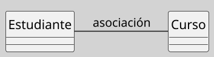
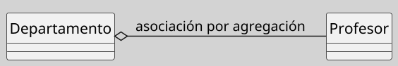
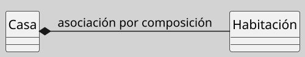
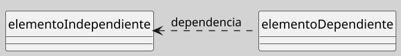
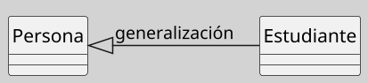

---
{"dg-publish":true,"permalink":"/050 Base de Conocimientos/200  Mi Zettelkasten/100 Docencia/IS1/2025/Clase 08 Modelo Conceptual del UML - Elementos, Relaciones, Reglas y Mecanismos Comunes/Zk Modelo Conceptual del UML (Relaciones Estructurales)/","tags":["digitalGarden","modeloConceptualUML"]}
---

## Relaciones Estructurales del Modelo Conceptual del UML

 Conectan elementos del modelo UML para representar interacciones estáticas o dinámicas entre objetos ([[050 Base de Conocimientos/900 Biblioteca/Zk Lit (Booch et al., 2006) Booch, G., Rumbaugh, J., y Jacobson, I. (2006). El lenguaje Unificado de Modelado - Guía del Usuario. Addison-Wesley\|Booch et al. (2006)]]; [[050 Base de Conocimientos/900 Biblioteca/Zk Lit (OMG, 2017) UML Specifications\|OMG, 2017]]; [[050 Base de Conocimientos/900 Biblioteca/Zk Lit (Rumbaugh et al.,2000) Lenguaje Unificado de Modelado. Manual de Referencia\|Rumbaugh et al., 2000]])

### Relaciones

#### Asociación 

| Item       | Descripción                                                                                                                                                                                                                                   |
| ---------- | --------------------------------------------------------------------------------------------------------------------------------------------------------------------------------------------------------------------------------------------- |
| Definición | Conexión binaria entre clases que indica una relación persistente [[050 Base de Conocimientos/900 Biblioteca/Zk Lit (Booch et al., 2006) Booch, G., Rumbaugh, J., y Jacobson, I. (2006). El lenguaje Unificado de Modelado - Guía del Usuario. Addison-Wesley\|(Booch et al., 2006)]]. |
| Uso        | Para modelar una conexión entre dos elementos.                                                                                                                                                                                                |

**Figura**
_Representación Gráfica de la Asociación_

_Nota:_ Muestra la asociación entre elementos, en este caso particular dos clases.

----
##### Asociación por Agregación

| Item       | Descripción                                                                                                                                                                                                                                          |
| ---------- | ---------------------------------------------------------------------------------------------------------------------------------------------------------------------------------------------------------------------------------------------------- |
| Definición | Relación "tiene-un" con independencia del ciclo de vida (diamante vacío) [[050 Base de Conocimientos/900 Biblioteca/Zk Lit (Booch et al., 2006) Booch, G., Rumbaugh, J., y Jacobson, I. (2006). El lenguaje Unificado de Modelado - Guía del Usuario. Addison-Wesley\|(Booch et al., 2006)]]. |
| Uso        | Muestra un relación no exclusiva de un elemento con relación a otro.                                                                                                                                                                                 |

**Figura**
_Representación Gráfica de la Asociación por Agregación_

_Nota:_ Muestra la asociación por agregación entre elementos, en este caso particular dos clases.

----
##### Asociación por Composición

| Item       | Descripción                                                                                                                                                                                                                              |
| ---------- | ---------------------------------------------------------------------------------------------------------------------------------------------------------------------------------------------------------------------------------------- |
| Definición | Relación "parte-de" con dependencia vital (diamante relleno) [[050 Base de Conocimientos/900 Biblioteca/Zk Lit (Booch et al., 2006) Booch, G., Rumbaugh, J., y Jacobson, I. (2006). El lenguaje Unificado de Modelado - Guía del Usuario. Addison-Wesley\|(Booch et al., 2006)]]. |
| Uso        | Muestra un relación **exclusiva** de un elemento con relación a otro.                                                                                                                                                                    |

**Figura**
_Representación Gráfica de la Composición_

_Nota:_ Muestra la asociación por composición entre elementos, en este caso particular dos clases.

----
#### Dependencia

| Item       | Descripción                                                                                                                                                                                                                                |
| ---------- | ------------------------------------------------------------------------------------------------------------------------------------------------------------------------------------------------------------------------------------------ |
| Definición | Relación temporal donde un cambio en un elemento afecta a otro [[050 Base de Conocimientos/900 Biblioteca/Zk Lit (Booch et al., 2006) Booch, G., Rumbaugh, J., y Jacobson, I. (2006). El lenguaje Unificado de Modelado - Guía del Usuario. Addison-Wesley\|(Booch et al., 2006)]]. |
| Uso        | - La subclase hereda atributos y operaciones. - No se admite herencia múltiple en UML estricto.                                                                                                                                      |

**Figura**
_Representación Gráfica de la Generalización_

_Nota:_ Muestra la dependencia entre elementos, en este caso particular dos clases.

----
#### Generalización

| Item       | Descripción                                                                                                                                                                                               |
| ---------- | --------------------------------------------------------------------------------------------------------------------------------------------------------------------------------------------------------- |
| Definición | Herencia "es-un" entre clases [[050 Base de Conocimientos/900 Biblioteca/Zk Lit (Booch et al., 2006) Booch, G., Rumbaugh, J., y Jacobson, I. (2006). El lenguaje Unificado de Modelado - Guía del Usuario. Addison-Wesley\|(Booch et al., 2006)]]. |
| Uso        | - Uso temporal de métodos estáticos. - Parámetros en operaciones                                                                                                                                       |

**Figura**
_Representación Gráfica de la Dependencia_

_Nota:_ Muestra la generalización entre elementos, en este caso particular dos clases.

----
#### Realización

| Item       | Descripción                                                                                                                                                                                                          |
| ---------- | -------------------------------------------------------------------------------------------------------------------------------------------------------------------------------------------------------------------- |
| Definición | Implementación de interfaces o contratos [[050 Base de Conocimientos/900 Biblioteca/Zk Lit (Booch et al., 2006) Booch, G., Rumbaugh, J., y Jacobson, I. (2006). El lenguaje Unificado de Modelado - Guía del Usuario. Addison-Wesley\|(Booch et al., 2006)]]. |
| Uso        | Implementación de funciones específicas por ejemplo de una clase.                                                                                                                                                    |

**Figura**
_Representación Gráfica de la Realización_

```plantuml
@startuml
!pragma layout smetana
skinparam style strictuml
skinparam classAttributeIconSize 0
skinparam BackgroundColor LightGray
left to right direction
'top to bottom direction
skinparam linetype ortho


Interfaz <|.. ClaseConcreta : realización

@enduml
```

_Nota:_ Muestra la realización entre elementos, en este caso particular dos clases.
