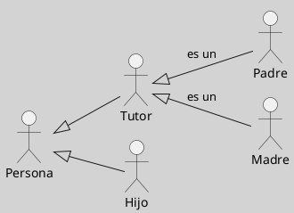

---
{"dg-publish":true,"permalink":"/050 Base de Conocimientos/200  Mi Zettelkasten/100 Docencia/IS1/2025/Clase 09 Diagrama de Casos de Uso (Fundamentos y Elementos Básicos)/Zk Diagrama de Casos de Uso - Elementos (Actores)/","tags":["digitalGarden","diagramaCasosDeUso","elementos","actor"]}
---

## Actores

Los **actores** en UML son entidades externas que interactúan con el **sistema sujeto**, representando [[050 Base de Conocimientos/200  Mi Zettelkasten/100 Docencia/IS1/2025/Clase 09 Diagrama de Casos de Uso (Fundamentos y Elementos Básicos)/Zk Rol\|roles]] que pueden ser desempeñados por usuarios humanos, otros sistemas externos o dispositivos ([[050 Base de Conocimientos/900 Biblioteca/Zk Lit (Booch et al., 2006) Booch, G., Rumbaugh, J., y Jacobson, I. (2006). El lenguaje Unificado de Modelado - Guía del Usuario (2a ed). Addison-Wesley.\|Booch et al., 2006, p. 244]]; [[050 Base de Conocimientos/900 Biblioteca/Zk Lit (OMG, 2017) UML Specifications\|OMG, 2017, p. 647]]; [[050 Base de Conocimientos/900 Biblioteca/Zk Lit (Rumbaugh et al., 2007) Lenguaje Unificado de Modelado. Manual de Referencia\|Rumbaugh et al., 2007, 69]]). Estos roles definen cómo los actores participan en las interacciones, intercambiando información con el sistema [(Rumbaugh et al., 2007, p. 69)].

----
### Características

Un actor representa un [[050 Base de Conocimientos/200  Mi Zettelkasten/100 Docencia/IS1/2025/Clase 09 Diagrama de Casos de Uso (Fundamentos y Elementos Básicos)/Zk Rol\|rol]] que puede estar vinculado a múltiples usuarios y participar en varios casos de uso. Su implementación interna es irrelevante; lo importante son sus atributos y comportamiento externos. Los actores pueden organizarse en jerarquías de generalización y se representan gráficamente mediante figuras estilizadas con su nombre debajo ([[050 Base de Conocimientos/900 Biblioteca/Zk Lit (Rumbaugh et al., 2007) Lenguaje Unificado de Modelado. Manual de Referencia\|Rumbaugh et al., 2007, 69]]).

----
### Representación Gráfica

Los actores se representan gráficamente mediante figuras humanoides (stick figures) con el nombre del rol encima o debajo de la figura. También pueden usarse iconos personalizados para actores no humanos, como sistemas externos ([[050 Base de Conocimientos/900 Biblioteca/Zk Lit (Booch et al., 2006) Booch, G., Rumbaugh, J., y Jacobson, I. (2006). El lenguaje Unificado de Modelado - Guía del Usuario (2a ed). Addison-Wesley.\|Booch et al., 2006, p. 244]]; [[050 Base de Conocimientos/900 Biblioteca/Zk Lit (OMG, 2017) UML Specifications\|OMG, 2017, p. 647]]; [[050 Base de Conocimientos/900 Biblioteca/Zk Lit (Rumbaugh et al., 2007) Lenguaje Unificado de Modelado. Manual de Referencia\|Rumbaugh et al., 2007, 69]]). 

**Figura**
_Representación Gráfica de un Actor en UML_

```plantuml
@startuml
!pragma layout smetana
skinparam style strictuml
skinparam classAttributeIconSize 0
skinparam BackgroundColor LightGray
left to right direction
'top to bottom direction
skinparam linetype ortho
scale 2

actor Actor
@enduml
```

_Nota_: Los nombres de los actores, deben representar el rol que representa.

----
### Tipos

| Tipo de Actor | Descripción                                                                                                                                                                                                                                                                                                                                                                                                                                                    |
| ------------- | -------------------------------------------------------------------------------------------------------------------------------------------------------------------------------------------------------------------------------------------------------------------------------------------------------------------------------------------------------------------------------------------------------------------------------------------------------------- |
| Primario      | Son aquellos que inician interacciones con el sistema para lograr un objetivo específico. Ejemplo: Un cliente que realiza una compra ([[050 Base de Conocimientos/900 Biblioteca/Zk Lit (Booch et al., 2006) Booch, G., Rumbaugh, J., y Jacobson, I. (2006). El lenguaje Unificado de Modelado - Guía del Usuario (2a ed). Addison-Wesley.\|Booch et al., 2006, capítulo 17, 18]]; [[050 Base de Conocimientos/900 Biblioteca/Zk Lit (Rumbaugh et al., 2007) Lenguaje Unificado de Modelado. Manual de Referencia\|Rumbaugh et al., 2007, 69]]). |
| Secundario    | Proporcionan servicios o información al sistema ([[050 Base de Conocimientos/900 Biblioteca/Zk Lit (Rumbaugh et al., 2007) Lenguaje Unificado de Modelado. Manual de Referencia\|Rumbaugh et al., 2007, 69]]). Ejemplo: En un sistema de comercio electrónico, el **banco** es un actor secundario en el caso de uso _"Realizar pago"_, ya que procesa la transacción iniciada por el cliente (actor primario).                                                                                         |

----
### Relaciones entre Actores

Aunque UML no permite asociaciones directas entre actores, se pueden establecer relaciones de generalización (herencia) entre ellos. Esto permite modelar roles más específicos que heredan características de roles más generales ([[050 Base de Conocimientos/900 Biblioteca/Zk Lit (Booch et al., 2006) Booch, G., Rumbaugh, J., y Jacobson, I. (2006). El lenguaje Unificado de Modelado - Guía del Usuario (2a ed). Addison-Wesley.\|Booch et al., 2006, p. 244]]; [[050 Base de Conocimientos/900 Biblioteca/Zk Lit (OMG, 2017) UML Specifications\|OMG, 2017, p. 647]]; [[050 Base de Conocimientos/900 Biblioteca/Zk Lit (Rumbaugh et al., 2007) Lenguaje Unificado de Modelado. Manual de Referencia\|Rumbaugh et al., 2007, 69]]). 

**Figura**
_Control Parental_

_Nota_: Por ejemplo para configurar las restricciones parentales en un dispositivo, solo las Personas que son Tutor pueden realizar dicha configuración. ¿Quiénes pueden hacerlo en este ejemplo?

### Ejemplo Práctico

En el Sistema Académico Sapientia, para el proceso de pago de cuotas de estudiantes:
- Boca de Cobranza:
	- Estudiante: Actor primario
	- Boca de Cobranza: Actor Secundario
- Caja:
	- Estudiante: Actor primario
	- Cajero: Actor Secundario
