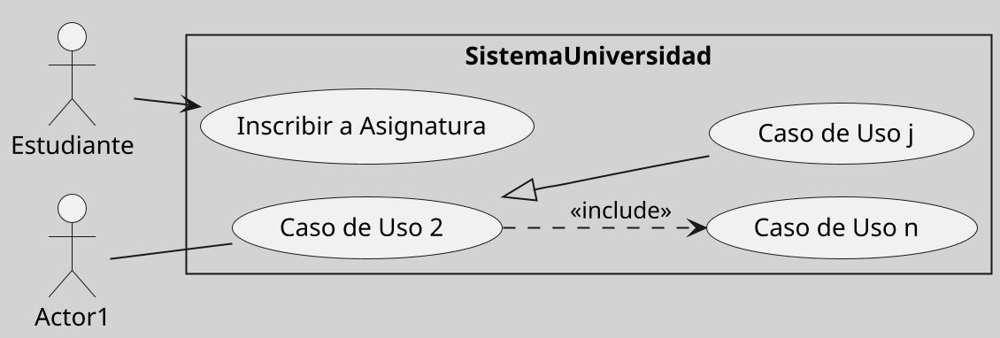

---
{"dg-publish":true,"permalink":"/050 Base de Conocimientos/200  Mi Zettelkasten/100 Docencia/IS1/2025/Clase 09 Diagrama de Casos de Uso (Fundamentos y Elementos Básicos)/Zk Diagrama de Casos de Uso - Elementos (Caso de Uso) Especificación - Ejemplo/","tags":["digitalGarden","casosDeUso","diagramaCasosDeUso","especificación"]}
---

## Ejemplo de Especificación de Caso de Uso (Texto)

A continuación, se presenta un ejemplo de caso de uso relacionado con la inscripción de un estudiante en una asignatura universitaria. Esta especificación tiene un propósito ilustrativo y no pretende representar una situación real, ya que su aplicación dependerá del contexto específico.

### Diagrama de Caso de Uso Asociado (parcial)

Figura
_Diagrama de Caso de Uso: Sistema Universidad - Inscripción a asignaturas_

_Nota:_ En el ejemplo se incluyen otros casos de uso con la finalidad de mostrar que normalmente hay otros casos de uso involucrados.

----
### Especificación del Caso de Uso

#### Identificación
- **Nombre:** Inscribir a Asignatura
- **Actor(es):** Estudiante (primario)
- **Precondiciones:**
    - El estudiante debe estar registrado en el sistema académico.
    - El período de inscripción debe estar abierto.
    - El estudiante debe cumplir con los requisitos previos de la asignatura.

#### Escenario
- El estudiante no cuenta con beca

#### Flujo Principal (Normal)

1. El estudiante inicia el proceso de inscripción.
2. El sistema presenta las asignaturas disponibles según los requisitos establecidos.
3. El estudiante selecciona la asignatura a inscribirse.
4. El sistema verifica la disponibilidad de cupos.
5. El estudiante confirma la inscripción.
6. El sistema registra la inscripción y la confirma al estudiante.
7. Fin del caso de uso.

#### Flujos Alternativos
- **A1: La asignatura seleccionada no tiene cupos disponibles**
    1. El sistema informa al estudiante que no hay cupos disponibles.
    2. El estudiante puede seleccionar otra asignatura o intentar más tarde.
        
- **A2: El estudiante no cumple con los requisitos previos**
    1. El sistema verifica los requisitos y detecta que no se cumplen.
    2. El sistema informa al estudiante y deniega la inscripción.
    3. El estudiante puede seleccionar otra asignatura o solicitar asesoría académica.
    
- **A3: El estudiante ya está inscrito en la asignatura**
    1. El sistema detecta que el estudiante ya está inscrito en la asignatura seleccionada.
    2. El sistema informa al estudiante y deniega la inscripción.
    3. Fin del flujo alternativo.
#### Excepciones

- **E1: Fallo en el sistema durante la inscripción**
    1. Se produce un error en el proceso que impide completar la inscripción.
    2. El sistema informa al estudiante y registra la falla.
    3. El estudiante puede reintentar la inscripción más tarde o contactar soporte.
        
- **E2: El período de inscripción ha finalizado**
    1. El sistema detecta que la inscripción está fuera del período establecido.
    2. El sistema informa al estudiante y deniega la inscripción.
    3. Fin del caso de uso.

#### Poscondiciones

- Si la inscripción fue aceptada, queda registrada en el sistema y el estudiante recibe una notificación de confirmación.
- Si la inscripción fue rechazada, el sistema informa al estudiante sobre la causa del rechazo y no registra la inscripción.

----
