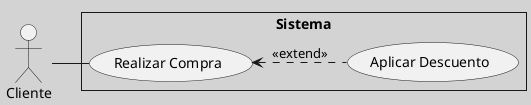

---
{"dg-publish":true,"permalink":"/050 Base de Conocimientos/200  Mi Zettelkasten/100 Docencia/IS1/2025/Clase 09 Diagrama de Casos de Uso (Fundamentos y Elementos Básicos)/Zk Diagrama de Casos de Uso - Elementos (Caso de Uso, Punto de Extensión)/","tags":["digitalGarden","diagramaCasosDeUso"]}
---

## Punto de Extensión de Caso de Uso

Un **punto de extensión** es una ubicación específica dentro del flujo de un caso de uso base donde se puede insertar un comportamiento adicional definido por otro caso de uso mediante la relación `<<extend>>`. Estos puntos permiten modelar funcionalidades opcionales o condicionales sin modificar el flujo principal del caso base. Se documenta en la [[050 Base de Conocimientos/200  Mi Zettelkasten/100 Docencia/IS1/2025/Clase 09 Diagrama de Casos de Uso (Fundamentos y Elementos Básicos)/Zk Diagrama de Casos de Uso - Elementos (Caso de Uso, Especificación) Ejemplo\|especificación textual]] del caso de uso base.

### Propósito

<a class="markdown-embed-link" href="/050-base-de-conocimientos/200-mi-zettelkasten/100-docencia/is-1/2025/clase-09-diagrama-de-casos-de-uso-fundamentos-y-elementos-basicos/zk-diagrama-de-casos-de-uso-relaciones-entre-casos-de-uso-dependencia-extend/#proposito" aria-label="Open link"><svg xmlns="http://www.w3.org/2000/svg" width="24" height="24" viewBox="0 0 24 24" fill="none" stroke="currentColor" stroke-width="2" stroke-linecap="round" stroke-linejoin="round" class="svg-icon lucide-link"><path d="M10 13a5 5 0 0 0 7.54.54l3-3a5 5 0 0 0-7.07-7.07l-1.72 1.71"></path><path d="M14 11a5 5 0 0 0-7.54-.54l-3 3a5 5 0 0 0 7.07 7.07l1.71-1.71"></path></svg></a>

### Propósito

| Propósito    | Explicación                                                             |
| ------------ | ----------------------------------------------------------------------- |
| Modularidad  | Separar funcionalidades opcionales o condicionales del flujo principal. |
| Flexibilidad | Permitir que el caso base funcione independientemente de la extensión.  |
| Claridad     | Evitar sobrecargar el caso base con variantes poco frecuentes.          |

### Ejemplo

#### El Diagrama de Casos de Uso
**Figura**
_Ejemplo de Relación de Dependencia Extend _

_Nota:_ Una limitación del diagrama es que no indica en qué paso del flujo principal se extiende a `Aplicar Descuento`.

#### La Especificación del Caso de Uso (Base)

##### Opción 1
>[!example] Especificación del Caso de Uso
> #### Identificación
>- **Nombre:** Realizar Compra
>- **Actor(es):** Cliente
>- **Precondiciones:**
>- ...
>- 
>#### Escenario
>- ...
> 
>#### Flujo Principal (Normal)
>1. Paso 1
>2. Paso 2
>...
>j. Si se cumple <condición> entonces ver Caso de Uso **Aplicar Descuento**
>
>#### Flujos Alternativos
>- ...
>
>#### Excepciones
>- ...
>#### Poscondiciones
>- ...

##### Opción 2
>[!example] Especificación del Caso de Uso
> #### Identificación
>- **Nombre:** Realizar Compra
>- **Actor(es):** Cliente
>- **Precondiciones:**
>- ...
>- 
>#### Escenario
>- ...
> #### Puntos de Extensión
> PE1: Luego del Paso i, si se cumple la <condición>
> PE2: ...
> 
>#### Flujo Principal (Normal)
>1. Paso 1
>2. Paso 2
>...
>i. Paso i
>j. Si se cumple <condición> entonces ver Caso de Uso **Aplicar Descuento**
>...
>
>#### Flujos Alternativos
>- ...
>
>#### Excepciones
>- ...
>#### Poscondiciones
>- ...

**Ventaja**: La especificación textual precisa dónde y cómo se invoca el caso incluido.
