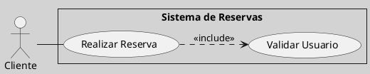

---
{"dg-publish":true,"permalink":"/050 Base de Conocimientos/200  Mi Zettelkasten/100 Docencia/IS1/2025/Clase 09 Diagrama de Casos de Uso (Fundamentos y Elementos Básicos)/Zk Diagrama de Casos de Uso - Elementos (Caso de Uso, Punto de Inclusión)/","tags":["digitalGarden","diagramaCasosDeUso"]}
---

## Punto de Inclusión de Caso de Uso

Un **punto de inclusión** es la ubicación específica dentro del flujo de un caso de uso base donde se invoca un caso de uso incluido (`<<include>>`). Este concepto es crítico para entender cómo y cuándo se ejecuta la funcionalidad incluida, y se documenta en la [[050 Base de Conocimientos/200  Mi Zettelkasten/100 Docencia/IS1/2025/Clase 09 Diagrama de Casos de Uso (Fundamentos y Elementos Básicos)/Zk Diagrama de Casos de Uso - Elementos (Caso de Uso, Especificación) Ejemplo\|especificación textual]] del caso de uso base ([[050 Base de Conocimientos/900 Biblioteca/Zk Lit (Booch et al., 2006) Booch, G., Rumbaugh, J., y Jacobson, I. (2006). El lenguaje Unificado de Modelado - Guía del Usuario (2a ed). Addison-Wesley.\|Booch et al., 2006, p. 244]]; [[050 Base de Conocimientos/900 Biblioteca/Zk Lit (OMG, 2017) UML Specifications\|OMG, 2017, sección 18]]). 

### Ejemplo

#### El Diagrama de Casos de Uso
**Figura**
_Ejemplo de Relación de Dependencia Include _

_Nota:_ Una limitación del diagrama es que no indica en qué paso del flujo principal se incluye `Validar Usuario`.

#### La Especificación del Caso de Uso (Base)

>[!example] Especificación del Caso de Uso
> #### Identificación
>- **Nombre:** Realizar Reserva
>- **Actor(es):** Cliente
>- **Precondiciones:**
>- ...
>- 
>#### Escenario
>- ...
> 
>#### Flujo Principal (Normal)
>1. El Cliente selecciona fechas y habitación.
>2. **Incluir Caso de Uso** Validar Usuario.
>3. Cliente confirma la reserva.
>
>#### Flujos Alternativos
>- ...
>
>#### Excepciones
>- ...
>#### Poscondiciones
>- ...

**Ventaja**: La especificación textual precisa dónde y cómo se invoca el caso incluido.