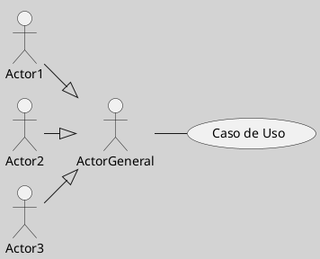
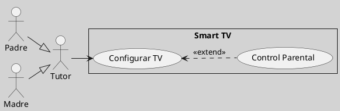
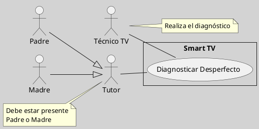

---
{"dg-publish":true,"permalink":"/050 Base de Conocimientos/200  Mi Zettelkasten/100 Docencia/IS1/2025/Clase 09 Diagrama de Casos de Uso (Fundamentos y Elementos Básicos)/Zk Diagrama de Casos de Uso - Generalización de Actores para Ejecución de Casos de Uso de Usuarios No Concurrentes/","tags":["digitalGarden","diagramaCasosDeUso","casosDeUso"]}
---

## Diagrama de Casos de Uso - Generalización de Actores para Ejecución de Casos de Uso de Usuarios No Concurrentes

En diagramas de casos de uso UML, cuando un caso de uso puede ser ejecutado por múltiples [[050 Base de Conocimientos/200  Mi Zettelkasten/100 Docencia/IS1/2025/Clase 09 Diagrama de Casos de Uso (Fundamentos y Elementos Básicos)/Zk Diagrama de Casos de Uso - Elementos (Actores)\|actores]] de forma independiente (es decir, sin necesidad de que los actores estén presentes o interactúen simultáneamente), se recomienda [[050 Base de Conocimientos/200  Mi Zettelkasten/100 Docencia/IS1/2025/Clase 08 Modelo Conceptual del UML - Elementos, Relaciones, Reglas y Mecanismos Comunes/Zk Modelo Conceptual del UML (Relaciones)#Generalización\|generalizar]] estos actores en un actor común. Este actor generalizado se asocia entonces con el caso de uso.

**Figura**
_Ejecución de Caso de Uso por Varios Actores no Silmultáneos_

_Nota:_ En este ejemplo tanto el Actor1, Actor2 como el Actor3 pueden ejecutar el Caso de Uso, pero no necesariamente de manera concurrente, es decir estar presentes para su uso.

Es fundamental distinguir entre la ejecución independiente de un caso de uso y la ejecución concurrente:
- La ejecución **independiente** implica que **cada actor puede iniciar y completar el caso de uso por sí mismo**, sin requerir la presencia o interacción simultánea de otros.

- La ejecución **concurrente**, por otro lado, implica que **los actores deben actuar juntos** en tiempo real para completar el caso de uso.

### Ventajas

| Ventaja            | Descripción                                                                                     |
| ------------------ | ----------------------------------------------------------------------------------------------- |
| Claridad           | Reduce la complejidad del diagrama y facilita la comprensión de quién puede realizar la acción. |
| Mantenibilidad     | Simplifica la adición de nuevos actores ejecutores.                                             |
| Semántica Correcta | Evita la interpretación errónea de ejecución simultánea.                                        |

### Ejemplo

En el contexto de un [[050 Base de Conocimientos/200  Mi Zettelkasten/100 Docencia/IS1/2025/Clase 09 Diagrama de Casos de Uso (Fundamentos y Elementos Básicos)/Zk Diagrama de Casos de Uso - Elementos (Sujeto)\|sujeto]] como un Smart TV, los padres (Padre, Madre) pueden configurar el televisor de forma independiente. En lugar de asociar cada padre directamente con el caso de uso "Configurar Smart TV", se generalizan bajo el actor "Tutor".

**Figura**
_Padre o Madre Pueden Configurar el Smart TV_

_Nota:_ En el ejemplo, el padre o la madre pueden configurar el Smart TV.

### Casos Mixto

Es posible encontrar escenarios donde múltiples actores participan en un caso de uso de forma independiente, pero además se requiere la presencia de otro u otros actores para su ejecución. Por ejemplo, retomando el caso del Smart TV, si este presenta un desperfecto, se necesita la intervención de un técnico de reparación a domicilio (Caso de Uso: Diagnosticar Desperfecto). Para que el técnico pueda realizar su trabajo, el padre o la madre deben estar presentes durante el diagnóstico.

**Figura**
_Diagnóstico de Desperfacto de Smart TV_

