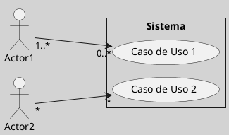
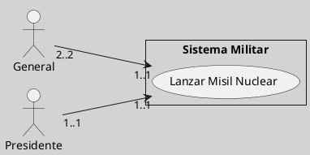
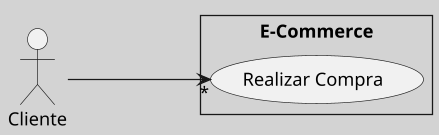

---
{"dg-publish":true,"permalink":"/050 Base de Conocimientos/200  Mi Zettelkasten/100 Docencia/IS1/2025/Clase 09 Diagrama de Casos de Uso (Fundamentos y Elementos Básicos)/Zk Diagrama de Casos de Uso - Relaciones (Entre Actores y Casos de Uso) (Multiplicidad)/","tags":["digitalGarden","diagramaCasosDeUso","relaciones"]}
---

## Multiplicidad en las Asociaciones entre Actores y Casos de Uso

La [[050 Base de Conocimientos/200  Mi Zettelkasten/100 Docencia/IS1/2025/Clase 09 Diagrama de Casos de Uso (Fundamentos y Elementos Básicos)/Zk UML - Multiplicidad\|multiplicidad]] en esta asociación, define cuántas instancias de un [[050 Base de Conocimientos/200  Mi Zettelkasten/100 Docencia/IS1/2025/Clase 09 Diagrama de Casos de Uso (Fundamentos y Elementos Básicos)/Zk Diagrama de Casos de Uso - Elementos (Actores)\|actor]] pueden participar en un [[050 Base de Conocimientos/200  Mi Zettelkasten/100 Docencia/IS1/2025/Clase 09 Diagrama de Casos de Uso (Fundamentos y Elementos Básicos)/Zk Diagrama de Casos de Uso - Elementos (Caso de Uso)\|caso de uso]], o viceversa. Según la especificación UML 2.5.1 del [[050 Base de Conocimientos/900 Biblioteca/Zk Lit (OMG, 2017) UML Specifications\|OMG (2017)]], esta relación se modela mediante asociaciones con multiplicidades en sus extremos, lo que permite representar escenarios complejos de interacción, agregando una semántica precisa.

#### Representación Gráfica

La cardinalidad se indica mediante [[050 Base de Conocimientos/200  Mi Zettelkasten/100 Docencia/IS1/2025/Clase 09 Diagrama de Casos de Uso (Fundamentos y Elementos Básicos)/Zk UML - Multiplicidad\|multiplicidades]] en la asociación entre un  [[Zk Diagrama de Casos de Uso - Elementos (Actor)\|actor]] y un [[050 Base de Conocimientos/200  Mi Zettelkasten/100 Docencia/IS1/2025/Clase 09 Diagrama de Casos de Uso (Fundamentos y Elementos Básicos)/Zk Diagrama de Casos de Uso - Elementos (Caso de Uso)\|caso de uso]]:

| Multiplicidad en           | Ejemplo                                                                                           |
| -------------------------- | ------------------------------------------------------------------------------------------------- |
| El extremo del actor       | `1..*` indica que una o más instancias del actor participan en el caso de uso.                    |
| El extremo del caso de uso | `*` indica que una instancia del actor puede participar en múltiples ejecuciones del caso de uso. |

Figura
_Notación UML de la Cardinalidad_

#### Escenarios de Cardinalidad

##### Multiplicidad en el Extremo del Actor

Cuando un caso de uso está asociado a un actor con multiplicidad mayor a `1`, significa que **múltiples instancias del actor pueden participar simultáneamente** en la misma ejecución del caso de uso. La interacción exacta depende del contexto:

Figura
_Cardinalidad del Lado del Actor_

##### Multiplicidad en el Extremo del Caso de Uso

Cuando un actor tiene multiplicidad mayor a `1` en el extremo del caso de uso, significa que **una instancia del actor puede participar en múltiples ejecuciones del mismo caso de uso**.

Figura
_Cardinalidad del Lado del Caso de Uso_

_Nota:_ Un cliente puede realizar múltiples compras simultáneas o en diferentes momentos.
