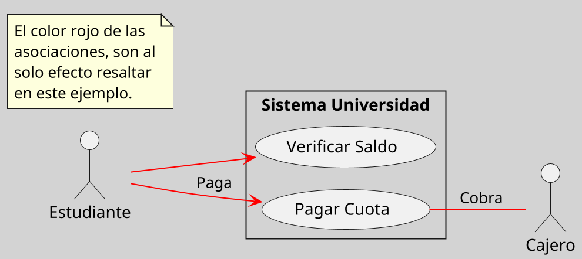
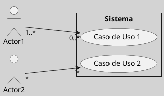
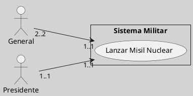
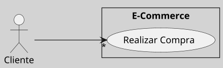
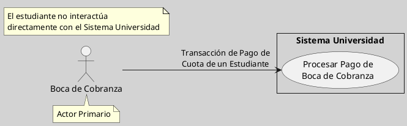
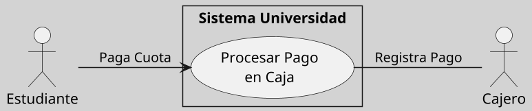

---
{"dg-publish":true,"permalink":"/050 Base de Conocimientos/200  Mi Zettelkasten/100 Docencia/IS1/2025/Clase 09 Diagrama de Casos de Uso (Fundamentos y Elementos Básicos)/Zk Diagrama de Casos de Uso - Relaciones (Entre Actores y Casos de Uso)/","tags":["digitalGarden","diagramaCasosDeUso","relaciones"]}
---

## Diagrama de Casos de Uso - Relaciones (Entre Actores y Casos de Uso)

En un diagrama de casos de uso, los [[050 Base de Conocimientos/200  Mi Zettelkasten/100 Docencia/IS1/2025/Clase 09 Diagrama de Casos de Uso (Fundamentos y Elementos Básicos)/Zk Diagrama de Casos de Uso - Elementos (Actores)\|actores]] se relacionan con el [[050 Base de Conocimientos/200  Mi Zettelkasten/100 Docencia/IS1/2025/Clase 09 Diagrama de Casos de Uso (Fundamentos y Elementos Básicos)/Zk Diagrama de Casos de Uso - Elementos (Sujeto)\|sujeto]] a través de las funcionalidades representadas por los [[050 Base de Conocimientos/200  Mi Zettelkasten/100 Docencia/IS1/2025/Clase 09 Diagrama de Casos de Uso (Fundamentos y Elementos Básicos)/Zk Diagrama de Casos de Uso - Elementos (Caso de Uso)\|casos de uso]]. Estas relaciones se modelan mediante **asociaciones**, que indican cómo los actores interactúan o se comunican con los casos de uso ([[050 Base de Conocimientos/900 Biblioteca/Zk Lit (Booch et al., 2006) Booch, G., Rumbaugh, J., y Jacobson, I. (2006). El lenguaje Unificado de Modelado - Guía del Usuario (2a ed). Addison-Wesley.\|Booch et al., 2006, p. 244]]; [[050 Base de Conocimientos/900 Biblioteca/Zk Lit (OMG, 2017) UML Specifications\|OMG, 2017, sección 18]]). 

### Representación Gráfica

En UML, una asociación entre un actor y un caso de uso se representa como una línea simple que conecta ambos elementos. Esta línea indica que el actor participa en el caso de uso, ya sea iniciándolo o colaborando en su ejecución.

Figura
_Ejemplo de Representación Gráfica de Asociación Entre Actor y Caso de Uso_

----
### Adornos de la Asociación

La **cardinalidad** en esta asociación, define cuántas instancias de un [[Zk Diagrama de Casos de Uso - Elementos (Actor)\|actor]] pueden participar en un [[050 Base de Conocimientos/200  Mi Zettelkasten/100 Docencia/IS1/2025/Clase 09 Diagrama de Casos de Uso (Fundamentos y Elementos Básicos)/Zk Diagrama de Casos de Uso - Elementos (Caso de Uso)\|caso de uso]], o viceversa. Según la especificación UML 2.5.1 del [[050 Base de Conocimientos/900 Biblioteca/Zk Lit (OMG, 2017) UML Specifications\|OMG (2017)]], esta relación se modela mediante asociaciones con multiplicidades en sus extremos, lo que permite representar escenarios complejos de interacción.

#### Representación Gráfica

La cardinalidad se indica mediante **multiplicidades** en la asociación entre un  [[Zk Diagrama de Casos de Uso - Elementos (Actor)\|actor]] y un [[050 Base de Conocimientos/200  Mi Zettelkasten/100 Docencia/IS1/2025/Clase 09 Diagrama de Casos de Uso (Fundamentos y Elementos Básicos)/Zk Diagrama de Casos de Uso - Elementos (Caso de Uso)\|caso de uso]]:

| Multiplicidad en           | Ejemplo                                                                                           |
| -------------------------- | ------------------------------------------------------------------------------------------------- |
| El extremo del actor       | `1..*` indica que una o más instancias del actor participan en el caso de uso.                    |
| El extremo del caso de uso | `*` indica que una instancia del actor puede participar en múltiples ejecuciones del caso de uso. |

Figura
_Notación UML de la Cardinalidad_

#### Escenarios de Cardinalidad

##### Multiplicidad en el Extremo del Actor

Cuando un caso de uso está asociado a un actor con multiplicidad mayor a `1`, significa que **múltiples instancias del actor pueden participar simultáneamente** en la misma ejecución del caso de uso. La interacción exacta depende del contexto:

Figura
_Cardinalidad del Lado del Actor_

##### Multiplicidad en el Extremo del Caso de Uso

Cuando un actor tiene multiplicidad mayor a `1` en el extremo del caso de uso, significa que **una instancia del actor puede participar en múltiples ejecuciones del mismo caso de uso**.

Figura
_Cardinalidad del Lado del Caso de Uso_

_Nota:_ Un cliente puede realizar múltiples compras simultáneas o en diferentes momentos.

----
#### Sentido de la Asociación
#### Texto
#### Otro?

### Casos de Uso con Varios Actores no Simultáneos

Se refiere al caso en que varios actores pueden usar el caso de uso pero no se requiere que todos estén presentes [[050 Base de Conocimientos/200  Mi Zettelkasten/100 Docencia/IS1/2025/Clase 09 Diagrama de Casos de Uso (Fundamentos y Elementos Básicos)/Zk Diagrama de Casos de Uso - Generalización de Actores para Ejecución de Casos de Uso de Usuarios No Concurrentes\|Generalización de Actores para Ejecución de Casos de Uso de Usuarios No Concurrentes]]

#### Ejemplos

1. Estudiante realiza el pago de su cuota de la universidad desde una boca de cobranza externa.
	- Si bien el Estudiante paga su cuota, esta transacción debe registrarse en el Sistema Universidad (SU), en este caso el Estudiante interactúa con el Sistema de la Boca de Cobranza (SBC), no con SU.
	- El SBC es el actor primario que interactúa con SU

**Figura**
_Pago de Cuota de Universidad Vía Boca de Cobranza (Externa)_

2. Estudiante realiza el pago de su cuota de la universidad en una Caja de la universidad.
	- El Estudiante inicia el proceso de pago de su cuota en SU, por tanto es el actor primario
	- El Cajero, es un actor secundario, que interactúa con SU para Registrar Pago de Cuota.

**Figura**
_Pago de Cuota Vía Caja Interna de la Universidad)_

