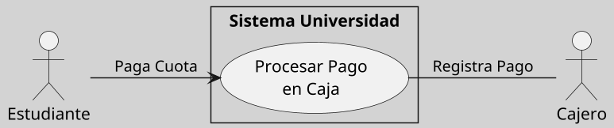
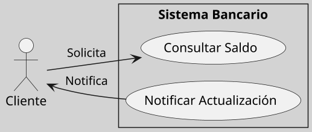

---
{"dg-publish":true,"permalink":"/050 Base de Conocimientos/200  Mi Zettelkasten/100 Docencia/IS1/2025/Clase 09 Diagrama de Casos de Uso (Fundamentos y Elementos Básicos)/Zk Diagrama de Casos de Uso - Relaciones (Entre Actores y Casos de Uso, Navegabilidad)/","tags":["digitalGarden","diagramaCasosDeUso","relaciones"]}
---

## Navegabilidad en la Asociación de Actores y Casos de Uso

En UML, la **navegabilidad** en una asociación indica la dirección en la que fluye la interacción entre un actor y un caso de uso. Aunque las asociaciones en diagramas de casos de uso suelen ser bidireccionales por defecto, es posible especificar el sentido de la navegación para representar interacciones más precisas o unidireccionales [[050 Base de Conocimientos/900 Biblioteca/Zk Lit (OMG, 2017) UML Specifications\|(OMG, 2017, sección 18.1)]].

### Uso de la Navegabilidad

#### Propósito

- Representar si la interacción es iniciada por el actor o por el sistema.
- Clarificar el flujo de comunicación entre los elementos.

#### Notación

- Se utiliza una flecha (`-->`) para indicar el sentido de la navegación.
- Por defecto, las asociaciones son bidireccionales (sin flecha).

#### Ejemplo Básico
**Figura**
_Ejemplo Básico de Navegabilidad_

#### Ejemplo Práctico

>[!Example] Escenario: Sistema Bancario
>Un cliente solicita consultar su saldo, y el sistema puede notificar al cliente sobre actualizaciones automáticas.

**Figura**
_Cliente Consulta su Saldo_

_Explicación:_
- La flecha `-->` en `Cliente --> Consultar Saldo` indica que el cliente inicia la solicitud de consulta.
- La flecha `-->` en `Notificar Actualización --> Cliente` indica que el sistema envía notificaciones al cliente.

### Reglas y Buenas Prácticas

- Evitar Redundancias
- Mantener coherencia visual, usar las navegación de manera uniforme en todo el diagrama
- Usar la navegación solo cuando sea necesario

> [!Attention] Navegabilidad
> El sentido de la navegación en las asociaciones entre actores y casos de uso es una herramienta opcional pero útil para clarificar flujos específicos de interacción. Aunque no siempre es necesario incluir navegabilidad explícita, su uso puede ser valioso en sistemas complejos o cuando se requiere precisión adicional en los diagramas. Esto mejora la legibilidad y facilita la comprensión por parte de todos los stakeholders del proyecto.
