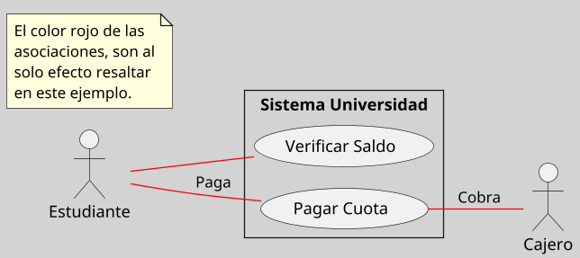

---
{"dg-publish":true,"permalink":"/050 Base de Conocimientos/200  Mi Zettelkasten/100 Docencia/IS1/2025/Clase 09 Diagrama de Casos de Uso (Fundamentos y Elementos Básicos)/Zk Diagrama de Casos de Uso - Relaciones (Entre Actores y Casos de Uso, Nombre)/","tags":["digitalGarden","diagramaCasosDeUso","relaciones"]}
---

## Nombre de la Asociación entre Actores y Casos de Uso

En UML, las [[050 Base de Conocimientos/200  Mi Zettelkasten/100 Docencia/IS1/2025/Clase 09 Diagrama de Casos de Uso (Fundamentos y Elementos Básicos)/Zk Diagrama de Casos de Uso - Relaciones (Entre Actores y Casos de Uso)\|asociaciones entre actores y casos de uso]] pueden incluir un **nombre opcional** que describe el propósito o tipo de interacción entre ambos elementos. Este nombre no altera la semántica de la asociación, pero proporciona información adicional que mejora la claridad y comprensión del diagrama, especialmente en sistemas complejos [[050 Base de Conocimientos/900 Biblioteca/Zk Lit (OMG, 2017) UML Specifications\|(OMG, 2017, sección 18.1)]].

### Propósito
- Identificar el rol del [[050 Base de Conocimientos/200  Mi Zettelkasten/100 Docencia/IS1/2025/Clase 09 Diagrama de Casos de Uso (Fundamentos y Elementos Básicos)/Zk Diagrama de Casos de Uso - Elementos (Actores)\|actor]] en el caso de uso.
- Aclarar el tipo de interacción entre el actor y el [[050 Base de Conocimientos/200  Mi Zettelkasten/100 Docencia/IS1/2025/Clase 09 Diagrama de Casos de Uso (Fundamentos y Elementos Básicos)/Zk Diagrama de Casos de Uso - Elementos (Sujeto)\|sujeto]]].
- Facilitar la interpretación del diagrama por stakeholders no técnicos.

## Notación

El nombre se coloca junto a la línea de asociación entre el actor y el caso de uso.

**Figura**
_Notación del Nombre de una Asociación_

<a class="markdown-embed-link" href="/050-base-de-conocimientos/200-mi-zettelkasten/100-docencia/is-1/2025/clase-09-diagrama-de-casos-de-uso-fundamentos-y-elementos-basicos/zk-diagrama-de-casos-de-uso-relaciones-entre-actores-y-casos-de-uso/#195d41" aria-label="Open link"><svg xmlns="http://www.w3.org/2000/svg" width="24" height="24" viewBox="0 0 24 24" fill="none" stroke="currentColor" stroke-width="2" stroke-linecap="round" stroke-linejoin="round" class="svg-icon lucide-link"><path d="M10 13a5 5 0 0 0 7.54.54l3-3a5 5 0 0 0-7.07-7.07l-1.72 1.71"></path><path d="M14 11a5 5 0 0 0-7.54-.54l-3 3a5 5 0 0 0 7.07 7.07l1.71-1.71"></path></svg></a>

### Reglas y Buenas Prácticas

| Regla                    |                                                                                                                                                                                         |
| ------------------------ | --------------------------------------------------------------------------------------------------------------------------------------------------------------------------------------- |
| Opcionalidad             | - El nombre no es obligatorio según UML 2.5.1 [[050 Base de Conocimientos/900 Biblioteca/Zk Lit (OMG, 2017) UML Specifications\|OMG (2017, sección 18.1)]]. - Utilizar solo cuando sea necesario para aclarar la interacción. |
| Claridad                 | - Los nombres deben ser breves y descriptivos. - Evitar términos redundantes o ambiguos.                                                                                             |
| Consistencia             | - Usar nombres coherentes en todo el diagrama. - Ejemplo: Si se usa "Solicita" para un caso, evitar usar sinónimos como "Pide" para otro similar.                                    |
| Evitar Sobrecarga Visual | No usar nombres si ya están implícitos en el contexto del caso de uso o actor.                                                                                                          |

### Ventajas del uso de Nombre en Asociaciones

- Mejora la legibilidad del diagrama.

- Facilita la comunicación entre equipos técnicos y no técnicos.

- Ayuda a documentar roles específicos en sistemas con múltiples actores.
