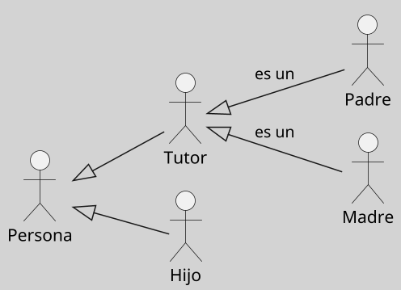

---
{"dg-publish":true,"permalink":"/050 Base de Conocimientos/200  Mi Zettelkasten/100 Docencia/IS1/2025/Clase 09 Diagrama de Casos de Uso (Fundamentos y Elementos Básicos)/Zk Diagrama de Casos de Uso - Relaciones (Entre Actores)/","tags":["digitalGarden","diagramaCasosDeUso","relaciones"]}
---

## Diagrama de Casos de Uso - Relaciones (Entre Actores)

En UML, la única relación admitida entre [[050 Base de Conocimientos/200  Mi Zettelkasten/100 Docencia/IS1/2025/Clase 09 Diagrama de Casos de Uso (Fundamentos y Elementos Básicos)/Zk Diagrama de Casos de Uso - Elementos (Actores)\|actores]] es la **generalización** (herencia), que permite modelar roles especializados que heredan características de un rol más general. Esta relación refleja cómo actores específicos comparten comportamientos comunes mientras añaden funcionalidades únicas ([[050 Base de Conocimientos/900 Biblioteca/Zk Lit (Booch et al., 2006) Booch, G., Rumbaugh, J., y Jacobson, I. (2006). El lenguaje Unificado de Modelado - Guía del Usuario (2a ed). Addison-Wesley.\|Booch et al., 2006, p. 244]]; [[050 Base de Conocimientos/900 Biblioteca/Zk Lit (OMG, 2017) UML Specifications\|OMG, 2017, p. 647]]; [[050 Base de Conocimientos/900 Biblioteca/Zk Lit (Rumbaugh et al., 2007) Lenguaje Unificado de Modelado. Manual de Referencia\|Rumbaugh et al., 2007, 69]]). 

### Características Clave

| Característica              | Descripción                                                                                                                                                                                                 |
| --------------------------- | ----------------------------------------------------------------------------------------------------------------------------------------------------------------------------------------------------------- |
| Generalización de Roles     | Los actores especializados heredan todas las interacciones y responsabilidades del actor general.          Ejemplo: Un "Administrador" hereda de "Usuario", accediendo a funcionalidades adicionales. |
| Flexibilidad en el Modelado | - Permite reutilizar comportamientos comunes sin duplicar casos de uso. - Facilita la adaptación del sistema a nuevos roles sin modificar la estructura base.                                            |

**Figura**
_Generalización de la Estructura de una Familia Tipo_
{ #5fc200}

_Explicación:_
- **Persona**: Actor general que modela a cualquier miembro de la familia, definiendo comportamientos comunes compartidos por todos.
- **Tutor**: Rol especializado que hereda de Persona y asume responsabilidades adicionales, como la atención y cuidado de otros miembros de la familia.
- **Padre/Madre**: Roles derivados de Tutor que, además de heredar sus responsabilidades, añaden nuevas tareas específicas relacionadas con su función dentro de la familia.
- **Hijo**: Es un rol que Hereda directamente de Persona, diferenciándose de otros miembros de la familia al tener características específicas según su contexto.

### Ejemplo

Supongamos la interacción con un sistema Smart TV como el ([[050 Base de Conocimientos/200  Mi Zettelkasten/100 Docencia/IS1/2025/Clase 09 Diagrama de Casos de Uso (Fundamentos y Elementos Básicos)/Zk Diagrama de Casos de Uso - Elementos (Sujeto)\|sujeto]]). La figura anterior resulta útil para modelar cómo los distintos miembros de una familia interactúan con el sistema según sus respectivos roles.

Tomando como base la la [[050 Base de Conocimientos/200  Mi Zettelkasten/100 Docencia/IS1/2025/Clase 09 Diagrama de Casos de Uso (Fundamentos y Elementos Básicos)/Zk Diagrama de Casos de Uso - Relaciones (Entre Actores)#^5fc200\|Estructura Jerárquica de una Familia Tipo]] ([[050 Base de Conocimientos/200  Mi Zettelkasten/100 Docencia/IS1/2025/Clase 09 Diagrama de Casos de Uso (Fundamentos y Elementos Básicos)/Zk Diagrama de Casos de Uso - Elementos (Actores)\|actores]]), supongamos la interacción con el [[050 Base de Conocimientos/200  Mi Zettelkasten/100 Docencia/IS1/2025/Clase 09 Diagrama de Casos de Uso (Fundamentos y Elementos Básicos)/Zk Diagrama de Casos de Uso - Elementos (Sujeto)\|sujeto]] (Sistema Smart TV), los actores pueden organizarse jerárquicamente para modelar interacciones según roles familiares:

1. **Actor General**: Persona (puede ver contenido básico).
2. **Actores Especializados**:
    - _Tutor_: Configura controles parentales y restricciones horarias.
    - _Niño_: Accede solo a contenido aprobado por el Tutor.

#### Modelado de Roles Familiares en un Sistema Smart TV

Para modelar cómo los miembros de una familia interactúan con un **sistema Smart TV** ([[050 Base de Conocimientos/200  Mi Zettelkasten/100 Docencia/IS1/2025/Clase 09 Diagrama de Casos de Uso (Fundamentos y Elementos Básicos)/Zk Diagrama de Casos de Uso - Elementos (Sujeto)\|sujeto]]), podemos utilizar una jerarquía de [[050 Base de Conocimientos/200  Mi Zettelkasten/100 Docencia/IS1/2025/Clase 09 Diagrama de Casos de Uso (Fundamentos y Elementos Básicos)/Zk Diagrama de Casos de Uso - Elementos (Actores)\|actores]] basada en la [[050 Base de Conocimientos/200  Mi Zettelkasten/100 Docencia/IS1/2025/Clase 09 Diagrama de Casos de Uso (Fundamentos y Elementos Básicos)/Zk Diagrama de Casos de Uso - Relaciones (Entre Actores)#^5fc200\|Estructura Familiar Tipo]]. Este enfoque refleja roles y responsabilidades específicas.

#### Jerarquía de Actores

1. **Actor General**:
    
    - **Persona**: Representa a cualquier miembro de la familia con acceso básico al sistema (ejemplo: ver contenido estándar).
        
2. **Actores Especializados**:
    
    - **Tutor**: Configura controles parentales, restricciones horarias y define políticas de acceso (ejemplo: bloquear contenido inapropiado).
        
    - **Niño**: Accede únicamente a contenido aprobado por el Tutor y no puede modificar configuraciones del sistema.

