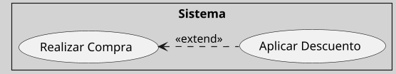

---
{"dg-publish":true,"permalink":"/050 Base de Conocimientos/200  Mi Zettelkasten/100 Docencia/IS1/2025/Clase 09 Diagrama de Casos de Uso (Fundamentos y Elementos Básicos)/Zk Diagrama de Casos de Uso - Relaciones (Entre Casos de Uso, Dependencia Extend)/","tags":["digitalGarden","diagramaCasosDeUso","relaciones"]}
---

## Relación de Dependencia `<<extend>>` del Diagrama de Casos de Uso

La relación `<<extend>>`, es una dependencia que indica que un caso de uso (extendido) **añade comportamiento opcional** a otro caso de uso (base) bajo ciertas condiciones. A diferencia de `<<include>>`, esta relación no es obligatoria y se activa solo cuando se cumplen criterios específicos, definidos en [[050 Base de Conocimientos/200  Mi Zettelkasten/100 Docencia/IS1/2025/Clase 09 Diagrama de Casos de Uso (Fundamentos y Elementos Básicos)/Zk Diagrama de Casos de Uso - Elementos (Caso de Uso, Punto de Extensión)\|puntos de extensión]] ([[050 Base de Conocimientos/900 Biblioteca/Zk Lit (Booch et al., 2006) Booch, G., Rumbaugh, J., y Jacobson, I. (2006). El lenguaje Unificado de Modelado - Guía del Usuario (2a ed). Addison-Wesley.\|Booch et al., 2006, capítulos 17 y 18]]; [[050 Base de Conocimientos/900 Biblioteca/Zk Lit (OMG, 2017) UML Specifications\|OMG, 2017, sección 18]]). 

La relación `<<extend>>` permite modelar funcionalidades opcionales o condicionales en sistemas complejos. Al combinar [[050 Base de Conocimientos/200  Mi Zettelkasten/100 Docencia/IS1/2025/Clase 09 Diagrama de Casos de Uso (Fundamentos y Elementos Básicos)/Zk Diagrama de Casos de Uso - Elementos (Caso de Uso, Punto de Extensión)\|puntos de extensión]] documentados y [[050 Base de Conocimientos/200  Mi Zettelkasten/100 Docencia/IS1/2025/Clase 09 Diagrama de Casos de Uso (Fundamentos y Elementos Básicos)/Zk Diagrama de Casos de Uso - Elementos (Caso de Uso, Especificación) Ejemplo\|especificaciones textuales]] claras, se logra un equilibrio entre flexibilidad y mantenibilidad. Su uso adecuado evita la sobrecarga de casos base y facilita la adaptación a requisitos cambiantes.

### Propósito

| Propósito    | Explicación                                                             |
| ------------ | ----------------------------------------------------------------------- |
| Modularidad  | Separar funcionalidades opcionales o condicionales del flujo principal. |
| Flexibilidad | Permitir que el caso base funcione independientemente de la extensión.  |
| Claridad     | Evitar sobrecargar el caso base con variantes poco frecuentes.          |

### Notación

Se representa mediante una línea punteada con una flecha abierta, etiquetada con `<<extend>>`, desde el caso extendido al caso base.

Los [[050 Base de Conocimientos/200  Mi Zettelkasten/100 Docencia/IS1/2025/Clase 09 Diagrama de Casos de Uso (Fundamentos y Elementos Básicos)/Zk Diagrama de Casos de Uso - Elementos (Caso de Uso, Punto de Extensión)\|puntos de extensión]] se documentan en la especificación textual del caso base.

#### Ejemplo
**Figura**
_Ejemplo de Relación de Dependencia `<<extend>>`_

_Nota:_
- Caso de Uso Base: `(Realizar Compra)`
- Caso de Uso Extendido: `(Aplicar Descuento)`
- El caso de uso `(Aplicar Descuento)` es ejecutado de manera condicional por `(Realizar Compra)` en  puntos específicos de su secuencia llamado [[050 Base de Conocimientos/200  Mi Zettelkasten/100 Docencia/IS1/2025/Clase 09 Diagrama de Casos de Uso (Fundamentos y Elementos Básicos)/Zk Diagrama de Casos de Uso - Elementos (Caso de Uso, Punto de Extensión)\|punto de extensión]].

### Reglas y Buenas Prácticas

| Regla                                | Ejemplo Correcto                                               | Ejemplo Incorrecto                                         |
| ------------------------------------ | -------------------------------------------------------------- | ---------------------------------------------------------- |
| Usar para funcionalidades opcionales | `<<extend>>` para aplicar descuentos                           | `<<extend>>` para validar usuario (debe ser `<<include>>`) |
| Documentar puntos de extensión       | Especificar en qué paso del flujo base se activa la extensión. | Dejar la condición implícita.                              |
| Evitar ciclos                        | `<<include>>` con etiquetas claras                             | `<<incl>>` (abreviación ambigua)                           |

### Comparación de Relaciones de Dependencia `<<include>>` y `<<extend>>`
Ver [[050 Base de Conocimientos/200  Mi Zettelkasten/100 Docencia/IS1/2025/Clase 09 Diagrama de Casos de Uso (Fundamentos y Elementos Básicos)/Zk Diagrama de Casos de Uso - Relaciones (Entre Casos de Uso, Comparación de Dependencias include y extend)\|Comparación de Dependencias include y extend]]

