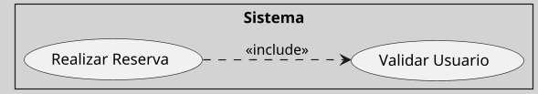

---
{"dg-publish":true,"permalink":"/050 Base de Conocimientos/200  Mi Zettelkasten/100 Docencia/IS1/2025/Clase 09 Diagrama de Casos de Uso (Fundamentos y Elementos Básicos)/Zk Diagrama de Casos de Uso - Relaciones (Entre Casos de Uso, Dependencia Include)/","tags":["digitalGarden","diagramaCasosDeUso","relaciones"]}
---

## Relación de Dependencia `<<include>>` del Diagrama de Casos de Uso

La relación `<<include>>`, es una dependencia que indica que un caso de uso base **requiere obligatoriamente** la ejecución de otro caso de uso incluido para completar su flujo principal. Esta relación se utiliza para evitar duplicar funcionalidades comunes en múltiples casos de uso, promoviendo la reutilización y la modularidad ([[050 Base de Conocimientos/900 Biblioteca/Zk Lit (Booch et al., 2006) Booch, G., Rumbaugh, J., y Jacobson, I. (2006). El lenguaje Unificado de Modelado - Guía del Usuario (2a ed). Addison-Wesley.\|Booch et al., 2006, capítulos 17 y 18]]; [[050 Base de Conocimientos/900 Biblioteca/Zk Lit (OMG, 2017) UML Specifications\|OMG, 2017, sección 18]]). 

La relación `<<include>>` es esencial para modelar dependencias obligatorias entre casos de uso, mejorando la reutilización y estructura del sistema. Su uso adecuado evita redundancias y facilita el mantenimiento, especialmente en sistemas con funcionalidades compartidas.

### Propósito

| Propósito      | Explicación                                                                                  |
| -------------- | -------------------------------------------------------------------------------------------- |
| Reutilización  | Centralizar comportamientos comunes (ejemplo: autenticación) en casos de uso independientes. |
| Simplificación | Dividir casos de uso complejos en subfuncionalidades manejables.                             |
| Mantenibilidad | Facilitar actualizaciones al modificar un solo caso de uso incluido.                         |

### Notación

Se representa mediante una línea punteada con una flecha abierta, etiquetada con `<<include>>`, desde el caso base al caso incluido.

Los [[050 Base de Conocimientos/200  Mi Zettelkasten/100 Docencia/IS1/2025/Clase 09 Diagrama de Casos de Uso (Fundamentos y Elementos Básicos)/Zk Diagrama de Casos de Uso - Elementos (Caso de Uso, Punto de Inclusión)\|puntos de inclusión]] se documentan en la especificación textual del caso base.

#### Ejemplo
**Figura**
_Ejemplo de Relación de Dependencia `<<include>>`_

_Nota:_
- Caso de Uso Base: `(Realizar Reserva)`
- Caso de Uso Incluido: `(Validar Usuario)`
- El caso de uso `(Validar Usuario)` es incluido de manera obligatoria por `(Realizar Reserva)` en puntos específicos de su secuencia llamado [[050 Base de Conocimientos/200  Mi Zettelkasten/100 Docencia/IS1/2025/Clase 09 Diagrama de Casos de Uso (Fundamentos y Elementos Básicos)/Zk Diagrama de Casos de Uso - Elementos (Caso de Uso, Punto de Inclusión)\|punto de inclusión]].

### Reglas y Buenas Prácticas

| Regla                                    | Ejemplo Correcto                      | Ejemplo Incorrecto                                                 |
| ---------------------------------------- | ------------------------------------- | ------------------------------------------------------------------ |
| Usar solo para dependencias obligatorias | `(Realizar Compra) .> (Validar Pago)` | `(Consultar Catálogo) .> (Agregar al Carrito)` (no es obligatorio) |
| Evitar ciclos                            | `A .> B` y `B .> C`                   | `A .> B` y `B .> A` (ciclo infinito)                               |
| Mantener nombres descriptivos            | `<<include>>` con etiquetas claras    | `<<incl>>` (abreviación ambigua)                                   |

### Comparación de Relaciones de Dependencia `<<include>>` y `<<extend>>`
Ver [[050 Base de Conocimientos/200  Mi Zettelkasten/100 Docencia/IS1/2025/Clase 09 Diagrama de Casos de Uso (Fundamentos y Elementos Básicos)/Zk Diagrama de Casos de Uso - Relaciones (Entre Casos de Uso, Comparación de Dependencias include y extend)\|Comparación de Dependencias include y extend]]
