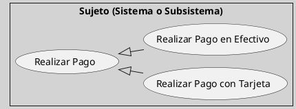
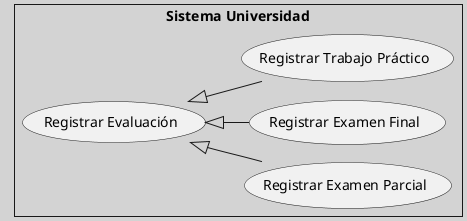

---
{"dg-publish":true,"permalink":"/050 Base de Conocimientos/200  Mi Zettelkasten/100 Docencia/IS1/2025/Clase 09 Diagrama de Casos de Uso (Fundamentos y Elementos Básicos)/Zk Diagrama de Casos de Uso - Relaciones (Entre Casos de Uso, Generalización)/","tags":["digitalGarden","diagramaCasosDeUso","relaciones"]}
---

## Relación de Generalización entre Casos de Uso

La relación de [[050 Base de Conocimientos/200  Mi Zettelkasten/100 Docencia/IS1/2025/Clase 08 Modelo Conceptual del UML - Elementos, Relaciones, Reglas y Mecanismos Comunes/Zk Modelo Conceptual del UML (Relaciones)#Generalización\|generalización]], dentro del Modelo Conceptual UML, establece una jerarquía entre elementos. En esta jerarquía, un caso de uso hijo hereda el comportamiento de su caso de uso padre, con la posibilidad de añadir o modificar funcionalidades específicas. Esta relación es fundamental para modelar variantes o especializaciones de un caso de uso general, lo que facilita la reutilización de elementos y aporta claridad a sistemas complejos [[050 Base de Conocimientos/900 Biblioteca/Zk Lit (OMG, 2017) UML Specifications\|(OMG, 2017, sección 18.1)]].

### Propósito

| Propósito       | Explicación                                                                               |
| --------------- | ----------------------------------------------------------------------------------------- |
| Reutilización   | Permite que los casos de uso hijos hereden comportamientos comunes del caso de uso padre. |
| Especialización | Modela variantes específicas del caso general.                                            |
| Claridad        | Simplifica el diagrama al evitar redundancias entre casos similares.                      |

### Notación

La [[050 Base de Conocimientos/200  Mi Zettelkasten/100 Docencia/IS1/2025/Clase 08 Modelo Conceptual del UML - Elementos, Relaciones, Reglas y Mecanismos Comunes/Zk Modelo Conceptual del UML (Relaciones)#Generalización\|generalización]] se representa mediante una línea con un triángulo vacío en el extremo del caso de uso padre.

**Figura**
_Notación de Generalización entre Casos de Uso_

_Explicación:_ 
- Realizar Pago, es el caso de uso general o padre.
- Realizar Pago en Efectivo, es un caso de uso hijo, que hereda el comportamiento del caso de uso general.
- Realizar Pago con Tarjeta, es un caso de uso hijo, que hereda el comportamiento del caso de uso general.

### Ejemplo Práctico

>[!Example] Escenario: Sistema de Universidad
>En un sistema universitario, los estudiantes pueden rendir diferentes tipos de evaluaciones, como exámenes parciales, exámenes finales y trabajos prácticos. Aunque todos los tipos de evaluación comparten pasos comunes (por ejemplo, "Registrar Calificación"), cada tipo tiene particularidades.

**Figura**
_Ejemplo de Generalización de Casos de Uso_

#### Explicación

| Concepto                              | Explicación                                                                                                                                                                                                                                                                                                                                                                                                                                    |
| ------------------------------------- | ---------------------------------------------------------------------------------------------------------------------------------------------------------------------------------------------------------------------------------------------------------------------------------------------------------------------------------------------------------------------------------------------------------------------------------------------- |
| Caso General (`Registrar Evaluación`) | - Define los pasos comunes para registrar cualquier tipo de evaluación: 	- Seleccionar estudiante. 	- Seleccionar asignatura. 	- Registrar calificación.                                                                                                                                                                                                                                                                              |
| Casos Específicos                     | **`Registrar Examen Parcial`**: Puede incluir detalles adicionales como el número de parcial (ejemplo: "Primer Parcial"), el puntaje, etc.. 	 - **`Registrar Examen Final`**: Puede requerir información sobre si es un examen de primera, segunda, tercera oportunidad. 	 - **`Registrar Trabajo Práctico`**: Puede incluir la fecha de entrega y el estado del trabajo (ejemplo: "Entregado a Tiempo", "Entregado con Retraso"). |

#### Reglas Aplicadas

| Regla               | Explicación                                                                                                               |
| ------------------- | ------------------------------------------------------------------------------------------------------------------------- |
| Reutilización       | Los pasos comunes se modelan en el caso general `Registrar Evaluación`, evitando redundancias en los casos específicos.   |
| Especialización     | Cada caso hijo agrega o modifica comportamientos según las particularidades del tipo de evaluación.                       |
| Claridad Jerárquica | La relación jerárquica entre el caso general y los casos específicos es clara y comprensible para todos los stakeholders. |

### Reglas y Buenas Prácticas

| Regla                                         | Ejemplo Correcto                                    | Ejemplo Incorrecto                          |
| --------------------------------------------- | --------------------------------------------------- | ------------------------------------------- |
| Usar generalización solo cuando sea necesario |                                                     |                                             |
| Mantener coherencia semántica                 | Los casos hijos deben ser variantes del caso padre. | Casos hijos no relacionados con el padre.   |
| Evitar redundancias                           | Modelar pasos comunes en el caso padre.             | Repetir los mismos pasos en cada caso hijo. |
#### Ventajas

- Permite modelar un sistema modular y extensible.
- Facilita la incorporación de nuevos tipos de evaluación en el futuro (por ejemplo, "Registrar Proyecto Final").
- Refleja cómo las funcionalidades compartidas y específicas se organizan jerárquicamente.

### Temas Avanzados

1. Uno de los puntos que suelen crear confusiones se refiere al uso de generalizaciones vs dependencias. Ver [[050 Base de Conocimientos/200  Mi Zettelkasten/100 Docencia/IS1/2025/Clase 09 Diagrama de Casos de Uso (Fundamentos y Elementos Básicos)/Zk Diagrama de Casos de Uso - Relaciones (Entre Casos de Uso, Comparación Generalización vs Dependencias include y extend)\|Comparación entre Generalización y Dependencias include y extend]].

2. [[050 Base de Conocimientos/200  Mi Zettelkasten/100 Docencia/IS1/2025/Clase 09 Diagrama de Casos de Uso (Fundamentos y Elementos Básicos)/Zk Diagramas de Casos de Uso (Relaciones de Asociación entre Actores y Casos de Uso Generalizados y Especializados)\|Relaciones de Asociación entre Actores y Casos de Uso Generalizados y Especializados]].
