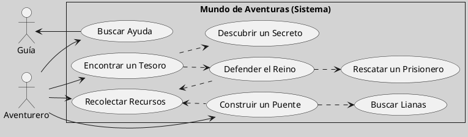
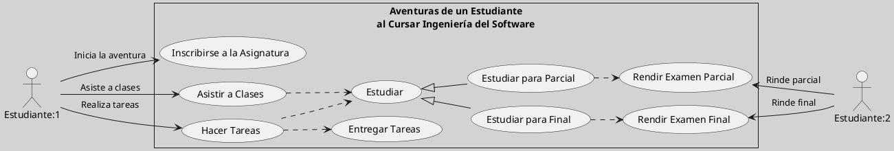

---
{"dg-publish":true,"permalink":"/050 Base de Conocimientos/200  Mi Zettelkasten/100 Docencia/IS1/2025/Clase 09 Diagrama de Casos de Uso (Fundamentos y Elementos Básicos)/Zk Diagrama de Casos de Uso - Un Mapa de Aventuras/","tags":["digitalGarden","diagramaCasosDeUso"]}
---

## Diagrama de Casos de Uso - Un Mapa de Aventuras

Imaginemos un **mapa de aventuras**, donde los **actores**, nuestros protagonistas, exploran un mundo llamado **sistema**. Cada acción que realizan, desde buscar ayuda hasta rescatar a un prisionero, representa una pequeña **aventura**, también conocida como **caso de uso**, con su propio inicio, desarrollo y desenlace. El **diagrama de casos de uso** es este mapa, que conecta todas las aventuras y muestra los caminos posibles, así como los **objetivos** que los actores pueden alcanzar dentro del sistema.

**Figura**
_Un Mapa de Aventuras_

_Nota:_ Cada caso de uso tiene su historia, un inicio un desarrollo y desenlace.

**Figura**
_Las Aventuras de un Estudiante al Cursar Ingeniería del Software_

A partir de estos ejemplos introductorios, podemos extraer algunas ideas que nos servirán para comprender mejor el **Diagrama de Casos de Uso**.

| **Idea**                                            | **Analogía**                             |
| --------------------------------------------------- | ---------------------------------------- |
| Un sistema tiene **actores** que interactúan con él | Aventureros que exploran un mundo        |
| Cada acción relevante es un **caso de uso**         | Cada misión es una aventura              |
| Los casos de uso tienen un inicio y un fin          | Cada aventura tiene su propia historia   |
| Los actores pueden compartir casos de uso           | Aventureros pueden seguir mismos caminos |
| Algunos casos de uso dependen de otros              | Algunas misiones requieren pasos previos |

El **diagrama de casos de uso** es una herramienta poderosa que nos permite visualizar cómo los actores interactúan con un sistema para alcanzar objetivos específicos. A través de la analogía del "mapa de aventuras", hemos explorado cómo cada caso de uso representa una pequeña historia con un inicio, desarrollo y desenlace, conectando las interacciones y objetivos dentro del sistema.

Estos ejemplos iniciales nos invitan a reflexionar sobre cómo modelar sistemas no solo desde la perspectiva técnica, sino también desde el punto de vista narrativo y funcional. A medida que avancemos en el estudio de los elementos y relaciones en UML, podremos refinar estos diagramas para capturar con mayor precisión la complejidad y riqueza de los sistemas que modelamos. En definitiva, cada diagrama es un mapa que guía tanto a los desarrolladores como a los usuarios hacia una comprensión compartida del sistema.