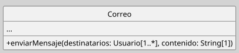

---
{"dg-publish":true,"permalink":"/050 Base de Conocimientos/200  Mi Zettelkasten/100 Docencia/IS1/2025/Clase 09 Diagrama de Casos de Uso (Fundamentos y Elementos Básicos)/Zk UML - Multiplicidad/","tags":["digitalGarden","UML"]}
---

## Multiplicidad

La **multiplicidad** en UML especifica el número mínimo y máximo de instancias de un elemento que pueden participar en una relación con otro elemento [[050 Base de Conocimientos/900 Biblioteca/Zk Lit (OMG, 2017) UML Specifications\|(OMG, 2017, sección 7.5.3)]].

### **Notación**

La multiplicidad se representa como un intervalo de valores enteros no negativos:

| Formato          | Ejemplos                                                                                                                                               |
| ---------------- | ------------------------------------------------------------------------------------------------------------------------------------------------------ |
| `mínimo..máximo` | - `0..1`: Cero o una instancia. - `1..*`: Una o más instancias. - `*`: Equivalente a `0..*` (cero o más). - `3`: Exactamente tres instancias. |

### Aplicaciones de la Multiplicidad

La multiplicidad se utiliza en tres contextos principales:

#### 1. Asociaciones

Define cuántas instancias de una clase (clasificador) pueden vincularse con instancias de otra.

Figura
_Multiplicidad en Asociaciones entre Clasificadores_

```plantuml
@startuml
!pragma layout smetana
skinparam style strictuml
skinparam classAttributeIconSize 0
skinparam BackgroundColor LightGray
left to right direction
'top to bottom direction
skinparam linetype ortho
scale 1

class Estudiante
class Curso

Estudiante "1..*" --> "0..*" Curso : Matriculado en
@enduml
```

_Nota:_ Esto se interpreta como:
- Un `Estudiante` puede matricularse en cero o más `Cursos`.
- Un `Curso` puede tener uno o más `Estudiantes`.

#### 2. Atributos

Especifica cuantos valores puede tener un atributo

Figura
_Multiplicidad en Atributos_

```plantuml
@startuml
!pragma layout smetana
skinparam style strictuml
skinparam classAttributeIconSize 0
skinparam BackgroundColor LightGray
left to right direction
'top to bottom direction
skinparam linetype ortho
scale 1

class Producto {
  - nombre: String [1]
  - códigosDeBarras: String [1..*]
}
@enduml
```

_Nota:_ Esto se interpreta como:
- `nombre` debe tener exactamente un valor.
- `códigosDeBarras` puede tener uno o más valores.

#### 2. Parámetros

Indica cuantos argumentos puede recibir un parámetro en una operación

Figura
_Multiplicidad en Parámetros_

_Nota:_ Esto se interpreta como:
- `destinatarios` requiere al menos un `Usuario`.
-  `contenido` debe ser una cadena única.

### Casos Especiales

|Multiplicidad|Descripción|Ejemplo de Uso|
|---|---|---|
|`0..1`|Opcional: Cero o una instancia.|Un empleado puede tener 0 o 1 jefe.|
|`1`|Obligatorio: Exactamente una instancia.|Una orden debe tener un cliente.|
|`*`|Ilimitado: Cero o más instancias.|Un blog puede tener muchos posts.|
|`2..4`|Rango específico: Entre dos y cuatro instancias.|Un equipo de fútbol tiene 11 jugadores.|

### Buenas Prácticas

Algunas recomendaciones:

| Buena Práctica              |                                                                                                            |
| --------------------------- | ---------------------------------------------------------------------------------------------------------- |
| Evitar Redundancia          | No usar `1..1`; en su lugar, usar `1`.                                                                     |
| Consistencia con el Dominio | Asegurar que las multiplicidades reflejen reglas del negocio (ejemplo: una reserva debe tener un cliente). |
| Restricciones Adicionales   | Usar notas para aclarar restricciones complejas (ejemplo: "Solo una instancia activa al mismo tiempo").    |

