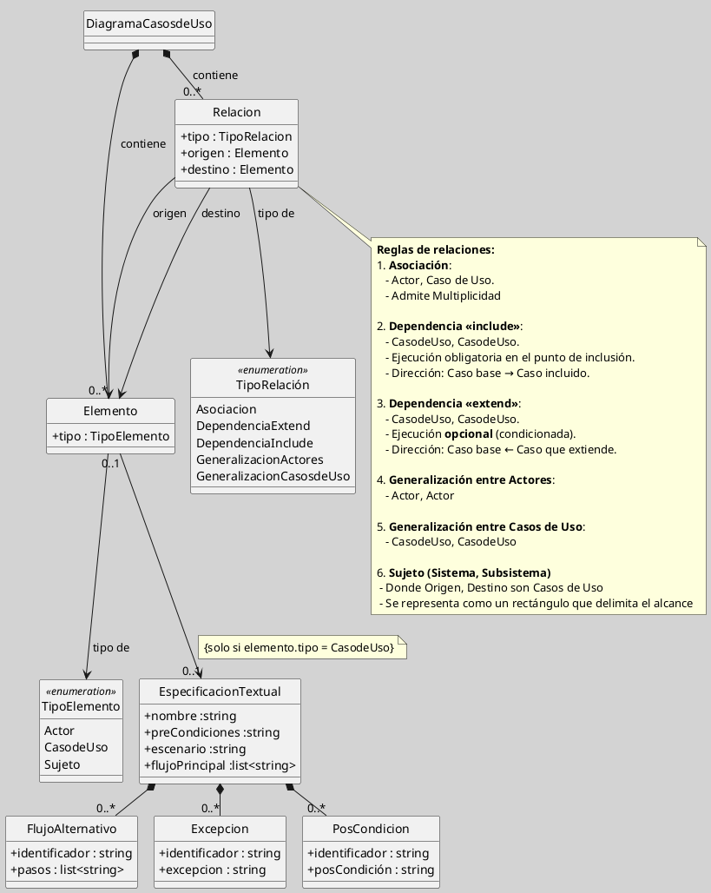

---
{"dg-publish":true,"permalink":"/050 Base de Conocimientos/200  Mi Zettelkasten/100 Docencia/IS1/2025/Clase 09 Diagrama de Casos de Uso (Fundamentos, Elementos, Relaciones)/Zk !MOC Diagrama de Casos de Uso (Fundamentos, Elementos, Relaciones)/","tags":["digitalGarden","moc","UML","casosDeUso"]}
---

## !MOC Diagrama de Casos de Uso (Fundamentos, Elementos, Relaciones)

### Introducción

En el análisis del [[050 Base de Conocimientos/200  Mi Zettelkasten/100 Docencia/IS1/2025/Clase 06 Introducción al UML/Zk Modelo Conceptual del UML\|Modelo Conceptual del UML]], exploramos las características generales del [[050 Base de Conocimientos/200  Mi Zettelkasten/100 Docencia/IS1/2025/Clase 07 Modelo Conceptual del UML - Diagramas/Zk Modelo Conceptual del UML (Diagrama de Casos de Uso)\|Diagrama de Casos de Uso]]. En esta clase, profundizaremos en su estudio para que, al finalizar las sesiones previstas, puedan interpretar y elaborar diagramas de casos de uso con una aplicación precisa de su semántica y sintaxis.

El objetivo principal es que adquieran las herramientas necesarias para modelar interacciones entre actores y sistemas, capturando los requisitos funcionales y definiendo el alcance del sistema.

#### Ejercicio

>[!Todo] [[050 Base de Conocimientos/200  Mi Zettelkasten/100 Docencia/IS1/2025/Clase 09 Diagrama de Casos de Uso (Fundamentos, Elementos, Relaciones)/Zk Diagrama de Casos de Uso - Ejercicio de Clase 01.1\|Desarrollar el ejercicio 1.1]]

----
### Desarrollo

#### Visualización Preliminar

Para comenzar, utilizaremos una [[050 Base de Conocimientos/200  Mi Zettelkasten/100 Docencia/IS1/2025/Clase 09 Diagrama de Casos de Uso (Fundamentos, Elementos, Relaciones)/Zk Diagrama de Casos de Uso - Un Mapa de Aventuras\|historia conceptual]] que nos permitirá visualizar qué es un diagrama de casos de uso. Esta analogía facilita la comprensión inicial al relacionar los elementos del diagrama con un "mapa de aventuras".

#### El Diagrama

Según la [[050 Base de Conocimientos/200  Mi Zettelkasten/100 Docencia/IS1/2025/Clase 07 Modelo Conceptual del UML - Diagramas/Zk Diagrama UML - Definición\|definición de diagrama]] y el [[050 Base de Conocimientos/200  Mi Zettelkasten/100 Docencia/IS1/2025/Clase 06 Introducción al UML/Zk Modelo Conceptual del UML\|Modelo Conceptual del UML]], la construcción de diagramas se basa en [[050 Base de Conocimientos/200  Mi Zettelkasten/100 Docencia/IS1/2025/Clase 07 Modelo Conceptual del UML - Diagramas/Zk Modelo Conceptual del UML (Tipos de Elementos)\|elementos]] y las [[050 Base de Conocimientos/200  Mi Zettelkasten/100 Docencia/IS1/2025/Clase 08 Modelo Conceptual del UML - Elementos, Relaciones, Reglas y Mecanismos Comunes/Zk Modelo Conceptual del UML (Relaciones)\|relaciones]] entre ellos.

Para entender completamente el [[050 Base de Conocimientos/200  Mi Zettelkasten/100 Docencia/IS1/2025/Clase 07 Modelo Conceptual del UML - Diagramas/Zk Modelo Conceptual del UML (Diagrama de Casos de Uso)\|Diagrama de Casos de Uso]], analizaremos por separado los [[050 Base de Conocimientos/200  Mi Zettelkasten/100 Docencia/IS1/2025/Clase 07 Modelo Conceptual del UML - Diagramas/Zk Modelo Conceptual del UML (Tipos de Elementos)\|elementos]]  y las [[050 Base de Conocimientos/200  Mi Zettelkasten/100 Docencia/IS1/2025/Clase 08 Modelo Conceptual del UML - Elementos, Relaciones, Reglas y Mecanismos Comunes/Zk Modelo Conceptual del UML (Relaciones)\|relaciones]] que lo componen. Sin embargo, dado que los elementos y las relaciones están intrínsecamente conectados, en algunos casos será necesario abordar las relaciones al presentar los elementos, con el fin de contextualizar su uso y dar sentido a cada componente en su entorno funcional.

Este enfoque permite comprender cómo los actores, casos de uso y el sistema sujeto de estudio se integran y colaboran para modelar interacciones significativas, manteniendo la coherencia entre los conceptos fundamentales del UML.

##### Elementos

Los Elementos del Diagrama de Casos de Uso son:

<a class="markdown-embed-link" href="/050-base-de-conocimientos/200-mi-zettelkasten/100-docencia/is-1/2025/clase-09-diagrama-de-casos-de-uso-fundamentos-elementos-relaciones/zk-diagrama-de-casos-de-uso-elementos/#elementos-fundamentales" aria-label="Open link"><svg xmlns="http://www.w3.org/2000/svg" width="24" height="24" viewBox="0 0 24 24" fill="none" stroke="currentColor" stroke-width="2" stroke-linecap="round" stroke-linejoin="round" class="svg-icon lucide-link"><path d="M10 13a5 5 0 0 0 7.54.54l3-3a5 5 0 0 0-7.07-7.07l-1.72 1.71"></path><path d="M14 11a5 5 0 0 0-7.54-.54l-3 3a5 5 0 0 0 7.07 7.07l1.71-1.71"></path></svg></a>

### Elementos Fundamentales

| Elemento                                                                | Descripción                                                                                                                                                                                                                                                                                                                                                                                                                                                                                                                            |                         |
| ----------------------------------------------------------------------- | -------------------------------------------------------------------------------------------------------------------------------------------------------------------------------------------------------------------------------------------------------------------------------------------------------------------------------------------------------------------------------------------------------------------------------------------------------------------------------------------------------------------------------------- | ----------------------- |
| [[050 Base de Conocimientos/200  Mi Zettelkasten/100 Docencia/IS1/2025/Clase 09 Diagrama de Casos de Uso (Fundamentos, Elementos, Relaciones)/Zk Diagrama de Casos de Uso - Elementos (Sujeto)\|Sujeto]]            | El sistema o subsistema es delimitado por un rectángulo, con el que interactúan los [[050 Base de Conocimientos/200  Mi Zettelkasten/100 Docencia/IS1/2025/Clase 09 Diagrama de Casos de Uso (Fundamentos, Elementos, Relaciones)/Zk Diagrama de Casos de Uso - Elementos (Actores)\|Actores]] desde fuera [[050 Base de Conocimientos/900 Biblioteca/Zk Lit (Booch et al., 2006) Booch, G., Rumbaugh, J., y Jacobson, I. (2006). El lenguaje Unificado de Modelado - Guía del Usuario (2a ed). Addison-Wesley.\|(Booch et al., 2006, p. 246, 261)]].                                                                                                                                                                       | /000%20Adjuntos/umlSubject.png)     |
| [[050 Base de Conocimientos/200  Mi Zettelkasten/100 Docencia/IS1/2025/Clase 09 Diagrama de Casos de Uso (Fundamentos, Elementos, Relaciones)/Zk Diagrama de Casos de Uso - Elementos (Actores)\|Actores]]          | Representan a las entidades externas (humanos, sistemas o hardware) que interactúan con el [[050 Base de Conocimientos/200  Mi Zettelkasten/100 Docencia/IS1/2025/Clase 09 Diagrama de Casos de Uso (Fundamentos, Elementos, Relaciones)/Zk Diagrama de Casos de Uso - Elementos (Sujeto)\|Sujeto]] ([[050 Base de Conocimientos/900 Biblioteca/Zk Lit (Booch et al., 2006) Booch, G., Rumbaugh, J., y Jacobson, I. (2006). El lenguaje Unificado de Modelado - Guía del Usuario (2a ed). Addison-Wesley.\|Booch et al., 2006, p. 244]]; [[050 Base de Conocimientos/900 Biblioteca/Zk Lit (OMG, 2017) UML Specifications\|OMG, 2017, p. 647]]; [[050 Base de Conocimientos/900 Biblioteca/Zk Lit (Rumbaugh et al., 2007) Lenguaje Unificado de Modelado. Manual de Referencia\|Rumbaugh et al., 2007, 69]]). | /000%20Adjuntos/umlActor.png)       |
| [[050 Base de Conocimientos/200  Mi Zettelkasten/100 Docencia/IS1/2025/Clase 09 Diagrama de Casos de Uso (Fundamentos, Elementos, Relaciones)/Zk Diagrama de Casos de Uso - Elementos (Caso de Uso)\|Casos de Uso]] | Describen las funcionalidades del sistema desde la perspectiva del actor, incluyendo los resultados esperados (objetivos) [[050 Base de Conocimientos/900 Biblioteca/Zk Lit (Rumbaugh et al., 2007) Lenguaje Unificado de Modelado. Manual de Referencia\|(Rumbaugh et al., 2007, 70)]].                                                                                                                                                                                                                                                                                        | /000%20Adjuntos/umlUseCase.png)  |

_Nota:_ A parte de los elementos, para formar diagramas son necesarias las [[050 Base de Conocimientos/200  Mi Zettelkasten/100 Docencia/IS1/2025/Clase 09 Diagrama de Casos de Uso (Fundamentos, Elementos, Relaciones)/Zk Diagrama de Casos de Uso - Relaciones\|relaciones]].

###### Ejercicio
>[!Todo] [[050 Base de Conocimientos/200  Mi Zettelkasten/100 Docencia/IS1/2025/Clase 09 Diagrama de Casos de Uso (Fundamentos, Elementos, Relaciones)/Zk Diagrama de Casos de Uso - Ejercicio de Clase 01.2\|Desarrollar el ejercicio 1.2]]

##### Relaciones

<a class="markdown-embed-link" href="/050-base-de-conocimientos/200-mi-zettelkasten/100-docencia/is-1/2025/clase-09-diagrama-de-casos-de-uso-fundamentos-elementos-relaciones/zk-diagrama-de-casos-de-uso-relaciones/#diagrama-de-casos-de-uso-relaciones" aria-label="Open link"><svg xmlns="http://www.w3.org/2000/svg" width="24" height="24" viewBox="0 0 24 24" fill="none" stroke="currentColor" stroke-width="2" stroke-linecap="round" stroke-linejoin="round" class="svg-icon lucide-link"><path d="M10 13a5 5 0 0 0 7.54.54l3-3a5 5 0 0 0-7.07-7.07l-1.72 1.71"></path><path d="M14 11a5 5 0 0 0-7.54-.54l-3 3a5 5 0 0 0 7.07 7.07l1.71-1.71"></path></svg></a>

## Diagrama de Casos de Uso - Relaciones

Las relaciones crean conexiones entre los elementos del [[050 Base de Conocimientos/200  Mi Zettelkasten/100 Docencia/IS1/2025/Clase 07 Modelo Conceptual del UML - Diagramas/Zk Diagrama UML - Definición\|diagrama]], proporcionando coherencia y significado al conjunto. En el contexto del [[050 Base de Conocimientos/200  Mi Zettelkasten/100 Docencia/IS1/2025/Clase 07 Modelo Conceptual del UML - Diagramas/Zk Modelo Conceptual del UML (Diagrama de Casos de Uso)\|Diagrama de Casos de Uso]] se pueden distinguir las siguientes relaciones entre los elementos:

>[!Tip] Relaciones
>- [[050 Base de Conocimientos/200  Mi Zettelkasten/100 Docencia/IS1/2025/Clase 09 Diagrama de Casos de Uso (Fundamentos, Elementos, Relaciones)/Zk Diagrama de Casos de Uso - Relaciones (Entre Actores)\|Entre Actores]]
>- [[050 Base de Conocimientos/200  Mi Zettelkasten/100 Docencia/IS1/2025/Clase 09 Diagrama de Casos de Uso (Fundamentos, Elementos, Relaciones)/Zk Diagrama de Casos de Uso - Relaciones (Entre Actores y Casos de Uso)\|Entre Actores y Casos de Uso]]
>- [[050 Base de Conocimientos/200  Mi Zettelkasten/100 Docencia/IS1/2025/Clase 09 Diagrama de Casos de Uso (Fundamentos, Elementos, Relaciones)/Zk Diagrama de Casos de Uso - Relaciones (Entre Casos de Uso)\|Entre Casos de Uso]]

----
### Conclusión

El diagrama indicado a continuación, resume los conceptos a asociados al diagrama de casos uso, en cuanto a sus [[050 Base de Conocimientos/200  Mi Zettelkasten/100 Docencia/IS1/2025/Clase 09 Diagrama de Casos de Uso (Fundamentos, Elementos, Relaciones)/Zk Diagrama de Casos de Uso - Elementos\|elementos]], [[050 Base de Conocimientos/200  Mi Zettelkasten/100 Docencia/IS1/2025/Clase 09 Diagrama de Casos de Uso (Fundamentos, Elementos, Relaciones)/Zk Diagrama de Casos de Uso - Relaciones\|relaciones]], reglas y mecanismos comunes ([[050 Base de Conocimientos/200  Mi Zettelkasten/100 Docencia/IS1/2025/Clase 06 Introducción al UML/Zk Modelo Conceptual del UML\|Modelo Conceptual del UML]]).

**Figura**
_Modelo Conceptual del Diagrama de Casos de Uso_

----
## Referencias
[[050 Base de Conocimientos/900 Biblioteca/Zk Lit (OMG, 2017) UML Specifications\|(OMG, 2017)]]
OMG. (2017, diciembre). _About the Unified Modeling Language Specification Version 2.5.1_. [https://www.omg.org/spec/UML](https://www.omg.org/spec/UML) 

[[050 Base de Conocimientos/900 Biblioteca/Zk Lit (Booch et al., 2006) Booch, G., Rumbaugh, J., y Jacobson, I. (2006). El lenguaje Unificado de Modelado - Guía del Usuario (2a ed). Addison-Wesley.\|(Booch et al., 2006)]]
Booch, G., Rumbaugh, J., y Jacobson, I. (2006). _El lenguaje Unificado de Modelado: Guía del Usuario_ (J. J. García Molina & J. Sáez Martínez, Trads.). Addison-Wesley.

[[050 Base de Conocimientos/900 Biblioteca/Zk Lit (Rumbaugh et al., 2000) Lenguaje Unificado de Modelado. Manual de Referencia\|(Rumbaugh et al.,2000)]]
Rumbaugh, J., Booch, G., y Jacobson, I. (2000). _El lenguaje unificado de modelado: Manual de referencia_.

## Bibliografía Adicional
Blankenhorn, K., y Jeckle, M. (2004). A UML Profile for GUI Layout. En M. Weske y P. Liggesmeyer (Eds.), _Object-Oriented and Internet-Based Technologies_ (Vol. 3263, pp. 110-121). Springer Berlin Heidelberg. [https://doi.org/10.1007/978-3-540-30196-7_9](https://doi.org/10.1007/978-3-540-30196-7_9)

Cabot, Sagrera, Jordi. Ingeniería del software, Editorial UOC, 2013. ProQuest Ebook Central, [(https://ebookcentral.proquest.com/lib/biblioucsp/detail.action?docID=3219169)](https://ebookcentral.proquest.com/lib/biblioucsp/detail.action?docID=3219169).

Campderrich, Falgueras, Benet. Ingeniería del software, Editorial UOC, 2003. ProQuest Ebook 
Central, [https://ebookcentral.proquest.com/lib/biblioucsp/detail.action?docID=3206903](https://ebookcentral.proquest.com/lib/biblioucsp/detail.action?docID=3206903).

Casas, Roma, Jordi, and i Caralt,Jordi Conesa. Diseño conceptual de bases de datos en UML, Editorial UOC, 2014. ProQuest Ebook Central, [https://ebookcentral.proquest.com/lib/biblioucsp/detail.action?docID=3222912](https://ebookcentral.proquest.com/lib/biblioucsp/detail.action?docID=3222912).

