---
{"dg-publish":true,"permalink":"/050 Base de Conocimientos/200  Mi Zettelkasten/100 Docencia/IS1/2025/Clase 09 Diagrama de Casos de Uso (Fundamentos, Elementos, Relaciones)/Zk Diagrama de Casos de Uso - Elementos (Actores)/","tags":["digitalGarden","diagramaCasosDeUso","elementos","actor"]}
---

## Actores

Los **actores** en UML son entidades externas que interactúan con el [[050 Base de Conocimientos/200  Mi Zettelkasten/100 Docencia/IS1/2025/Clase 09 Diagrama de Casos de Uso (Fundamentos, Elementos, Relaciones)/Zk Diagrama de Casos de Uso - Elementos (Sujeto)\|sujeto]] (sistema, subsistema o clase), representando [[050 Base de Conocimientos/200  Mi Zettelkasten/100 Docencia/IS1/2025/Clase 09 Diagrama de Casos de Uso (Fundamentos, Elementos, Relaciones)/Zk Rol\|roles]] que pueden ser desempeñados por usuarios humanos, sistemas externos, dispositivos o procesos. Un actor caracteriza las interacciones que una clase de usuarios externos puede tener con el sistema. Durante la ejecución, un usuario físico puede estar asociado con múltiples actores dentro del sistema, dependiendo del contexto y del rol que desempeñe en ese momento ([[050 Base de Conocimientos/900 Biblioteca/Zk Lit (Booch et al., 2000) Booch, G., Rumbaugh, J., y Jacobson, I. (2000). El lenguaje Unificado de Modelado (1a ed.). Addison-Wesley.\|Booch et al., 2006, p. 244]]; [[050 Base de Conocimientos/900 Biblioteca/Zk Lit (OMG, 2017) UML Specifications\|OMG, 2017, p. 647]]; [[050 Base de Conocimientos/900 Biblioteca/Zk Lit (Rumbaugh et al., 2007) Lenguaje Unificado de Modelado. Manual de Referencia\|Rumbaugh et al., 2007, p. 69]]).

### Ejemplo

- En el contexto de la universidad, una persona puede actuar como estudiante y docente en diferentes momentos.

- Un sistema externo, por ejemplo una Boca de Cobranza, puede ser un proveedor de servicios o un consumidor de datos.

----
### Características

 [[050 Base de Conocimientos/900 Biblioteca/Zk Lit (Rumbaugh et al., 2007) Lenguaje Unificado de Modelado. Manual de Referencia\|Rumbaugh et al. (2007, 69)]] en su libro Lenguaje Unificado de Modelado: Guía del Usuario, distingue las siguientes características:

| Caracterísitca            | Descripción                                                                                                                                                                                                                          |
| ------------------------- | ------------------------------------------------------------------------------------------------------------------------------------------------------------------------------------------------------------------------------------ |
| Rol y Contexto            | - Un actor es una idealización de un rol desempeñado por una persona externa, sistema o dispositivo.      - Los actores pueden compartir comportamientos comunes o tener atributos únicos que los distinguen.                  |
| Interacción con el Sujeto | - Los actores participan en uno o más casos de uso mediante el intercambio de mensajes con el sistema.      - La implementación interna del actor no es relevante; lo importante son sus atributos y comportamientos externos. |
| Generalización            | - Los actores pueden organizarse en jerarquías de generalización.      - Un actor abstracto define comportamientos comunes que son heredados y extendidos por actores concretos.                                               |

----
### Representación Gráfica

Los actores se representan gráficamente mediante figuras humanoides con el nombre del [[050 Base de Conocimientos/200  Mi Zettelkasten/100 Docencia/IS1/2025/Clase 09 Diagrama de Casos de Uso (Fundamentos, Elementos, Relaciones)/Zk Rol\|rol]]. También pueden usarse iconos personalizados para actores no humanos, como sistemas externos ([[050 Base de Conocimientos/900 Biblioteca/Zk Lit (Booch et al., 2006) Booch, G., Rumbaugh, J., y Jacobson, I. (2006). El lenguaje Unificado de Modelado - Guía del Usuario (2a ed). Addison-Wesley.\|Booch et al., 2006, p. 244]]; [[050 Base de Conocimientos/900 Biblioteca/Zk Lit (OMG, 2017) UML Specifications\|OMG, 2017, p. 647]]; [[050 Base de Conocimientos/900 Biblioteca/Zk Lit (Rumbaugh et al., 2007) Lenguaje Unificado de Modelado. Manual de Referencia\|Rumbaugh et al., 2007, 69]]). 

**Figura**
_Representación Gráfica de un Actor en UML_

```plantuml
@startuml
!pragma layout smetana
skinparam style strictuml
skinparam classAttributeIconSize 0
skinparam BackgroundColor LightGray
left to right direction
'top to bottom direction
skinparam linetype ortho
scale 2

actor Actor
@enduml
```

_Nota_: Los nombres de los actores, deben representar el rol que representa.

----
### Tipos de Interacción

Según la interacción del actor con el caso de uso, estos se clasifican en:

| Tipo Interacción | Descripción                                                                                                                                                                                                                                                                                                                                                                                                                                                                                                                                                                                    |     |
| ---------------- | ---------------------------------------------------------------------------------------------------------------------------------------------------------------------------------------------------------------------------------------------------------------------------------------------------------------------------------------------------------------------------------------------------------------------------------------------------------------------------------------------------------------------------------------------------------------------------------------------- | --- |
| Primario         | Son aquellos que **inician interacciones** con el sistema para lograr un objetivo específico  ([[050 Base de Conocimientos/900 Biblioteca/Zk Lit (Booch et al., 2006) Booch, G., Rumbaugh, J., y Jacobson, I. (2006). El lenguaje Unificado de Modelado - Guía del Usuario (2a ed). Addison-Wesley.\|Booch et al., 2006, capítulo 17, 18]]; [[050 Base de Conocimientos/900 Biblioteca/Zk Lit (Rumbaugh et al., 2007) Lenguaje Unificado de Modelado. Manual de Referencia\|Rumbaugh et al., 2007, 69]]).  Ejemplo: En el Sistema Universidad, una **Boca de Cobranza externa** es un actor primario en el caso de uso "Pagar Cuota", porque inicia inicia la interacción. |     |
| Secundario       | Proporcionan servicios o información al sistema ([[050 Base de Conocimientos/900 Biblioteca/Zk Lit (Rumbaugh et al., 2007) Lenguaje Unificado de Modelado. Manual de Referencia\|Rumbaugh et al., 2007, 69]]).   Ejemplo: En el Sistema Universidad, el **Cajero** es un actor secundario en el caso de uso "Pagar Cuota", que procesa la transacción iniciada por el Estudiante (actor primario).                                                                                                                                                                                                                                |     |
